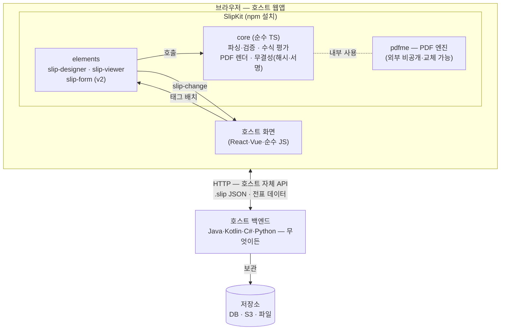
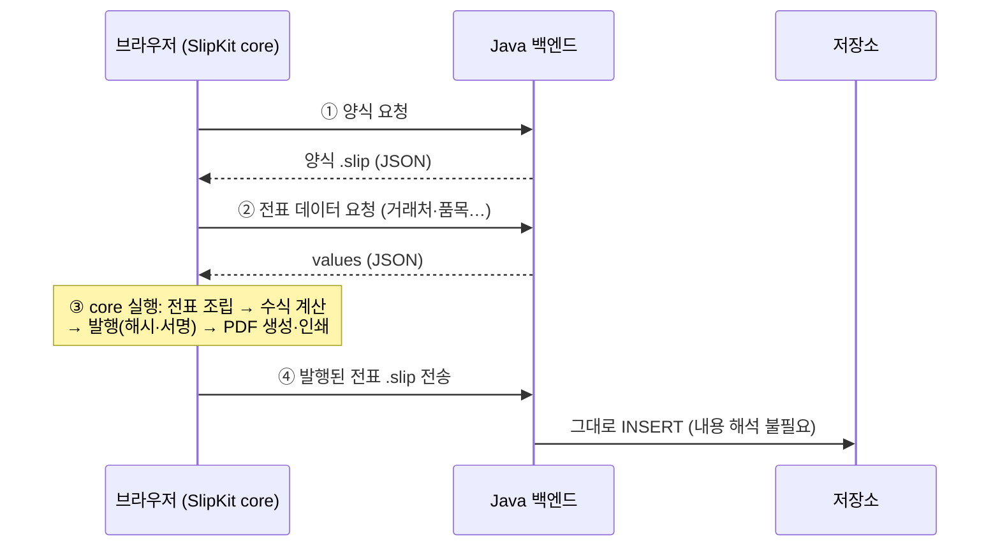
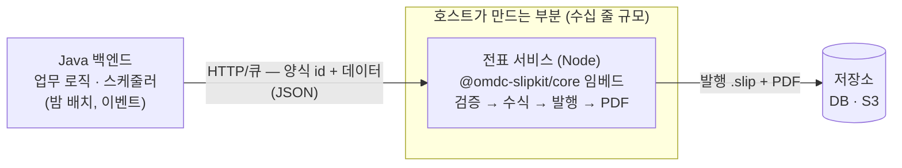

# 아키텍처 — 외부 시스템 연계

최종 갱신: 2026-08-19

SlipKit이 어디서 실행되고, 외부 백엔드(Java든 무엇이든)와 어떻게 연결되는지 정리한다.
근거 설계 결정: ADR-002(임베드형) · ADR-006(연계 3방식) · ADR-012(브라우저 직접 생성) ·
ADR-019(무결성) · ADR-022(SPEC·JSON Schema 공개).

**요지 세 줄:**

1. 연계의 계약은 코드가 아니라 **파일**이다 — `.slip`은 순수 JSON이고 공개 명세([SPEC.md](SPEC.md))와
   JSON Schema가 있어, 백엔드는 SlipKit 코드를 실행하지 않고 저장·전달·검증까지 할 수 있다.
2. 기본 패턴은 **브라우저가 엔진**이다 — 수식·PDF·발행(해시)은 사용자 브라우저 안의 core가 수행하고,
   백엔드는 JSON을 주고받아 보관한다.
3. **별도 전표 서버는 필요할 때만** — 사람 개입 없는 일괄 발행이 필요해지면 core를 임베드한
   작은 Node 서비스를 호스트 인프라에 곁들인다.

## 1. 전체 구조 — 무엇이 어디서 실행되나

SlipKit은 서버가 없는 임베드형 라이브러리다. UI와 엔진(core)은 호스트 웹앱과 함께 브라우저에서
돌고, 백엔드는 호스트가 이미 가진 서버가 맡는다. 두 세계를 잇는 것이 `.slip` 파일이다.

`.slip` = 연계 계약 (순수 JSON · SPEC · JSON Schema). 경계를 넘는 것이 코드가 아니라 JSON이기
때문에 백엔드 언어는 무엇이든 상관없다.

### 설치·배포·실행 관점

"브라우저의 core"는 어딘가 떠 있는 서비스가 아니라 **프론트엔드 번들에 함께 담기는 라이브러리**다.

1. **개발**: 프론트 프로젝트에 `npm install @omdc-slipkit/elements` (React/Vue는 래퍼 패키지).
   npm/Node는 빌드 도구로만 쓰인다 — 상시 서버가 아니다.
2. **배포**: 번들러가 SlipKit을 호스트 앱 JS에 묶어 정적 파일로 만든다. 정적 파일은 아무 웹서버나
   서빙하면 된다 (nginx, Spring Boot 정적 리소스 등).
3. **실행**: 사용자가 페이지를 열면 사용자의 브라우저 안에서 실행된다. 런타임에 별도 서버는 없다.

SPA가 아니어도 된다 — UI가 웹컴포넌트라서 JSP/Thymeleaf 같은 서버 렌더링 페이지에도
번들 스크립트 한 줄 + `<slip-viewer src="...">` 태그로 붙는다 (ADR-003).

## 2. 패턴 A — 기본형: 백엔드는 JSON만 다룬다

"외부 백엔드가 파일 + 데이터를 세팅해 연계"하는 시나리오. 백엔드는 ⑴ 양식 `.slip` 보관·제공
⑵ 전표 데이터(values)를 자기 DB에서 가공해 JSON으로 내려주는 것까지 하고, 전표 조립·수식·발행·PDF는
브라우저의 core가 한다.

백엔드가 자기 힘으로 할 수 있는 일 / core가 필요한 일:

| 백엔드 단독으로 가능 | 수단 |
|---|---|
| `.slip` 저장·조회·전송, 메타(제목·종류·발행 여부) 색인 | 일반 JSON 처리 (Jackson 등) |
| 들어온 파일의 구조 검증 | 동봉 JSON Schema + 각 언어의 검증 라이브러리 |
| 전표 값(values) 생성 | 일반 코드 |
| 발행 전표의 위변조 검증 | SPEC §8이 표준(RFC 8785 + SHA-256 + JWS ES256) 기반 — 각 언어의 암호 라이브러리로 재구현 가능 |

| core(레퍼런스 구현) 필요 | 실행 위치 |
|---|---|
| 교차 필드까지 완전한 검증, 구버전 마이그레이션 | 브라우저(패턴 A) 또는 Node 전표 서비스(패턴 B) |
| 수식 평가 (함수 29종) | 〃 |
| PDF 생성, 발행 처리(해시·서명 기록, 이미지 내장) | 〃 |

## 3. 패턴 B — 별도 전표 서비스: 서버에서 발행까지 해야 할 때

"매일 밤 확정 주문 500건 자동 발행"처럼 사람(브라우저) 없는 흐름이 필요할 때만 쓴다.
SlipKit이 서버를 제공하지는 않지만(ADR-006 — REST 서버 범위 제외), core는 순수 TS라
Node 20+에서 그대로 돌기 때문에(결합 테스트가 Node에서 PDF 생성·서명까지 수행해 확인됨)
**호스트가 core를 임베드한 작은 Node 서비스**를 만들면 된다.

Java 쪽 코드는 HTTP 호출 한 번이라 기존 배치·이벤트 구조에 그대로 붙는다.
로드맵 v4 후보의 **서버 렌더러 재포장**(ADR-012 예약)이 이 서비스 구현을 몇 줄로 줄이는 작업이다.

## 4. 구성 조합 — 디자이너는 필수가 아니다

컴포넌트는 필요한 것만 골라 쓴다. 모든 조합에서 오가는 것이 같은 `.slip`이라, 아래는 구조 변경이
아니라 배치 선택이다.

| 구성 | 설치하는 것 | 쓰임새 |
|---|---|---|
| 뷰어만 | `slip-viewer` (+v2 작성폼) | 양식은 미리 만들어 서버 보관, 최종 사용자는 열람·작성만 |
| 디자이너는 관리자 화면에만 | 관리자: designer / 사용자: viewer·form | 가장 흔한 실서비스 구성 |
| UI 없이 core만 | `@omdc-slipkit/core` (Node) | 패턴 B — 서버 자동 발행, 사용자는 PDF만 수령 |
| 양식 중앙 관리 | 저장소 어댑터를 중앙 서버 API로 구현 | 여러 앱이 하나의 양식 저장소 공유 (ADR-021 인터페이스) |

## 5. 패턴 선택 기준

| 상황 | 선택 | 이유 |
|---|---|---|
| 사람이 화면에서 양식을 만들고 값을 채워 발행 | **패턴 A** | 브라우저가 엔진 — 추가 인프라 0 |
| 백엔드가 데이터를 세팅, 최종 확인·발행은 사람 | **패턴 A** | values를 API로 내려주면 브라우저 core가 조립 |
| 사람 개입 없이 일괄 발행·서버측 PDF | **패턴 B** | 브라우저가 없는 흐름이므로 core를 Node에서 실행 |
| 들어온 전표의 위변조만 서버에서 확인 | A로 충분 | 해시·서명 검증은 표준 기반이라 백엔드 언어로 직접 구현 가능 |

**"별도의 전표 서버 안에서 연결하는 방식인가?"의 답 = 기본은 아니오, 필요해지면 예.**
연계의 뼈대는 파일 포맷이고, 전표 서비스(패턴 B)는 그 위에 선택적으로 얹는 자동화 계층이다.
A로 시작해 일괄 처리 요구가 생기는 시점에 B를 추가해도 두 패턴이 같은 `.slip`을 다루므로
구조 변경 없이 공존한다.
