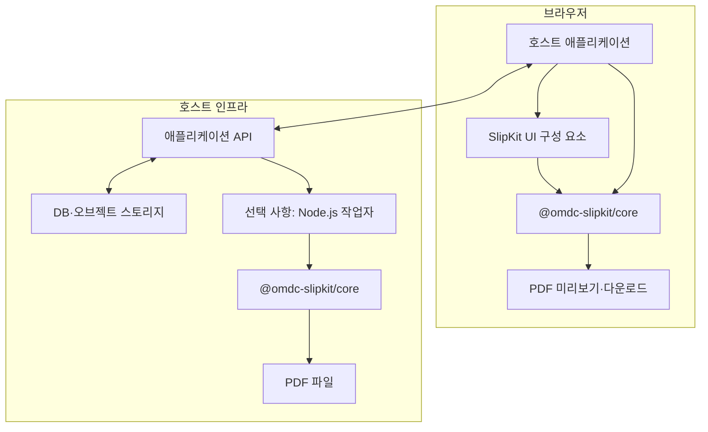
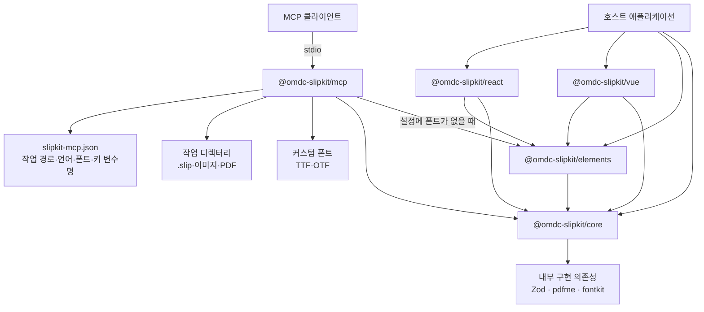
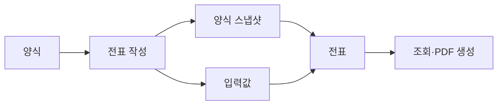
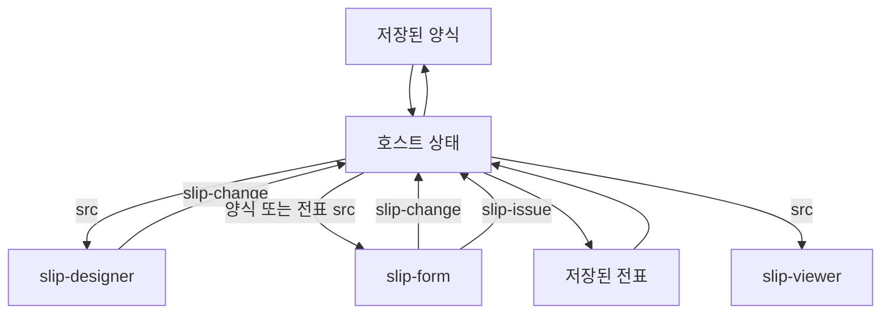
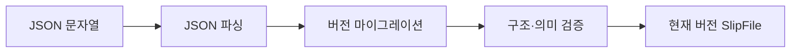
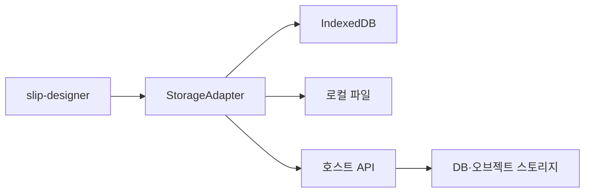

# 아키텍처

최종 갱신: 2026-08-29

이 문서는 SlipKit의 전체 구조와 패키지 간 책임, 데이터 흐름, 실행 환경, 외부 시스템과의 경계를 설명합니다.

SlipKit을 애플리케이션에 적용하는 방법은 [애플리케이션 통합 가이드](guide/integration.md)를, AI와 연결하는 방법은 [MCP 사용 가이드](guide/mcp.md)를, `.slip` 파일의 정확한 데이터 구조는 [.slip 파일 형식 명세](SPEC.md)를 참고하세요.

## 1. 설계 원칙

SlipKit은 다음 원칙에 따라 구성됩니다.

| 원칙 | 설명 |
| --- | --- |
| 호스트 중심 통합 | 화면 전환, 상태 관리, 저장 시점과 서버 통신은 SlipKit이 아니라 호스트 애플리케이션이 관리합니다. |
| UI와 도메인 로직 분리 | Web Component는 편집 화면을 제공하고, 파일 검증·수식 계산·PDF 생성 등의 핵심 기능은 `core`가 담당합니다. |
| 표준 파일 중심 교환 | 양식과 전표는 특정 데이터베이스 구조가 아니라 JSON 기반 `.slip` 파일로 표현합니다. |
| 자기 완결적인 전표 | 전표는 작성 당시의 양식 스냅샷을 포함하여 원본 양식이 변경되어도 같은 결과를 재현할 수 있습니다. |
| 점진적인 프레임워크 지원 | UI의 기준 구현은 Web Component이며 React와 Vue 패키지는 이를 감싸는 얇은 래퍼입니다. |
| 실행 환경 독립성 | 핵심 로직은 브라우저와 Node.js에서 모두 사용할 수 있습니다. |
| 명시적인 확장 | 저장소, 글꼴, 암호화 키와 같은 외부 자원은 설정이나 어댑터를 통해 주입합니다. |
| 안전한 해석 | 수식은 별도의 파서와 평가기를 사용하며 임의의 JavaScript 코드를 실행하지 않습니다. |

## 2. 전체 구조

SlipKit은 독립적인 애플리케이션 백엔드 서비스가 아니라 기존 애플리케이션에 포함하여 사용하는 라이브러리입니다. `mcp` 패키지는 예외적으로 MCP 클라이언트의 로컬 하위 프로세스로 실행됩니다.

호스트 애플리케이션은 필요한 UI 구성 요소와 `core` 기능을 선택하여 사용합니다.

브라우저에서는 양식 편집, 전표 작성, 조회와 PDF 생성을 직접 처리할 수 있습니다.

서버 저장이나 일괄 PDF 생성이 필요하다면 호스트가 API나 Node.js 작업자를 구성할 수 있습니다. SlipKit 자체는 서버, 데이터베이스, 사용자 관리 기능을 제공하지 않습니다.

> [!IMPORTANT]
> SlipKit 구성 요소는 호스트 애플리케이션의 일부입니다. 인증, 권한 검사, 영구 저장, 감사 기록과 업무 흐름은 호스트 시스템이 책임져야 합니다.

## 3. 패키지 구조

SlipKit은 pnpm 기반 모노레포로 관리되며, 공개 패키지는 책임에 따라 분리되어 있습니다.

| 패키지 | 책임 |
| --- | --- |
| `@omdc-slipkit/core` | 파일 형식, 검증, 마이그레이션, 수식 평가, PDF 생성, 암호화와 저장소 인터페이스 |
| `@omdc-slipkit/elements` | 양식 편집기, 전표 입력 폼, 뷰어와 브라우저 저장소 구현 |
| `@omdc-slipkit/react` | SlipKit Web Component를 React에서 사용하기 위한 래퍼 |
| `@omdc-slipkit/vue` | SlipKit Web Component를 Vue에서 사용하기 위한 래퍼 |
| `@omdc-slipkit/mcp` | AI가 작업 디렉터리의 `.slip` 파일을 다루도록 하는 로컬 stdio MCP 서버, 설정 로더와 파일 시스템 저장소 |

### 3.1 `core`

`@omdc-slipkit/core`는 DOM에 의존하지 않는 핵심 패키지입니다. 브라우저와 Node.js에서 모두 사용할 수 있습니다.

주요 책임은 다음과 같습니다.

- `.slip` 파일 파싱과 직렬화
- 스키마 버전 확인과 마이그레이션
- 구조 및 교차 필드 검증
- 전표 생성
- 수식 파싱과 평가
- PDF 생성
- 선택적인 AES-GCM 암호화와 복호화
- 저장소 어댑터 인터페이스 제공

애플리케이션 단위 설정이 필요할 때는 `createSlipKit()`으로 인스턴스를 생성할 수 있습니다. 글꼴 공급자, 로케일, 암호화 키와 이전 키 등을 인스턴스 설정으로 전달합니다. 컴포넌트와 저장 수단은 이 인스턴스를 받아 같은 설정을 재사용합니다 (ADR-064).

### 3.2 `elements`

`@omdc-slipkit/elements`는 Lit 기반 Web Component를 제공합니다.

| 구성 요소 | 역할 |
| --- | --- |
| `<slip-designer>` | 양식을 생성하거나 수정합니다. |
| `<slip-form>` | 양식 또는 기존 전표를 바탕으로 전표를 작성합니다. |
| `<slip-viewer>` | 양식이나 전표를 읽기 전용으로 표시합니다. |

이 패키지는 브라우저에서 사용할 수 있는 `IndexedDbStorage`와 파일 교환 기능 `SlipFileExchange`도 제공합니다.

### 3.3 React와 Vue 래퍼

React와 Vue 패키지는 Web Component를 각 프레임워크의 속성 및 이벤트 모델에 맞게 연결합니다.

핵심 기능을 별도로 재구현하지 않으므로 프레임워크가 달라도 동일한 `.slip` 형식과 렌더링 결과를 사용합니다.

> [!NOTE]
> React 또는 Vue 애플리케이션에서도 파일 검증이나 서버로 보낼 전표 생성처럼 UI와 무관한 작업은 `@omdc-slipkit/core`를 직접 사용할 수 있습니다.

### 3.4 `mcp`

`@omdc-slipkit/mcp`는 MCP 클라이언트와 stdio로 통신하는 로컬 Node.js 서버입니다. `core`의 검증·전표 조립·PDF 생성을 사용하고, 설정에 커스텀 폰트가 없으면 `elements`에서 노출한 동봉 폰트를 사용합니다.

서버는 `slipkit-mcp.json`에서 작업 디렉터리, 로케일, 커스텀 폰트와 암호화 키 환경변수 이름을 읽습니다. CLI 인자와 환경변수는 설정 파일의 값을 덮어쓸 수 있습니다. 암호화 키 값은 설정 파일에 저장하지 않고 서버 프로세스 환경에서 전달합니다.

파일 접근은 해석된 작업 디렉터리 안으로 제한합니다. 읽기 응답은 요약을 기본으로 하고 base64 이미지 데이터를 제외합니다. 기존 파일은 요소 id·파라미터 key·페이지 번호로 지목한 연산만 적용하고, 최종 결과가 전체 검증을 통과할 때만 저장합니다.

`FileSystemStorage`는 이 파일 접근 규칙을 `StorageAdapter`로 공개합니다. Node.js 호스트는 MCP 서버를 시작하지 않고도 같은 경로 제한과 암호화 설정을 재사용할 수 있습니다.

MCP 서버는 사용자 인증, 권한 검사, 임의 코드 실행, 네트워크 접속과 전표 발행을 담당하지 않습니다. 삭제나 덮어쓰기가 포함된 도구 호출의 사용자 승인은 MCP 클라이언트가 관리합니다.

### 3.5 내부 구현 의존성

SlipKit은 내부적으로 Zod, pdfme, fontkit 등의 라이브러리를 사용합니다.

이 라이브러리의 데이터 구조는 SlipKit의 공개 계약이 아닙니다. 호스트 애플리케이션은 pdfme 템플릿이나 내부 렌더링 구조가 아니라 SlipKit의 공개 API와 `.slip` 파일 형식에 의존해야 합니다.

## 4. 데이터 아키텍처

SlipKit의 데이터 교환 단위는 JSON 기반 `.slip` 파일입니다.

일반 `.slip` 파일은 `schemaVersion`과 `kind`를 통해 버전과 파일 종류를 구분합니다.

| 종류 | `kind` | 주요 내용 |
| --- | --- | --- |
| 양식 | `template` | 입력 필드, 배치, 스타일, 용지 설정과 수식 정의 |
| 전표 | `voucher` | 양식 스냅샷, 사용자가 입력한 값과 발행 상태 |
| 암호화 봉투 | 해당 없음 | 암호화된 `.slip` 데이터를 담는 별도의 봉투 형식 |

### 4.1 양식

양식 파일은 전표를 작성하기 위한 필드와 화면 배치를 정의합니다.

개념적인 구조는 다음과 같습니다.

- `schemaVersion`
- `kind: "template"`
- `template`

호스트 시스템에서 사용하는 양식 ID, 이름, 개정 번호와 배포 상태는 `.slip` 파일의 필수 식별자가 아닙니다. 이러한 업무 메타데이터는 호스트 애플리케이션이나 저장소가 관리합니다.

### 4.2 전표

전표 파일은 다음 정보를 포함합니다.

- `schemaVersion`
- `kind: "voucher"`
- `templateSnapshot`
- `values`
- `issued`

`templateSnapshot`에는 전표 작성 당시의 양식이 저장됩니다. 따라서 원본 양식이 이후에 수정되거나 삭제되어도 해당 전표를 당시 모습으로 다시 표시하고 PDF로 만들 수 있습니다.

> [!IMPORTANT]
> `issued: true`는 SlipKit UI에서 전표 편집을 잠그기 위한 상태입니다. 디지털 서명, 위변조 방지, 사용자 인증 또는 법적인 발행 증명을 의미하지 않습니다.

### 4.3 암호화 봉투

SlipKit은 필요할 때 `.slip` 데이터를 AES-256-GCM으로 암호화할 수 있습니다.

암호화 결과에는 다음과 같은 정보가 포함됩니다.

- SlipKit 암호화 데이터임을 나타내는 표식
- 암호화 봉투 버전
- 암호 알고리즘
- 초기화 벡터
- 암호문
- 문자열 비밀번호 사용 시 키 파생 정보

문자열 비밀번호는 PBKDF2-SHA256을 통해 키로 변환하며, 32바이트 원시 키도 사용할 수 있습니다.

암호화된 데이터는 복호화한 뒤 일반 `.slip` 파일로 파싱하고 검증합니다.

> [!WARNING]
> 암호화는 데이터의 기밀성을 위한 선택 기능입니다. 사용자 권한, 접근 제어, 감사 기록, 디지털 서명이나 키 보관 정책을 대신하지 않습니다.
>
> 암호화 키의 생성, 배포, 보관, 회전과 폐기는 호스트 시스템이 책임집니다.

## 5. 구성 요소와 데이터 흐름

SlipKit UI 구성 요소는 JSON 문자열을 입력으로 받고 사용자 작업 결과를 이벤트로 전달합니다.

| 구성 요소 | 입력 | 출력 |
| --- | --- | --- |
| `<slip-designer>` | 편집할 양식의 `src` | 변경된 양식의 `slip-change` |
| `<slip-form>` | 양식 또는 전표의 `src` | 임시 전표의 `slip-change`, 발행 전표의 `slip-issue` |
| `<slip-viewer>` | 양식 또는 전표의 `src` | 편집 결과 없음 |

호스트 애플리케이션은 이벤트로 받은 결과를 별도의 상태로 보관하고 필요한 시점에 저장합니다.

`src`는 편집 세션을 시작하거나 다른 파일을 불러오기 위한 입력입니다. 변경 이벤트를 받을 때마다 결과를 같은 구성 요소의 `src`로 즉시 다시 전달하면 편집 세션이 반복해서 초기화될 수 있습니다.

> [!TIP]
> 구성 요소에 전달하는 입력 상태와 구성 요소가 발생시킨 최신 결과 상태를 분리하세요. 구체적인 구현 방법은 [애플리케이션 통합 가이드](guide/integration.md)를 참고하세요.

SlipKit은 다음 항목을 자동으로 결정하지 않습니다.

- 어느 화면으로 이동할지
- 언제 서버에 저장할지
- 자동 저장을 사용할지
- 저장 실패를 어떻게 복구할지
- 어떤 양식이나 전표를 선택할지
- 사용자에게 어떤 권한을 부여할지

이 결정은 호스트 애플리케이션의 업무 흐름에 속합니다.

## 6. 실행 환경

### 6.1 브라우저

브라우저에서는 다음 기능을 사용할 수 있습니다.

- 양식 편집
- 전표 작성과 조회
- 파일 검증
- 수식 계산
- PDF 미리보기와 다운로드
- IndexedDB 또는 로컬 파일 기반 저장
- Web Crypto 기반 암호화와 복호화

UI 패키지인 `elements`, `react`, `vue`는 브라우저 환경을 대상으로 합니다.

### 6.2 Node.js

`@omdc-slipkit/core`는 Node.js에서도 사용할 수 있습니다.

대표적인 사용 사례는 다음과 같습니다.

- 서버에서 업로드된 `.slip` 파일 검증
- 전표의 일괄 PDF 생성
- 백그라운드 작업자에서 문서 생성
- 저장된 파일의 버전 마이그레이션
- 서버 측 암호화와 복호화

Node.js 작업자는 SlipKit이 제공하는 독립 서버가 아닙니다. 필요한 경우 호스트 시스템이 `core`를 이용해 직접 구성합니다.

### 6.3 다른 언어로 작성된 백엔드

`.slip`은 JSON 형식이므로 Java, Kotlin, Go, Python 등으로 작성된 서버에서도 저장하고 전송할 수 있습니다.

JSON Schema를 이용하면 언어에 관계없이 기본적인 구조를 검사할 수 있습니다. 다만 마이그레이션과 일부 교차 필드 규칙까지 SlipKit과 동일하게 적용하려면 `@omdc-slipkit/core`를 실행하거나 그 동작을 동등하게 구현해야 합니다.

## 7. 검증과 마이그레이션

외부에서 받은 `.slip` 파일은 사용하기 전에 반드시 검증해야 합니다.

SlipKit은 검증 목적에 따라 두 가지 경로를 제공합니다.

| 방법 | 용도 | 범위 |
| --- | --- | --- |
| `parseSlipFile()` | JSON 문자열을 SlipKit 데이터로 변환 | JSON 파싱, 버전 마이그레이션, 구조 검증과 교차 필드 검증 |
| `validateSlipFile()` | 이미 파싱된 객체 검증 | SlipKit 데이터 구조와 의미 규칙 검증 |
| JSON Schema | 다른 언어 또는 외부 도구에서 검사 | 언어 중립적인 구조 검증 |

기본 처리 순서는 다음과 같습니다.

JSON Schema는 외부 시스템과의 상호 운용을 위한 구조적 계약입니다. 모든 마이그레이션이나 교차 필드 규칙을 완전히 대신하지는 않습니다.

파일 형식의 기준은 [.slip 파일 형식 명세](SPEC.md)이며, 실제 동작의 기준 구현은 `@omdc-slipkit/core`입니다.

## 8. 렌더링 아키텍처

SlipKit은 `.slip` 파일을 PDF 엔진의 내부 형식으로 변환한 뒤 PDF를 생성합니다.

렌더링 과정에서는 다음 작업을 수행합니다.

1. 파일 종류와 버전을 확인합니다.
2. 전표라면 양식 스냅샷과 입력값을 사용합니다.
3. 수식을 파싱하고 계산합니다.
4. 글꼴과 이미지 같은 리소스를 확인합니다.
5. 필드 배치와 페이지 구성을 계산합니다.
6. 내부 렌더링 모델로 변환합니다.
7. PDF 바이트를 생성합니다.

브라우저 미리보기와 Node.js PDF 생성은 모두 `core`의 렌더링 기능을 기반으로 합니다.

PDF 엔진은 내부 구현 세부 사항입니다. 호스트 애플리케이션이 저장해야 하는 원본 데이터는 PDF 엔진의 템플릿이 아니라 `.slip` 파일입니다.

> [!NOTE]
> PDF는 `.slip` 원본을 대체하지 않습니다. 이후의 조회, 재출력과 업무 처리를 위해서는 전표 `.slip` 데이터를 별도로 보관해야 합니다.

## 9. 수식 실행 경계

SlipKit 수식은 전용 파서와 평가기로 처리합니다.

수식 문자열을 `eval()`이나 `Function` 생성자에 전달하지 않으며, 임의의 JavaScript 코드나 호스트 애플리케이션의 객체에 접근할 수 없습니다.

수식 평가기는 다음 범위만 사용합니다.

- 전표 입력값
- SlipKit이 제공하는 연산자
- 허용된 내장 함수
- 설정으로 전달된 평가 정보

이 구조는 수식을 애플리케이션 코드와 분리하고 브라우저와 Node.js에서 같은 계산 규칙을 적용하기 위한 것입니다.

수식 작성 방법과 지원 함수는 [수식 가이드](guide/formula.md)를 참고하세요.

## 10. 저장소 아키텍처

저장 기능은 `StorageAdapter` 인터페이스를 경계로 분리되어 있습니다.

기본 인터페이스는 다음 동작을 표현합니다.

- 저장
- 불러오기
- 삭제
- 목록 조회

버전 관리가 필요한 저장소는 버전 목록 조회와 특정 버전 불러오기를 추가로 구현할 수 있습니다.

`@omdc-slipkit/elements`는 브라우저용 구현으로 `IndexedDbStorage` 저장소와, 저장소가 아닌 파일 교환 기능 `SlipFileExchange`(내려받기·열기)를 제공합니다.

서버, S3 호환 스토리지, 사내 문서 시스템 또는 데이터베이스에 저장하려면 호스트가 `StorageAdapter`를 구현합니다.

`<slip-designer>`에 `storage`를 전달하면 양식 목록과 저장·불러오기 기능을 연결할 수 있습니다. 이는 애플리케이션 전체의 자동 저장이나 전표 저장 정책을 의미하지 않습니다.

> [!IMPORTANT]
> 저장소 어댑터는 데이터 접근 통로입니다. 사용자 인증, 권한 검사, 동시 수정 제어, 감사 로그와 백업 정책은 저장소 구현 또는 호스트 서버에서 처리해야 합니다.

## 11. 설정과 확장 지점

SlipKit은 호스트 환경에 종속적인 기능을 명시적으로 주입할 수 있도록 구성합니다.

| 확장 지점 | 책임 |
| --- | --- |
| 글꼴 공급자 | PDF 생성에 사용할 글꼴 데이터를 제공합니다. |
| 로케일 | 구성 요소와 핵심 기능이 사용할 언어 및 지역 설정을 지정합니다. |
| 저장소 어댑터 | 파일의 저장 위치와 버전 관리 방식을 정의합니다. |
| 암호화 설정 | 현재 키와 복호화에 사용할 이전 키를 제공합니다. |
| 디자이너 프리셋 | 사용 가능한 도구, 용지, 바코드 등의 편집 옵션을 제한합니다. |
| 구성 요소 설정 | 화면별 동작과 노출할 기능을 조정합니다. |

확장 설정은 SlipKit의 책임 경계를 바꾸지 않습니다. 예를 들어 저장소를 연결해도 로그인 기능이 생기지 않으며, 암호화를 설정해도 사용자 권한이 자동으로 관리되지 않습니다.

자세한 설정 항목은 [환경 설정 가이드](guide/configuration.md)를 참고하세요.

## 12. 보안과 신뢰 경계

SlipKit이 제공하는 안전 기능과 호스트가 구현해야 하는 보안 기능은 구분해야 합니다.

| 기능 | SlipKit이 제공하는 범위 | 제공하지 않는 범위 |
| --- | --- | --- |
| 파일 검증 | 구조, 버전과 의미 규칙 검사 | 파일 작성자의 신원 확인 |
| `issued` 상태 | UI 편집 잠금과 발행 상태 표현 | 위변조 방지, 전자서명, 법적 증명 |
| AES-GCM 암호화 | 기밀성 및 복호화 시 변조 감지 | 사용자 권한, 키 보관, 감사 기록 |
| 안전한 수식 평가 | 허용된 문법과 함수만 실행 | 호스트 업무 규칙 전체 검증 |
| 저장소 어댑터 | 저장소 연결을 위한 인터페이스 | 인증, 접근 제어, 백업 정책 |
| JSON Schema | 언어 중립적인 구조 검증 | 모든 마이그레이션과 교차 필드 검증 |

신뢰할 수 없는 `.slip` 데이터를 처리할 때 호스트는 최소한 다음 사항을 확인해야 합니다.

1. 파일 크기와 요청 크기를 제한합니다.
2. 파일을 파싱하고 현재 스키마로 마이그레이션합니다.
3. 구조와 교차 필드 규칙을 검증합니다.
4. 사용자에게 해당 파일을 읽거나 수정할 권한이 있는지 확인합니다.
5. 외부 리소스 접근 정책을 적용합니다.
6. 오류 정보에 민감한 데이터가 포함되지 않도록 합니다.
7. 서버 저장 전에도 필요한 검증을 다시 수행합니다.

클라이언트에서 검증을 완료했더라도 서버의 권한 검사와 검증을 생략해서는 안 됩니다.

## 13. 배포 패턴

### 13.1 브라우저 중심 구성

작은 애플리케이션이나 로컬 도구에서는 모든 주요 작업을 브라우저에서 처리할 수 있습니다.

- Web Component 또는 프레임워크 래퍼 사용
- 브라우저에서 양식과 전표 편집
- 브라우저에서 PDF 생성
- IndexedDB 또는 로컬 파일에 저장

이 구성에서도 중요한 데이터의 백업과 접근 제어가 필요하다면 별도의 호스트 기능을 추가해야 합니다.

### 13.2 기존 백엔드와 연동

일반적인 업무 애플리케이션에서는 호스트 백엔드가 `.slip` 파일과 업무 메타데이터를 저장합니다.

백엔드는 다음 역할을 담당할 수 있습니다.

- 사용자 인증과 권한 검사
- 양식 및 전표 식별자 관리
- 버전과 개정 이력 관리
- `.slip` 파일 저장과 조회
- 감사 기록
- 백업과 보존 기간 관리
- 암호화 키 관리
- PDF 결과물 보관

백엔드는 `.slip` JSON을 그대로 저장하거나 업무 메타데이터와 분리해 오브젝트 스토리지에 보관할 수 있습니다.

저장 방식과 관계없이 업로드 데이터의 검증, 접근 제어와 크기 제한은 필요합니다.

### 13.3 Node.js PDF 작업자

대량 출력이나 비동기 처리가 필요한 경우 Node.js 작업자에서 `@omdc-slipkit/core`를 사용합니다.

일반적인 처리 흐름은 다음과 같습니다.

1. 작업 요청을 받습니다.
2. 저장소에서 전표를 읽습니다.
3. 필요하면 암호화된 데이터를 복호화합니다.
4. 전표를 파싱하고 검증합니다.
5. 필요한 글꼴과 리소스를 제공합니다.
6. PDF를 생성합니다.
7. 결과를 저장하고 작업 상태를 갱신합니다.

작업 큐, 재시도, 오류 알림과 PDF 보존 정책은 호스트 인프라가 관리합니다.

## 14. 호스트 애플리케이션의 책임

SlipKit을 도입하는 애플리케이션은 다음 항목을 직접 설계해야 합니다.

- 로그인과 사용자 인증
- 역할 및 권한 관리
- 화면 전환과 업무 흐름
- 양식과 전표의 업무 식별자
- 저장 시점과 자동 저장 정책
- 동시 수정과 충돌 처리
- 서버 API
- 영구 저장소
- 버전 및 감사 기록
- 백업과 복구
- 파일 업로드 제한
- 외부 리소스 접근 정책
- 암호화 키 관리
- 전자서명 또는 위변조 증명이 필요한 경우 별도의 서명 체계

이 책임을 SlipKit의 구성 요소 상태나 `.slip` 파일 속성만으로 대신해서는 안 됩니다.

## 15. 비목표

SlipKit은 다음 기능을 제공하는 것을 목표로 하지 않습니다.

- 독립 실행형 SlipKit 서버
- 사용자 및 조직 관리
- 인증과 권한 시스템
- 호스트 애플리케이션의 업무 데이터 모델
- 자동으로 동작하는 영구 저장 또는 자동 저장 정책
- 데이터베이스 스키마와 마이그레이션
- 작업 큐와 백그라운드 작업 관리
- 감사 로그와 법적 보존 정책
- 전자서명 또는 공개 키 기반 무결성 증명
- PDF 엔진 내부 형식의 공개 API화
- 특정 클라우드나 저장소 공급자에 종속된 구현

이러한 기능은 애플리케이션마다 요구사항이 다르므로 호스트 시스템의 책임으로 유지합니다.

## 16. 관련 문서

- [프로젝트 README](../README.md)
- [요구사항](REQUIREMENTS.md)
- [.slip 파일 형식 명세](SPEC.md)
- [설계 결정 기록](DECISIONS.md)
- [애플리케이션 통합 가이드](guide/integration.md)
- [Core 사용 가이드](guide/core.md)
- [환경 설정 가이드](guide/configuration.md)
- [수식 가이드](guide/formula.md)

설계의 배경과 변경 이력은 다음 결정 기록에서 확인할 수 있습니다.

- ADR-002: 임베디드 계층형 모노레포
- ADR-003: Web Components와 얇은 프레임워크 래퍼
- ADR-004: 권한 관리의 호스트 책임
- ADR-006: 데이터 주입, 저장소 어댑터와 표준 파일 형식
- ADR-007: JSON 기반 파일 포맷
- ADR-008: 전표의 양식 스냅샷
- ADR-010: 안전한 수식 파서
- ADR-012: 브라우저 및 Node.js 렌더링
- ADR-016: 내부 PDF 엔진
- ADR-021: 저장소 어댑터
- ADR-022: 공개 파일 명세와 JSON Schema
- ADR-025: 저장소 인터페이스와 브라우저 구현의 분리
- ADR-054: 선택적 AES-GCM 암호화
- ADR-055: 저장소 암호화 설정
- ADR-056: `createSlipKit()` 인스턴스 API
- ADR-064: 공통 설정의 UI·저장 수단 재사용
