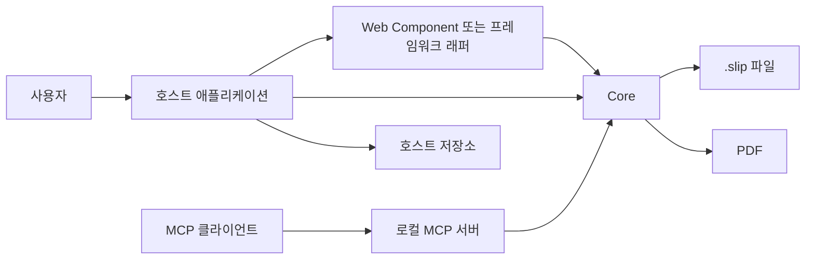

# SYS-001 시스템 개요와 적용 범위

최종 갱신: 2026-09-28

## 개요

SlipKit은 전표 양식을 만들고, 양식에 값을 입력해 전표를 작성하며, 같은 데이터를 PDF로 출력하는
임베드형 라이브러리입니다. 독립 업무 시스템이나 서버가 아니라 호스트 애플리케이션에 포함되는
구성 요소이며, 데이터 교환 기준은 JSON 기반 `.slip` 파일입니다.

## 변경 이력

| 날짜 | 구분 | 변경 내용 |
| --- | --- | --- |
| 2026-09-28 | 신규 작성 | 제품의 목적, 사용자, 시스템 경계와 주요 데이터 흐름을 정의했습니다. |

## 시스템 목적과 적용 범위

SlipKit은 다음 세 흐름을 하나의 파일 형식과 렌더링 규칙으로 연결합니다.

| 흐름 | 입력 | 결과 |
| --- | --- | --- |
| 양식 설계 | 빈 양식 또는 기존 양식 | 검증된 양식 `.slip` |
| 전표 작성 | 양식 또는 작성 중 전표와 업무 값 | 양식 스냅샷을 포함한 전표 `.slip` |
| 조회·출력 | 양식 또는 전표 | 읽기 전용 화면과 PDF 바이트 |

업무별 승인 절차, 사용자 계정, 권한, 서버 저장, 감사 기록과 전자서명은 범위에 포함하지 않습니다.
호스트는 SlipKit이 반환한 파일과 이벤트를 업무 흐름에 연결합니다.

## 시스템 구성

`core`는 파일 검증, 수식, 레이아웃, PDF와 암호화를 담당합니다. `elements`는 브라우저 UI를,
`react`와 `vue`는 프레임워크 연결을, `mcp`는 로컬 파일 작업을 위한 AI 도구를 제공합니다.

## 주요 사용자와 책임

| 주체 | 책임 |
| --- | --- |
| 양식 설계자 | 업무 양식, 파라미터, 수식과 출력 배치를 정의합니다. |
| 전표 작성자 | 양식에 값을 입력하고 전표를 작성하거나 발행합니다. |
| 조회 사용자 | 저장된 전표를 확인하고 PDF를 출력합니다. |
| 호스트 개발자 | 인증, 권한, 저장, 화면 전환, 오류 복구와 외부 자원을 연결합니다. |
| MCP 사용자 | 허용된 작업 디렉터리에서 AI 도구 호출을 승인하고 결과를 확인합니다. |

## 공통 제약

- `.slip` 파일의 규범은 [파일 형식 명세](../../SPEC.md)이며 구현 내부 자료형은 공개 계약이 아닙니다.
- 전표는 작성 시점의 양식 스냅샷을 포함하여 원본 양식이 바뀌어도 다시 출력할 수 있습니다.
- 브라우저와 Node.js는 같은 Core 검증과 렌더링 경로를 사용합니다.
- 발행 상태는 UI 편집 잠금이며 신원 확인이나 법적 발행 증명을 뜻하지 않습니다.
- 수식은 전용 파서와 평가기로 실행하며 JavaScript 코드를 실행하지 않습니다.

## 관련 설계

| 구분 | 식별자 | 관계 |
| --- | --- | --- |
| 공통 | SYS-002 | 패키지별 책임과 의존 방향을 정의합니다. |
| 데이터 | DAT-001·DAT-002·DAT-003 | 양식과 전표의 최상위 구조를 정의합니다. |
| 기능 | FNC-001·FNC-003·FNC-013 | 파일 검증, 전표 조립과 PDF 생성을 담당합니다. |
| 인터페이스 | IF-001·IF-004·IF-009 | Core, UI와 MCP의 공개 경계를 정의합니다. |

## 근거

- [아키텍처 1~5](../../ARCHITECTURE.md)
- [요구사항 2~3](../../REQUIREMENTS.md)
- [ADR-001·002·006·007](../../DECISIONS.md)
