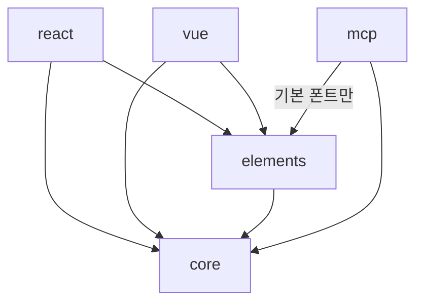

# SYS-002 패키지 구성과 책임

최종 갱신: 2026-09-28

## 개요

SlipKit의 다섯 공개 패키지가 맡는 책임과 허용되는 의존 방향을 정의합니다. 패키지 경계는 실행
환경과 기능 책임을 분리하며, 같은 기능을 여러 패키지에서 다시 구현하지 않습니다.

## 변경 이력

| 날짜 | 구분 | 변경 내용 |
| --- | --- | --- |
| 2026-09-28 | 신규 작성 | 공개 패키지의 책임, 의존 방향과 내부 구현 경계를 정의했습니다. |

## 패키지 책임

| 패키지 | 책임 | 주요 실행 환경 |
| --- | --- | --- |
| `@omdc-slipkit/core` | 파일 형식, 검증, 수식, 레이아웃, PDF, 암호화, 저장소 인터페이스 | 브라우저·Node.js |
| `@omdc-slipkit/elements` | 디자이너·작성 폼·뷰어, IndexedDB, 파일 열기·내려받기, 기본 폰트 | 브라우저 |
| `@omdc-slipkit/react` | Web Component 속성·이벤트를 React 계약으로 연결 | 브라우저 |
| `@omdc-slipkit/vue` | Web Component 속성·이벤트를 Vue 계약으로 연결 | 브라우저 |
| `@omdc-slipkit/mcp` | stdio MCP 서버, 제한된 파일 저장소, 설정·PDF 링크 서버 | Node.js |

## 의존 방향

`core`는 다른 SlipKit 공개 패키지에 의존하지 않습니다. React와 Vue 래퍼는 UI나 도메인 기능을
재구현하지 않습니다. MCP가 `elements`를 사용하는 범위는 사용자 지정 폰트가 없을 때 동봉 폰트를
읽는 경로로 제한합니다.

## 공개 계약과 내부 구현

패키지의 `exports`에 포함된 진입점과 타입만 공개 계약입니다. Zod, pdfme, fontkit, Lit과 내부
렌더링 모델은 교체할 수 있는 구현 세부 사항입니다. 호스트는 내부 경로를 가져오거나 PDF 엔진의
자료형을 저장하지 않습니다.

공개 계약을 바꿀 때는 tarball 공개 export 허용 목록, TypeScript 선언, 소비자 설치 시험과 관련
가이드를 함께 갱신합니다.

## 데이터 전달 원칙

- UI 구성 요소의 입력은 직렬화한 `.slip` JSON이며 변경 결과는 사용자 정의 이벤트로 전달합니다.
- Core 공개 함수와 인스턴스 API는 검증된 `SlipFile`을 주고받습니다.
- 저장소 구현은 `StorageAdapter` 경계를 따릅니다.
- MCP는 전체 파일을 임의 수정하지 않고 공개 도구 스키마와 편집 연산을 통해 Core 검증을 거칩니다.

## 관련 설계

| 구분 | 식별자 | 관계 |
| --- | --- | --- |
| 공통 | SYS-003·SYS-004 | 실행 환경과 신뢰 경계를 구체화합니다. |
| 인터페이스 | IF-001~IF-010 | 패키지별 공개 진입점을 정의합니다. |
| 기능 | FNC-019~FNC-025 | UI와 MCP의 조정 기능을 정의합니다. |

## 근거

- [아키텍처 3](../../ARCHITECTURE.md)
- [ADR-002·003·025·057·061](../../DECISIONS.md)
- `package.json`, `packages/*/package.json`
