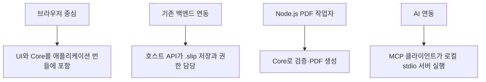

# SYS-003 실행 환경과 배포 구성

최종 갱신: 2026-09-28

## 개요

브라우저, Node.js와 다른 언어의 백엔드에서 SlipKit을 배치하는 방법과 환경별 책임을 정의합니다.
SlipKit은 호스트의 배포 구조에 포함되며 별도 원격 서비스로 배포되지 않습니다.

## 변경 이력

| 날짜 | 구분 | 변경 내용 |
| --- | --- | --- |
| 2026-09-28 | 신규 작성 | 지원 실행 환경, 배포 형태와 환경별 제한을 정의했습니다. |

## 실행 환경

| 환경 | 사용할 수 있는 기능 | 제한 |
| --- | --- | --- |
| 브라우저 | 설계·작성·조회 UI, 검증, 수식, PDF, IndexedDB, Web Crypto | DOM이 필요한 패키지는 서버에서 사용할 수 없습니다. |
| Node.js | Core 검증·수식·PDF·암호화, MCP 서버와 파일 저장소 | UI 패키지를 렌더링하지 않습니다. |
| 다른 언어의 백엔드 | JSON 저장·전송, 공개 JSON Schema 검증 | 마이그레이션과 교차 필드 검증은 동등하게 구현해야 합니다. |

지원 Node.js 버전과 브라우저 범위는 각 패키지의 `engines`, 빌드 설정과 CI 행렬을 기준으로 합니다.
공개 패키지는 ESM을 기준으로 하며 Core의 CommonJS 소비 경로는 공개 export 설정으로 제공합니다.

## 배포 형태

브라우저에서 PDF를 만들 수 있지만 대량 출력이나 중앙 저장이 필요하면 호스트가 Node.js 작업자를
구성합니다. MCP 서버는 사용자의 로컬 작업 디렉터리를 다루며 외부 네트워크 서비스를 대신하지
않습니다.

## 패키지 배포

- 다섯 공개 패키지는 같은 버전으로 배포합니다.
- Release 실행의 `prepare` 작업이 만든 원본 tarball을 `publish` 작업이 그대로 사용합니다.
- 배포 전 tarball의 export, 타입, Node.js 하한과 깨끗한 npm·pnpm 소비자 설치를 검사합니다.
- 일부 패키지 배포가 실패하면 같은 실행에서 실패한 작업만 다시 실행하며 이미 성공한 tarball을
  다시 만들지 않습니다.

## 호스트 구성

호스트는 폰트, 저장소, 암호화 키와 로케일을 실행 환경에 맞게 제공합니다. 웹 서버의 CSP, CORS,
인증과 파일 다운로드 정책도 호스트가 정합니다. 패키지에 포함된 데모 키나 브라우저 저장소는 운영
보안 체계를 대신하지 않습니다.

## 관련 설계

| 구분 | 식별자 | 관계 |
| --- | --- | --- |
| 공통 | SYS-002·SYS-004·SYS-006 | 패키지, 보안과 설정 경계를 정의합니다. |
| 인터페이스 | IF-008·IF-010 | 프레임워크와 MCP 실행 진입점을 정의합니다. |
| 데이터 | DAT-001·DAT-010·DAT-011 | 배포 환경에서 교환하고 보관하는 데이터를 정의합니다. |

## 근거

- [아키텍처 6·13](../../ARCHITECTURE.md)
- [요구사항 4](../../REQUIREMENTS.md)
- [배포 안내](../../RELEASE.md)
- [ADR-057·079·084](../../DECISIONS.md)
