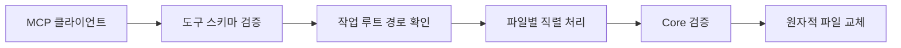

# SYS-004 보안과 신뢰 경계

최종 갱신: 2026-09-28

## 개요

SlipKit이 검사하는 입력 경계와 호스트 애플리케이션이 책임지는 보안 통제를 구분합니다. 파일 검증과
암호화는 제공하지만 사용자 신원, 권한과 업무 승인을 판단하지 않습니다.

## 변경 이력

| 날짜 | 구분 | 변경 내용 |
| --- | --- | --- |
| 2026-09-28 | 신규 작성 | 파일, 수식, 이미지, 저장소, MCP와 암호화의 신뢰 경계를 정의했습니다. |

## 신뢰 경계

| 경계 | SlipKit의 처리 | 호스트의 책임 |
| --- | --- | --- |
| 외부 `.slip` 입력 | JSON, 버전, 구조와 의미 규칙 검증 | 파일 출처, 업로드 권한과 보관 정책 |
| 수식 | 전용 문법과 허용 함수만 평가 | 입력값의 업무 적합성과 권한 |
| 이미지·폰트 | 형식, 크기, 서명과 글리프 확인 | 외부 URL 허용 정책, 라이선스와 개인정보 |
| 저장소 | 어댑터 계약과 오류 구분 | 인증, 인가, 동시 수정, 감사와 백업 |
| 암호화 | AES-256-GCM 봉투 생성·복호화 | 키 생성, 배포, 보관, 회전과 폐기 |
| MCP | 작업 루트 경로 제한과 도구 입력 검증 | 도구 실행 승인과 로컬 파일 접근 권한 |

## 파일과 렌더링 입력

외부 파일은 `parseSlipFile()` 또는 동등한 검증을 통과한 뒤 사용합니다. 구조 제한은 과도한 배열,
문자열과 이미지 입력을 거부합니다. 발행 전표에는 외부 URL 이미지를 허용하지 않으며 변동 이미지도
내장된 data URI만 사용할 수 있습니다.

수식은 `eval()`이나 `Function`을 사용하지 않습니다. 수식에서 접근할 수 있는 값은 평가 문맥과
내장 함수로 한정됩니다. 표시 문자열과 값은 HTML로 해석하지 않고 구성 요소의 속성 또는 텍스트로
처리합니다.

## 암호화 경계

암호화는 파일 내용을 읽지 못하게 하고 복호화 시 변조를 감지합니다. 발행자의 신원이나 법적 효력을
증명하지 않습니다. 문자열 암호 문구는 NFC 정규화와 PBKDF2-SHA256을 거치며 원시 키는 정확히
32바이트여야 합니다. 설정 키의 형식은 `createSlipKit()`을 만들 때 검사합니다.

## MCP 경계

MCP는 해석된 작업 루트 밖의 경로와 심볼릭 링크 파일을 처리하지 않습니다. 읽기 응답은 이미지의
Base64 본문을 요약하고, 수정 결과는 전체 파일 검증을 통과한 뒤 저장합니다. MCP 자체에는 사용자
인증이나 원격 네트워크 권한이 없습니다.

## 관련 설계

| 구분 | 식별자 | 관계 |
| --- | --- | --- |
| 데이터 | DAT-009·DAT-010·DAT-011 | 리소스, 암호화 봉투와 MCP 설정을 정의합니다. |
| 기능 | FNC-001·FNC-011·FNC-015·FNC-024·FNC-025 | 경계별 검증과 처리 흐름을 정의합니다. |
| 오류 | ERR-001·ERR-004·ERR-005 | 경계 위반과 실패 전달을 정의합니다. |

## 근거

- [아키텍처 12·14](../../ARCHITECTURE.md)
- [요구사항 14~15](../../REQUIREMENTS.md)
- [파일 형식 명세 6·19·21~22](../../SPEC.md)
- [ADR-004·010·036·053~055·061·064](../../DECISIONS.md)
