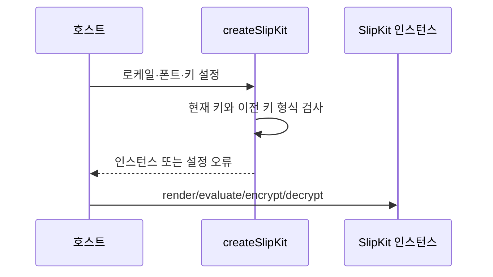

# SYS-006 공통 설정과 생명주기

최종 갱신: 2026-09-28

## 개요

`createSlipKit()`으로 만든 인스턴스가 로케일, 폰트와 암호화 키 설정을 공유하고 UI·저장소·MCP에
전달되는 생명주기를 정의합니다.

## 변경 이력

| 날짜 | 구분 | 변경 내용 |
| --- | --- | --- |
| 2026-09-28 | 신규 작성 | 설정의 생성, 공유, 재사용, 오류와 폐기 경계를 정의했습니다. |

## 설정 항목

| 항목 | 용도 | 생명주기 |
| --- | --- | --- |
| `locale` | 렌더링, 수식 형식과 오류 메시지 언어 | 인스턴스 생성부터 폐기까지 유지 |
| `getFonts` | 비동기 폰트 목록 제공 | 최초 성공 결과를 인스턴스에서 공유 |
| `encryption.key` | 새 파일 암호화와 기본 복호화 | 인스턴스 메모리에만 보관 |
| `encryption.previousKeys` | 이전 키로 만든 파일 복호화 | 현재 키가 맞지 않을 때 순서대로 시도 |

## 생성과 검증

원시 암호화 키가 32바이트가 아니면 인스턴스 생성 시 설정 위치를 포함한 오류가 발생합니다. 폰트
제공 함수는 최초 호출의 진행 중 Promise와 성공 결과를 공유합니다. 조회가 실패하면 실패한 결과를
저장하지 않고 다음 호출에서 다시 시도합니다.

## UI 연결

UI 구성 요소에는 같은 SlipKit 인스턴스를 전달하여 폰트, 로케일과 암호화 설정을 일치시킵니다.
구성 요소가 연결된 뒤 인스턴스를 바꾸면 현재 입력을 새 설정으로 다시 처리해야 하며, 호스트는
구성 요소가 발생시킨 결과를 `src`로 즉시 되돌려 편집 상태를 초기화하지 않습니다.

## 저장소와 MCP 연결

암호화 저장소는 현재 키로 저장하고 현재 키와 이전 키로 읽습니다. MCP 설정 파일에는 키 값이 아닌
환경변수 이름만 기록하며, 실제 키는 서버 프로세스 환경에서 읽습니다. 빈 키나 잘못된 이전 키는
서버 시작 또는 인스턴스 생성 단계에서 거부합니다.

## 갱신과 폐기

설정을 바꿀 때는 새 인스턴스를 만들고 소비자에 명시적으로 전달합니다. 키 교체가 끝나고 이전 파일을
모두 다시 저장한 뒤에만 이전 키를 제거합니다. SlipKit은 키를 영구 저장하거나 보안 메모리 삭제를
보장하지 않으므로 프로세스와 브라우저 세션 관리는 호스트가 담당합니다.

## 관련 설계

| 구분 | 식별자 | 관계 |
| --- | --- | --- |
| 기능 | FNC-014·FNC-015·FNC-022 | 폰트, 암호화와 UI 출력에 설정을 적용합니다. |
| 데이터 | DAT-009·DAT-010·DAT-011 | 설정이 참조하는 자원과 저장 구성을 정의합니다. |
| 인터페이스 | IF-001·IF-004·IF-010 | Core, UI와 MCP 설정 계약을 정의합니다. |

## 근거

- [아키텍처 5·11](../../ARCHITECTURE.md)
- [ADR-056·064](../../DECISIONS.md)
- `packages/core/src/slipkit.ts`
