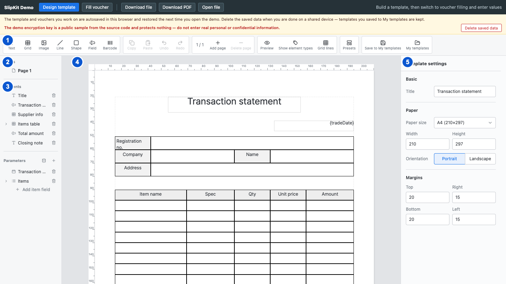

# SCR-001 디자이너 기본 화면

최종 갱신: 2026-09-28

## 개요

양식 설계자가 한 화면에서 페이지를 고르고, 요소와 파라미터를 선택하며, 선택한 대상을 편집하는
디자이너의 전체 배치를 정의합니다. 이 문서는 다섯 화면 영역의 위치와 서로 영향을 주는 선택·전환만
다룹니다.

## 변경 이력

| 날짜 | 구분 | 변경 내용 |
| --- | --- | --- |
| 2026-09-28 | 신규 작성 | 전체 화면의 영역 배치와 영역 사이의 선택·전환 관계를 정의했습니다. |

## 설계 범위

- 상단 도구 모음, 왼쪽 탐색, 캔버스와 오른쪽 속성 패널의 배치와 크기를 정의합니다.
- 페이지·요소·셀·파라미터 선택이 다른 영역의 표시를 어떻게 바꾸는지 정의합니다.
- 개별 버튼, 캔버스 조작과 속성 입력은 각 영역의 상세 설계서에서 정의합니다.
- 데모 상단의 화면 전환 메뉴, 저장 안내와 개인정보 경고는 SCR-016에서 정의합니다.

## 진입·종료 조건

### 진입 조건

- 호스트 애플리케이션이 디자이너 화면을 표시하고 편집할 양식을 전달하면 첫 번째 페이지를 선택한
  편집 화면을 엽니다.
- 편집할 양식이 없으면 편집 영역 대신 "양식이 없습니다" 안내를 표시합니다.
- 전달받은 파일이 손상되었거나 양식이 아닌 전표이면 편집 영역 대신 원인을 설명하는 오류를
  표시합니다.

### 종료 조건

- 호스트 애플리케이션이 디자이너를 다른 화면으로 바꾸면 편집 화면을 닫습니다.
- 다른 양식을 전달받으면 이전 양식의 선택, 실행 취소 기록, 복사 내용과 열린 모달을 지우고 새 양식의
  첫 번째 페이지를 엽니다.
- 미리보기는 디자이너를 닫지 않고 편집 영역을 SCR-013으로 바꿉니다.

## 화면 이미지

파란 번호는 아래 화면 구성 표의 번호와 같습니다. 이미지 위쪽의 데모 메뉴와 안내 문구는 디자이너
밖의 영역입니다.

## 화면 구성

디자이너는 최소 1280×640px에서 사용합니다. 그보다 작은 공간에서는 디자이너 내부를 줄이지 않고
호스트 화면이 바깥 스크롤을 제공합니다. 상단 도구 모음 아래는 왼쪽 176px, 가운데 남은 공간,
오른쪽 300px의 세 열로 나눕니다.

| 번호 | 화면 항목 | 위치와 표시 내용 | 동작과 조건 | 상세 설계 |
| --- | --- | --- | --- | --- |
| 1 | 상단 도구 모음 | 화면 맨 위 전체 너비에 요소 추가, 편집 기록, 페이지, 보기와 저장 명령을 기능별 묶음으로 표시합니다. | 편집 중에는 명령을 실행하고 미리보기 중에는 편집 버튼과 저장 명령만 사용할 수 있습니다. | SCR-017 |
| 2 | 페이지 목록 | 왼쪽 열 위쪽에 양식의 페이지를 저장 순서대로 표시하고 현재 페이지를 강조합니다. | 페이지를 고르면 3번 요소 목록과 4번 캔버스를 같은 페이지로 바꾸고 5번에는 페이지 설정을 표시합니다. | SCR-005 |
| 3 | 요소·파라미터 목록 | 왼쪽 열에서 페이지 목록 아래에 현재 페이지의 요소와 양식 전체의 파라미터를 구분해 표시합니다. | 요소나 파라미터를 고르면 4번과 5번의 선택을 같은 대상으로 맞춥니다. | SCR-003·SCR-009 |
| 4 | 캔버스 | 가운데 열에 현재 페이지의 용지, 눈금자, 요소와 선택 표시를 실제 용지 비율로 표시합니다. | 요소를 고르거나 이동하면 3번 목록과 5번 속성 패널을 같은 대상으로 맞춥니다. | SCR-002·SCR-006 |
| 5 | 속성 패널 | 오른쪽 열에 현재 편집 대상의 이름과 설정을 세로로 표시합니다. | 선택이 없으면 양식 설정, 페이지·요소·셀·파라미터를 고르면 선택한 대상의 설정으로 내용을 바꿉니다. | SCR-004·SCR-006·SCR-008·SCR-009 |

## 이벤트와 호출 기능

| 번호·화면 항목 | 사용자 동작 | 동작과 결과 | 관련 기능 |
| --- | --- | --- | --- |
| 2 페이지 목록 | 페이지를 고릅니다. | 현재 페이지를 바꾸고 요소 선택을 해제합니다. 요소 목록과 캔버스는 선택한 페이지를 표시하며 속성 패널은 그 페이지의 설정으로 바뀝니다. | FNC-019·FNC-020 |
| 3 요소·파라미터 목록 | 요소를 고릅니다. | 캔버스에서 같은 요소를 강조하고 속성 패널에 그 요소의 설정을 표시합니다. 복수 선택이면 공통 조작만 표시합니다. | FNC-020 |
| 3 요소·파라미터 목록 | 파라미터를 고릅니다. | 요소와 셀 선택을 해제하고 속성 패널에 선택한 파라미터의 설정을 표시합니다. | FNC-021 |
| 4 캔버스 | 요소를 고릅니다. | 요소 목록의 같은 항목을 강조하고 속성 패널에 그 요소의 설정을 표시합니다. | FNC-020 |
| 4 캔버스 | 빈 곳을 누릅니다. | 요소·셀·파라미터 선택을 해제하고 속성 패널을 양식 설정으로 바꿉니다. 요소 추가 도구를 선택한 상태라면 빈 곳을 누른 위치에 요소를 만듭니다. | FNC-019·FNC-020 |
| 5 속성 패널 | 유효한 설정값을 확정합니다. | 양식을 변경하고 2~5번 영역 가운데 영향을 받는 표시를 즉시 갱신합니다. | FNC-019·FNC-021 |

## 상태별 표시

| 상태 | 시작 조건 | 화면 표시 | 가능한 다음 동작 |
| --- | --- | --- | --- |
| 양식 없음 | 편집할 양식이 전달되지 않았습니다. | 다섯 영역 대신 화면 가운데에 양식이 없다는 안내를 표시합니다. | 호스트 애플리케이션이 양식을 전달하면 편집 화면을 엽니다. |
| 양식 읽기 실패 | 전달받은 파일을 읽거나 검증할 수 없습니다. | 다섯 영역 대신 화면 가운데에 실패 원인을 붉은 문구로 표시합니다. | 호스트 애플리케이션이 정상 양식을 다시 전달하면 편집 화면을 엽니다. |
| 편집 기본 | 양식을 열었고 선택한 대상이 없습니다. | 첫 페이지와 그 페이지의 요소를 표시하며 속성 패널에는 양식 설정을 표시합니다. | 페이지·요소·파라미터 선택, 요소 추가와 미리보기를 실행할 수 있습니다. |
| 대상 선택 | 페이지, 요소, 셀 또는 파라미터를 골랐습니다. | 목록, 캔버스와 속성 패널에서 같은 대상을 표시합니다. | 선택 변경, 대상 편집, 실행 취소와 미리보기를 실행할 수 있습니다. |
| 모달 열림 | 수식, 이미지, 샘플 값 또는 저장 모달을 열었습니다. | 편집 화면 위에 모달과 반투명 배경을 표시합니다. | 모달 안의 입력, 적용, 취소와 닫기만 실행할 수 있습니다. |
| 미리보기 | 미리보기를 실행했습니다. | 상단 도구 모음 아래를 PDF 생성 중, PDF 결과 또는 생성 오류로 표시합니다. | 편집으로 돌아가거나 저장 명령을 실행할 수 있습니다. |

## 입력 검증과 오류 표시

| 발생 위치 | 발생 조건 | 표시 방법 | 처리와 복구 |
| --- | --- | --- | --- |
| 화면 전체 | 편집할 파일이 없거나 읽을 수 없거나 양식이 아닙니다. | 다섯 영역을 숨기고 화면 가운데에 안내 또는 붉은 오류를 표시합니다. | 이전 편집 상태를 지웁니다. 정상 양식을 다시 전달받으면 첫 페이지에서 시작합니다. |

속성 입력, 캔버스, 모달과 미리보기에서 발생하는 오류의 위치와 복구 방법은 각 영역의 상세 설계서에서
정의합니다. 하위 영역의 오류는 다섯 영역 전체를 오류 화면으로 바꾸지 않습니다.

## 화면 전이

| 사용자 동작 | 화면 변화 | 유지하는 내용 | 초기화하는 내용 |
| --- | --- | --- | --- |
| 페이지를 고릅니다. | 2~5번 영역이 선택한 페이지와 페이지 설정으로 바뀝니다. | 양식과 실행 취소 기록 | 요소·셀·파라미터 선택 |
| 요소 또는 셀을 고릅니다. | 목록과 캔버스의 선택을 맞추고 5번에 대상 설정을 표시합니다. | 현재 페이지와 캔버스 스크롤 | 이전 편집 대상의 임시 입력 오류 |
| 파라미터를 고릅니다. | 5번에 파라미터 설정을 표시합니다. | 양식, 현재 페이지와 캔버스 스크롤 | 요소와 셀 선택 |
| 다른 양식을 엽니다. | 새 양식의 첫 페이지를 표시하거나 양식 없음·오류 상태로 바뀝니다. | 새 양식의 내용 | 이전 양식, 선택, 실행 취소 기록, 복사 내용과 열린 모달 |

## 키보드와 접근성

- 다섯 영역은 키보드로 이동할 수 있는 순서가 화면의 위쪽에서 아래쪽, 왼쪽에서 오른쪽으로 이어져야
  합니다.
- 모달을 열면 초점을 모달 안에 두고 닫으면 모달을 연 버튼으로 되돌립니다.
- 선택 상태는 색만으로 구분하지 않고 테두리, 눌림 상태와 접근 가능한 이름을 함께 제공합니다.
- 세부 단축키와 메뉴 조작은 SCR-002, SCR-003과 SCR-017에서 정의합니다.

## 관련 데이터·인터페이스·오류

| 구분 | 식별자 | 관계 |
| --- | --- | --- |
| 데이터 | DAT-002 | 페이지, 용지와 양식 설정을 표시하고 수정합니다. |
| 데이터 | DAT-004 | 캔버스 요소의 공통 위치와 스타일을 표시하고 수정합니다. |
| 데이터 | DAT-006 | 파라미터 정의와 샘플 값을 표시하고 수정합니다. |
| 인터페이스 | IF-005 | 호스트가 양식을 전달하고 변경 결과를 받는 경계를 정의합니다. |
| 오류 | ERR-001 | 양식 파일을 읽거나 검증하지 못한 상태를 표시합니다. |
| 오류 | ERR-003 | PDF 미리보기의 배치와 렌더링 실패를 표시합니다. |
| 오류 | ERR-005 | 입력, 모달과 저장소 조작 실패를 화면에 표시합니다. |

## 근거

- `packages/elements/src/slip-designer.ts`
- `packages/elements/src/designer/render/toolbar.ts`
- `packages/elements/src/designer/render/sidebar.ts`
- `packages/elements/src/designer/render/property-panel.ts`
- `packages/elements/src/styles/designer/sidebar.styles.ts`
