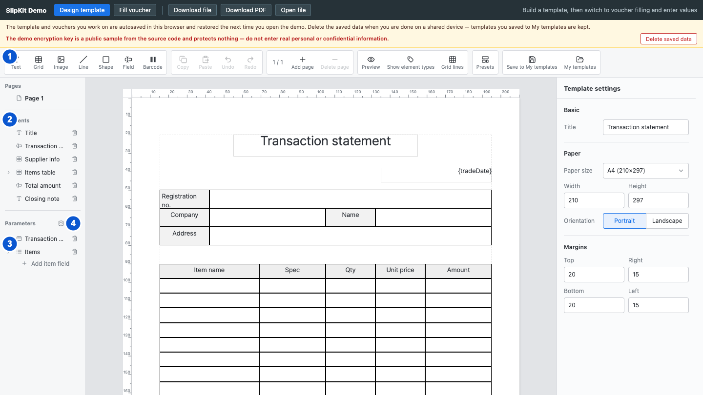

# SCR-003 요소 목록과 추가

최종 갱신: 2026-09-28

## 개요

디자이너 왼쪽에서 페이지, 현재 페이지의 요소와 양식의 파라미터를 찾고 선택하는 화면을 정의합니다.
요소 생성 명령은 상단 도구 모음에 있으며, 새 요소의 실제 위치는 캔버스에서 정합니다.

## 변경 이력

| 날짜 | 구분 | 변경 내용 |
| --- | --- | --- |
| 2026-09-28 | 신규 작성 | 번호별 목록 영역과 선택, 펼치기, 추가, 삭제 동작을 각각 정의했습니다. |

## 진입·종료 조건

### 진입 조건

- SCR-001에서 유효한 양식을 편집 상태로 열면 왼쪽 탐색 영역을 표시합니다.
- 현재 페이지가 정해져 있으면 해당 페이지의 요소만 요소 목록에 표시합니다.

### 종료 조건

- 미리보기 버튼을 누르면 왼쪽 탐색 영역을 숨기고 SCR-013을 표시합니다.
- 호스트가 `src`를 비우거나 `<slip-designer>`를 제거하면 이 화면을 종료합니다.

## 화면 이미지

## 화면 구성

| 번호 | 화면 항목 | 표시 내용 | 표시 조건 | 활성화 조건 |
| --- | --- | --- | --- | --- |
| 1 | 요소 생성 도구 | 글자, 그리드, 이미지, 선, 도형, 입력 필드와 바코드 생성 도구를 표시합니다. | 편집 상태의 상단 도구 모음에 표시합니다. | 모달이 닫혀 있을 때 도구 하나를 선택할 수 있습니다. |
| 2 | 요소 목록 | 현재 페이지의 요소 종류, 이름과 수식 경고를 문서 순서대로 표시합니다. 펼친 그리드에는 값이 있는 셀을 하위 항목으로 표시합니다. | 편집 상태에서 표시합니다. | 요소와 표시된 하위 셀을 선택할 수 있습니다. |
| 3 | 파라미터 목록 | 표시 이름, 값 종류와 목록 하위 필드를 계층으로 표시합니다. | 편집 상태에서 표시합니다. | 파라미터와 표시된 하위 필드를 선택할 수 있습니다. |
| 4 | 파라미터 명령 | 샘플 값 편집 버튼과 파라미터 추가 버튼을 표시합니다. | 편집 상태에서 표시합니다. | 모달이 닫혀 있을 때 사용할 수 있습니다. |

## 이벤트와 호출 기능

| 화면 항목 | 사용자 동작 | 호출 기능 | 결과 | 실행할 수 없는 조건 |
| --- | --- | --- | --- | --- |
| 페이지 항목 | 페이지를 고릅니다. | FNC-019 | 해당 페이지를 현재 페이지로 만들고 캔버스와 요소 목록을 갱신합니다. | 미리보기 또는 모달 상태 |
| 페이지 항목 | 포인터를 올립니다. | FNC-022 | 용지 비율과 요소 위치를 축소한 페이지 미리보기를 목록 옆에 표시합니다. | 미리보기 상태 |
| 페이지 항목 | 키보드 초점을 둡니다. | FNC-022 | 용지 비율과 요소 위치를 축소한 페이지 미리보기를 목록 옆에 표시합니다. | 미리보기 상태 |
| 요소 항목 | 요소를 고릅니다. | FNC-020 | 기존 선택을 지우고 해당 요소를 캔버스와 속성 패널에서 선택합니다. | 미리보기 또는 모달 상태 |
| 요소 항목 | Ctrl 또는 Command를 누른 채 요소를 고릅니다. | FNC-020 | 기존 선택에 해당 요소를 추가하거나 제거합니다. | 미리보기 또는 모달 상태 |
| 요소 항목 | Shift를 누른 채 요소를 고릅니다. | FNC-020 | 기존 선택에 해당 요소를 추가하거나 제거합니다. | 미리보기 또는 모달 상태 |
| 요소 펼치기 버튼 | 버튼을 누릅니다. | FNC-022 | 값이 있는 그리드 셀 하위 목록을 펼치거나 접습니다. | 하위 셀이 없는 요소 |
| 그리드 셀 항목 | 셀을 고릅니다. | FNC-021 | 해당 그리드와 셀을 선택하고 오른쪽에 셀 속성을 표시합니다. | 미리보기 또는 모달 상태 |
| 요소 삭제 버튼 | 버튼을 누릅니다. | FNC-019 | 해당 요소를 현재 페이지에서 제거하고 선택을 정리합니다. | 미리보기 또는 모달 상태 |
| 샘플 값 버튼 | 버튼을 누릅니다. | FNC-021 | SCR-010을 폼 탭의 첫 페이지로 엽니다. | 다른 모달이 열린 상태 |
| 파라미터 추가 버튼 | 버튼을 누릅니다. | FNC-021 | 고유한 기본 키를 가진 새 문자열 파라미터를 추가하고 선택합니다. | 다른 모달이 열린 상태 |
| 파라미터 항목 | 파라미터를 고릅니다. | FNC-021 | 오른쪽에 해당 파라미터의 속성을 표시합니다. | 미리보기 또는 모달 상태 |
| 파라미터 펼치기 버튼 | 버튼을 누릅니다. | FNC-022 | 목록 파라미터의 하위 필드를 펼치거나 접습니다. | 하위 필드가 없는 파라미터 |
| 하위 필드 항목 | 하위 필드를 고릅니다. | FNC-021 | 오른쪽에 해당 하위 필드의 속성을 표시합니다. | 미리보기 또는 모달 상태 |
| 하위 필드 추가 버튼 | 버튼을 누릅니다. | FNC-021 | 목록 파라미터에 고유한 기본 키를 가진 문자열 하위 필드를 추가합니다. | 선택한 파라미터가 목록이 아닌 상태 |
| 파라미터 삭제 버튼 | 버튼을 누릅니다. | FNC-021 | 아무 요소도 사용하지 않는 명시적 정의를 삭제합니다. 요소가 사용 중이면 정의를 유지하고 오른쪽 속성 패널 위쪽에 오류를 표시합니다. | 명시적 정의가 없는 상태 |
| 하위 필드 삭제 버튼 | 버튼을 누릅니다. | FNC-021 | 하위 필드 정의를 삭제하고, 같은 목록을 반복하는 그리드의 항목 셀에서 해당 파라미터 연결을 제거합니다. | 미리보기 또는 모달 상태 |

## 상태별 표시

| 상태 | 진입 조건 | 표시 내용 | 허용 동작 |
| --- | --- | --- | --- |
| 빈 요소 목록 | 현재 페이지에 요소가 없습니다. | 요소 목록에 대시 한 개를 표시합니다. | 상단 도구 모음에서 요소를 추가할 수 있습니다. |
| 요소 선택 | 요소 항목 또는 캔버스 요소를 골랐습니다. | 같은 요소 행을 선택 색으로 강조합니다. | 추가 선택, 삭제와 속성 편집을 사용할 수 있습니다. |
| 셀 선택 | 그리드 하위 셀을 골랐습니다. | 셀 행을 강조하고 상위 그리드 행의 단일 선택 강조는 해제합니다. | 다른 셀 선택과 셀 속성 편집을 사용할 수 있습니다. |
| 수식 경고 | 요소 또는 셀의 수식을 현재 샘플 값으로 계산할 수 없습니다. | 해당 행에 경고 아이콘과 접근 가능한 경고 이름을 표시합니다. | 항목을 선택해 수식을 고칠 수 있습니다. |
| 빈 파라미터 목록 | 정의되거나 요소에서 유추된 파라미터가 없습니다. | 파라미터 목록에 대시 한 개를 표시합니다. | 파라미터 추가와 샘플 값 편집을 사용할 수 있습니다. |
| 유추된 파라미터 | 요소가 키를 참조하지만 정의가 없습니다. | 값 종류 배지와 항목을 표시하고 삭제 버튼은 비활성화합니다. | 항목을 선택해 정의를 만들거나 참조 요소를 수정할 수 있습니다. |

## 입력 검증과 오류 표시

| 검사 대상 | 실패 조건 | 표시 위치와 표현 | 문서·화면 처리 | 복구 방법 |
| --- | --- | --- | --- | --- |
| 요소 수식 | 수식 문법, 참조 또는 계산 문맥이 올바르지 않습니다. | 요소 행 오른쪽에 경고 아이콘을 표시하고 아이콘 이름에 오류가 있음을 알립니다. | 요소를 삭제하거나 숨기지 않고 현재 문서를 유지합니다. | 요소를 선택하고 SCR-007에서 수식을 고칩니다. |
| 셀 수식 | 선택 가능한 그리드 셀의 수식을 계산할 수 없습니다. | 셀 행 오른쪽에 경고 아이콘을 표시합니다. | 셀과 그리드 구조를 유지합니다. | 셀을 선택하고 SCR-007에서 수식을 고칩니다. |
| 사용 중인 파라미터 삭제 | 하나 이상의 요소가 해당 파라미터를 사용합니다. | 오른쪽 속성 패널 위쪽에 사용 중인 요소 이름과 페이지를 포함한 오류를 표시합니다. | 파라미터 정의와 참조를 모두 유지합니다. | 표시된 요소의 참조를 제거한 뒤 다시 삭제합니다. |

## 화면 전이

| 시작 상태 | 사용자 동작 | 도착 화면·상태 | 유지 항목 | 초기화 항목 |
| --- | --- | --- | --- | --- |
| 페이지 목록 | 페이지를 고릅니다. | SCR-002의 해당 페이지 | 양식과 실행 취소 기록 | 요소, 셀과 파라미터 선택 |
| 요소 목록 | 요소를 고릅니다. | SCR-004의 요소 속성 | 현재 페이지와 캔버스 스크롤 | 이전 편집 대상 |
| 그리드 하위 셀 | 셀을 고릅니다. | SCR-006의 셀 속성 | 현재 페이지와 상위 그리드 | 다른 요소 선택 |
| 파라미터 목록 | 파라미터를 고릅니다. | SCR-009의 파라미터 속성 | 양식과 현재 페이지 | 요소와 셀 선택 |
| 파라미터 목록 | 샘플 값 버튼을 누릅니다. | SCR-010의 폼 탭 | 양식, 선택과 캔버스 스크롤 | 이전 샘플 모달 초안과 오류 |

## 관련 데이터·인터페이스·오류

| 구분 | 식별자 | 관계 |
| --- | --- | --- |
| 데이터 | DAT-002 | 페이지 목록과 현재 페이지를 표시합니다. |
| 데이터 | DAT-004 | 현재 페이지의 요소 종류와 이름을 표시합니다. |
| 데이터 | DAT-005 | 그리드의 값이 있는 셀을 하위 항목으로 표시합니다. |
| 데이터 | DAT-006 | 파라미터와 목록 하위 필드를 표시하고 수정합니다. |
| 인터페이스 | IF-005 | 변경된 양식을 `slip-change`로 알립니다. |
| 오류 | ERR-002 | 요소와 셀의 수식 경고를 표시합니다. |

## 근거

- `packages/elements/src/designer/render/sidebar.ts`
- `packages/elements/src/designer/parameters.ts`
- `packages/elements/src/slip-designer.ts`
