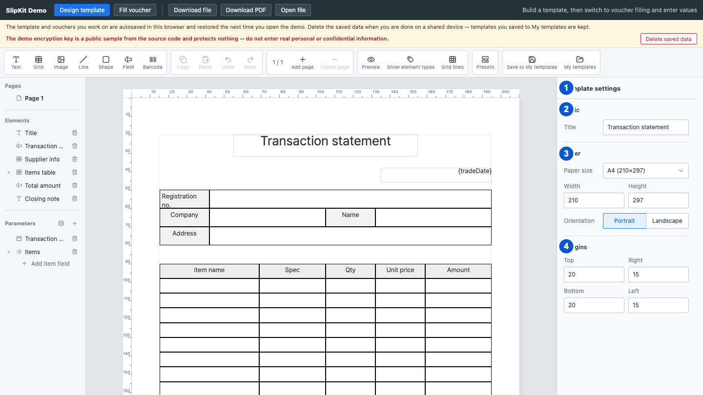

# SCR-004 속성 패널

최종 갱신: 2026-09-28

## 개요

디자이너 오른쪽에서 현재 편집 대상의 설정을 보고 바꾸는 화면을 정의합니다. 선택 대상은 양식, 페이지,
단일 요소, 여러 요소, 그리드 셀, 파라미터 또는 목록 하위 필드 중 하나입니다.

## 변경 이력

| 날짜 | 구분 | 변경 내용 |
| --- | --- | --- |
| 2026-09-28 | 신규 작성 | 선택 대상별 화면, 입력 반영, 오류 위치와 다른 편집 화면으로의 전이를 정의했습니다. |

## 진입·종료 조건

### 진입 조건

- SCR-001이 편집 상태이면 오른쪽에 속성 패널을 항상 표시합니다.
- 선택한 대상이 없으면 양식 설정을 표시합니다.
- 왼쪽 목록 또는 캔버스에서 대상을 고르면 오른쪽 패널의 내용을 지우고 선택한 대상의 설정을 표시합니다.

### 종료 조건

- 미리보기 버튼을 누르면 속성 패널을 숨기고 SCR-013을 표시합니다.
- 호스트가 유효한 양식을 제거하거나 디자이너를 제거하면 이 화면을 종료합니다.

## 화면 이미지

## 화면 구성

| 번호 | 화면 항목 | 표시 내용 | 표시 조건 | 활성화 조건 |
| --- | --- | --- | --- | --- |
| 1 | 패널 제목 | 양식, 페이지, 요소 종류, 여러 요소, 셀 또는 파라미터처럼 현재 편집 대상을 표시합니다. | 편집 상태에서 항상 표시합니다. | 표시 전용입니다. |
| 2 | 기본 설정 | 양식·페이지·요소의 이름, 파라미터 키, 셀과 입력 필드의 값 원본처럼 선택 대상의 기본 설정을 표시합니다. | 선택 대상이 해당 설정을 가질 때 표시합니다. | 모달이 닫혀 있고 해당 입력이 비활성화되지 않았을 때 수정할 수 있습니다. |
| 3 | 용지 또는 배치 설정 | 양식에서는 용지 크기와 방향을, 요소에서는 기준점, 좌표, 크기와 출력 페이지 조건을 표시합니다. | 선택 대상에 맞는 설정이 있을 때 표시합니다. | 허용 범위 안에서 수정할 수 있습니다. |
| 4 | 대상별 추가 설정 | 양식이면 여백과 기본 글꼴, 글자·입력 필드이면 글자와 조건부 서식, 그리드이면 반복과 행 구간, 이미지이면 원본 종류를 표시합니다. | 선택 대상이 해당 설정을 가질 때 표시합니다. | 반복 목록이나 고정 이미지처럼 해당 설정에 필요한 값이 있을 때 수정할 수 있습니다. |

## 이벤트와 호출 기능

| 화면 항목 | 사용자 동작 | 호출 기능 | 결과 | 실행할 수 없는 조건 |
| --- | --- | --- | --- | --- |
| 텍스트 입력 | 값을 입력하고 변경을 확정합니다. | FNC-019, FNC-021 | 값을 검증한 뒤 양식에 반영하고 캔버스를 갱신합니다. | 필수값이 비었거나 값 형식이 올바르지 않은 상태 |
| 숫자 입력 | 숫자를 입력하고 변경을 확정합니다. | FNC-019, FNC-021 | 범위를 확인한 뒤 좌표, 크기 또는 종류별 숫자 설정을 반영합니다. | 숫자가 아니거나 허용 범위를 벗어난 상태 |
| 선택 목록 | 항목 하나를 고릅니다. | FNC-019, FNC-021 | 고른 값을 반영하고, 그 값에만 필요한 입력을 바로 아래에 표시합니다. | 선택할 항목이 없는 상태 |
| 토글 버튼 | 버튼을 누릅니다. | FNC-019, FNC-021 | 해당 불리언 또는 열거형 설정을 바꾸고 눌림 상태를 갱신합니다. | 선택 대상이 설정을 지원하지 않는 상태 |
| 색상 견본 | 색을 고릅니다. | FNC-019 | 고른 색을 대상 스타일에 반영하고 색상 선택 창을 닫습니다. | 색상 선택 창을 열지 않은 상태 |
| 색상 코드 입력 | 16진수 값을 입력합니다. | FNC-019 | 유효한 색상 코드를 대상 스타일에 반영합니다. | 색상 문자열이 올바르지 않은 상태 |
| 수식 버튼 | 버튼을 누릅니다. | FNC-004, FNC-021 | 현재 필드 또는 셀을 편집 대상으로 삼아 SCR-007을 엽니다. | 선택 대상이 수식을 지원하지 않는 상태 |
| 이미지 선택 버튼 | 버튼을 누릅니다. | FNC-011, FNC-019 | 고정 이미지 요소에 사용할 이미지를 관리하는 SCR-011을 엽니다. | 이미지 요소가 아니거나 변동 이미지 원본인 상태 |
| 출력 보기 버튼 | 버튼을 누릅니다. | FNC-007 | 선택한 반복 그리드를 원본 행 보기와 출력 결과 보기 사이에서 전환합니다. | 반복 설정이 없는 그리드 또는 셀 선택 상태 |
| 조건부 서식 추가 버튼 | 버튼을 누릅니다. | FNC-009, FNC-021 | 현재 요소 또는 셀에 빈 조건부 서식 규칙을 추가합니다. | 조건부 서식을 지원하지 않는 대상 |
| 기본값으로 되돌리기 버튼 | 버튼을 누릅니다. | FNC-019 | 대상에 저장한 개별 스타일을 지우고 상위 설정을 물려받게 합니다. | 개별 설정이 없는 상태 |

## 상태별 표시

| 상태 | 진입 조건 | 표시 내용 | 허용 동작 |
| --- | --- | --- | --- |
| 양식 설정 | 선택한 대상이 없습니다. | 양식 이름, 용지, 여백과 기본 글꼴 설정을 표시합니다. | 양식 전체 설정을 수정할 수 있습니다. |
| 페이지 설정 | 왼쪽 페이지 항목을 골랐습니다. | 페이지 이름과 페이지별 설정을 표시합니다. | 현재 페이지 설정을 수정할 수 있습니다. |
| 단일 요소 설정 | 요소 하나를 골랐습니다. | 공통 배치와 해당 요소 종류의 설정을 표시합니다. | 요소의 모든 지원 설정을 수정할 수 있습니다. |
| 여러 요소 설정 | 요소를 둘 이상 골랐습니다. | 정렬, 분배와 공통 이동처럼 여러 요소에 적용하는 설정을 표시합니다. | 선택 요소 전체에 명령을 적용할 수 있습니다. |
| 그리드 셀 설정 | 그리드 셀을 골랐습니다. | 셀 값 원본, 행 높이, 열 너비, 병합, 스타일과 조건부 서식을 표시합니다. | 선택한 셀의 설정을 수정할 수 있습니다. |
| 파라미터 설정 | 파라미터를 골랐습니다. | 표시 이름, 키와 값 종류를 표시합니다. | 정의와 연결된 참조를 함께 수정할 수 있습니다. |
| 하위 필드 설정 | 목록 파라미터의 하위 필드를 골랐습니다. | 하위 필드의 표시 이름, 키와 값 종류를 표시합니다. | 목록에 허용되는 값 종류 안에서 수정할 수 있습니다. |

## 입력 검증과 오류 표시

| 검사 대상 | 실패 조건 | 표시 위치와 표현 | 문서·화면 처리 | 복구 방법 |
| --- | --- | --- | --- | --- |
| 필수 텍스트 | 양식 제목이나 파라미터 키처럼 비워 둘 수 없는 값이 비었습니다. | 해당 입력을 위험 색으로 표시하고 바로 아래에 오류 문구를 표시합니다. | 잘못된 값을 양식에 반영하지 않습니다. | 비어 있지 않은 값을 입력합니다. 요소·파라미터 표시 이름은 비우면 저장된 이름을 제거하고 키 또는 기본 이름을 표시합니다. |
| 숫자 | 숫자가 아니거나 종류별 최소·최대 범위를 벗어납니다. | 해당 숫자 입력 아래에 허용 범위를 포함한 오류를 표시합니다. | 마지막 유효값을 유지합니다. | 허용 범위의 숫자로 고칩니다. |
| 파라미터 키 | 키가 비었거나 같은 범위의 다른 키와 겹칩니다. | 키 입력 아래에 오류를 표시합니다. | 키와 참조를 변경하지 않습니다. | 비어 있지 않은 고유한 키를 입력합니다. |
| 수식 문법 | 수식을 해석할 수 없거나 함수의 인자 수가 맞지 않습니다. | 수식 입력 아래에 붉은 오류를 표시합니다. | 수식을 대상에 반영하지 않습니다. | SCR-007에서 오류 원인을 확인해 고칩니다. |
| 수식 계산 | 수식 문법은 맞지만 현재 샘플 값으로 계산할 수 없습니다. | 수식 입력 아래에 경고를 표시하고 캔버스 대상과 왼쪽 목록에 경고 배지를 표시합니다. | 수식은 대상에 반영합니다. | SCR-007에서 수식 또는 샘플 값을 고칩니다. |
| 일반 편집 | 한 필드에 연결할 수 없는 문서 변경 오류가 발생합니다. | 패널 맨 위에 위험 색 테두리와 배경을 가진 오류 상자를 표시합니다. | 변경 전 양식과 현재 선택을 유지합니다. | 오류 문구가 가리키는 설정을 고칩니다. |

## 화면 전이

| 시작 상태 | 사용자 동작 | 도착 화면·상태 | 유지 항목 | 초기화 항목 |
| --- | --- | --- | --- | --- |
| 양식 설정 | 페이지를 고릅니다. | 페이지 설정 | 양식과 캔버스 스크롤 | 이전 편집 대상 |
| 모든 설정 상태 | 요소를 고릅니다. | 단일 요소 설정 | 양식과 현재 페이지 | 파라미터와 셀 선택 |
| 단일 요소 설정 | Shift로 다른 요소를 추가 선택합니다. | 여러 요소 설정 | 현재 페이지와 선택 요소 | 단일 요소 전용 입력 오류 |
| 단일 요소 설정 | 그리드 셀을 고릅니다. | SCR-006의 셀 설정 | 상위 그리드와 현재 페이지 | 다른 요소 선택 |
| 수식 지원 설정 | 수식 버튼을 누릅니다. | SCR-007 | 현재 대상, 양식과 입력값 | 이전 수식 모달 초안과 오류 |
| 이미지 설정 | 이미지 선택 버튼을 누릅니다. | SCR-011 | 이미지 요소와 현재 원본 | 이전 파일 선택 오류 |
| 모든 설정 상태 | 미리보기 버튼을 누릅니다. | SCR-013 | 양식, 선택과 패널 스크롤 | 포인터 편집과 열린 메뉴 |

## 관련 데이터·인터페이스·오류

| 구분 | 식별자 | 관계 |
| --- | --- | --- |
| 데이터 | DAT-002 | 양식과 페이지 설정을 표시하고 수정합니다. |
| 데이터 | DAT-004 | 요소의 공통 배치와 스타일을 표시하고 수정합니다. |
| 데이터 | DAT-005 | 요소 종류와 그리드 셀 설정을 표시하고 수정합니다. |
| 데이터 | DAT-006 | 파라미터와 하위 필드 정의를 표시하고 수정합니다. |
| 인터페이스 | IF-005 | 공개 설정과 `slip-change` 이벤트 계약을 사용합니다. |
| 오류 | ERR-002 | 수식과 참조 오류를 표시합니다. |
| 오류 | ERR-005 | 필드 입력과 문서 변경 오류를 표시합니다. |

## 근거

- `packages/elements/src/designer/render/property-panel.ts`
- `packages/elements/src/designer/render/form-props.ts`
- `packages/elements/src/designer/render/element-props.ts`
- `packages/elements/src/designer/render/inputs.ts`
