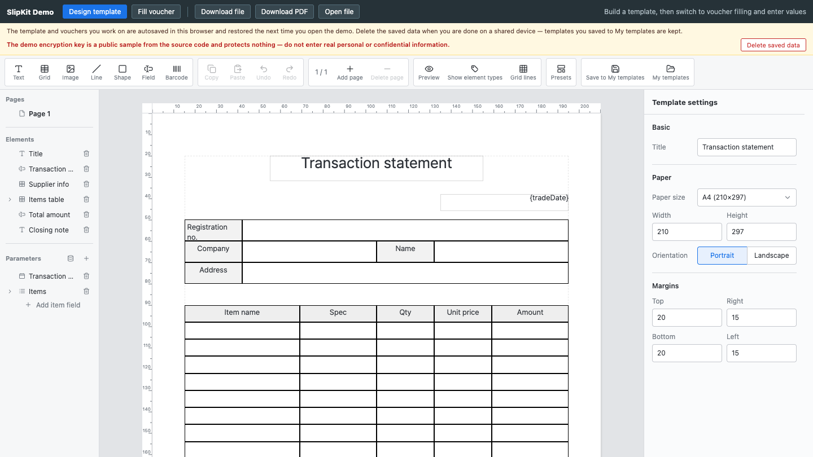

# SCR-005 페이지 관리

최종 갱신: 2026-09-28

## 개요

양식 페이지를 선택·추가·삭제하고 현재 페이지 번호를 관리하는 화면을 정의합니다.

## 변경 이력

| 날짜 | 구분 | 변경 내용 |
| --- | --- | --- |
| 2026-09-28 | 신규 작성 | 페이지 탐색과 추가·삭제 조건을 정의했습니다. |

## 진입·종료 조건

편집 모드에서 양식에 페이지가 하나 이상 있으면 도구 모음과 왼쪽 목록에 표시합니다.

## 화면 이미지

## 화면 영역

| 영역 | 입력·출력 항목 | 표시·활성화 조건 |
| --- | --- | --- |
| 페이지 번호 | 현재 번호와 전체 수 | 항상 표시합니다. |
| 추가·삭제 | 새 빈 페이지, 현재 페이지 삭제 | 마지막 한 페이지는 삭제할 수 없습니다. |
| 페이지 목록 | 페이지별 선택 항목 | 현재 페이지를 강조합니다. |

## 이벤트와 호출 기능

| 사용자 동작 | 호출 기능 | 결과 |
| --- | --- | --- |
| 페이지 선택 | FNC-019 | 캔버스와 요소 목록을 해당 페이지로 바꿉니다. |
| 페이지 추가·삭제 | FNC-019 | 문서와 현재 페이지를 갱신합니다. |

## 상태별 표시

첫 페이지에서도 추가할 수 있으며 페이지가 하나면 삭제를 비활성화합니다. 미리보기에서는 모든 편집
명령을 비활성화합니다.

## 입력 검증과 오류 표시

페이지 수 상한과 페이지 참조 무결성을 검사합니다. 실패하면 현재 페이지를 유지합니다.

## 화면 전이

페이지 선택 뒤 SCR-002 캔버스와 SCR-003 요소 목록이 함께 바뀝니다.

## 관련 데이터·인터페이스·오류

| 구분 | 식별자 | 관계 |
| --- | --- | --- |
| 데이터 | DAT-002 | 페이지 배열을 관리합니다. |
| 인터페이스 | IF-005 | 변경 이벤트를 보냅니다. |
| 오류 | ERR-005 | 페이지 명령 실패를 표시합니다. |

## 근거

- `packages/elements/src/slip-designer.ts`
- `packages/elements/src/designer/controllers/page-plan.ts`
