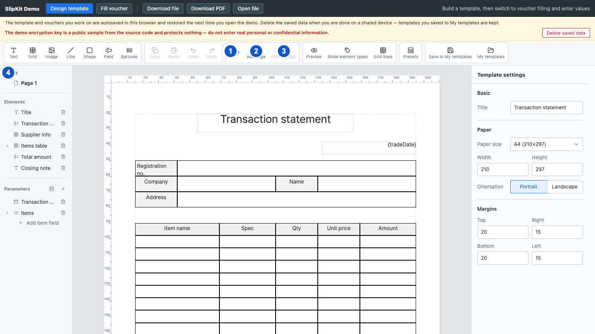

# SCR-005 페이지 관리

최종 갱신: 2026-09-28

## 개요

양식의 페이지 수와 순서를 확인하고, 현재 페이지를 선택하거나 새 페이지를 추가하고 삭제하는 화면을
정의합니다.

## 변경 이력

| 날짜 | 구분 | 변경 내용 |
| --- | --- | --- |
| 2026-09-28 | 신규 작성 | 페이지 표시, 선택, 추가, 삭제와 경계 상태를 개별 동작으로 정의했습니다. |

## 진입·종료 조건

### 진입 조건

- SCR-001에서 유효한 양식을 열면 상단 도구 모음과 왼쪽 목록에 페이지 정보를 표시합니다.
- 양식에는 페이지가 한 개 이상 있어야 하며 첫 진입 시 첫 페이지를 현재 페이지로 선택합니다.

### 종료 조건

- 미리보기 버튼을 누르면 페이지 편집 명령을 비활성화하고 SCR-013을 표시합니다.
- 호스트가 다른 `src`를 넣으면 기존 페이지 선택을 지우고 새 양식의 첫 페이지를 선택합니다.

## 화면 이미지

## 화면 구성

| 번호 | 화면 항목 | 표시 내용 | 표시 조건 | 활성화 조건 |
| --- | --- | --- | --- | --- |
| 1 | 페이지 번호 표시 | 현재 페이지 번호와 전체 페이지 수를 `현재 / 전체` 형식으로 표시합니다. | 유효한 양식이 있을 때 표시합니다. | 표시 전용입니다. |
| 2 | 페이지 추가 버튼 | 현재 페이지 뒤에 빈 페이지를 만드는 아이콘 버튼을 표시합니다. | 유효한 양식이 있을 때 표시합니다. | 편집 상태에서 사용할 수 있습니다. |
| 3 | 페이지 삭제 버튼 | 현재 페이지를 삭제하는 아이콘 버튼을 표시합니다. | 유효한 양식이 있을 때 표시합니다. | 페이지가 둘 이상인 편집 상태에서 사용할 수 있습니다. |
| 4 | 페이지 목록 | 페이지 이름을 문서 순서대로 표시하고 현재 페이지를 강조합니다. 포인터를 올리거나 키보드 초점을 두면 축소 미리보기를 목록 옆에 표시합니다. | 편집 상태에서 표시합니다. | 모달이 닫혀 있을 때 페이지를 선택할 수 있습니다. |

## 이벤트와 호출 기능

| 화면 항목 | 사용자 동작 | 호출 기능 | 결과 | 실행할 수 없는 조건 |
| --- | --- | --- | --- | --- |
| 페이지 항목 | 페이지를 고릅니다. | FNC-019 | 해당 페이지를 현재 페이지로 바꾸고 캔버스, 요소 목록과 속성 패널을 갱신합니다. | 미리보기 또는 모달 상태 |
| 페이지 항목 | 포인터를 올립니다. | FNC-022 | 항목 옆에 페이지 미리보기를 표시합니다. | 미리보기 상태 |
| 페이지 항목 | 키보드 초점을 둡니다. | FNC-022 | 항목 옆에 페이지 미리보기를 표시합니다. | 미리보기 상태 |
| 페이지 추가 버튼 | 버튼을 누릅니다. | FNC-019 | 현재 페이지 뒤에 빈 페이지를 추가하고 새 페이지를 선택합니다. | 미리보기 상태 |
| 페이지 삭제 버튼 | 버튼을 누릅니다. | FNC-019 | 현재 페이지를 삭제하고 삭제 위치에 가장 가까운 남은 페이지를 선택합니다. | 페이지가 하나뿐이거나 미리보기 상태 |

## 상태별 표시

| 상태 | 진입 조건 | 표시 내용 | 허용 동작 |
| --- | --- | --- | --- |
| 단일 페이지 | 양식에 페이지가 한 개 있습니다. | 번호를 `1 / 1`로 표시하고 삭제 버튼을 비활성화합니다. | 페이지 추가와 현재 페이지 편집을 사용할 수 있습니다. |
| 여러 페이지 | 양식에 페이지가 둘 이상 있습니다. | 모든 페이지를 목록에 표시하고 현재 페이지를 강조합니다. | 선택, 추가와 삭제를 사용할 수 있습니다. |
| 페이지 선택 | 왼쪽 목록에서 페이지를 골랐습니다. | 페이지 항목을 선택 색으로 표시하고 오른쪽에 페이지 설정을 표시합니다. | 페이지 설정 수정과 다른 페이지 선택을 사용할 수 있습니다. |
| 미리보기 | SCR-013을 표시하고 있습니다. | 번호 표시는 유지하고 추가와 삭제 버튼을 비활성화합니다. | 편집 버튼으로 돌아갈 수 있습니다. |

## 입력 검증과 오류 표시

| 검사 대상 | 실패 조건 | 표시 위치와 표현 | 문서·화면 처리 | 복구 방법 |
| --- | --- | --- | --- | --- |
| 페이지 삭제 | 마지막 한 페이지를 삭제하려고 합니다. | 삭제 버튼을 비활성화하여 실행할 수 없음을 나타냅니다. | 양식과 현재 페이지를 변경하지 않습니다. | 페이지를 추가한 뒤 삭제합니다. |

## 화면 전이

| 시작 상태 | 사용자 동작 | 도착 화면·상태 | 유지 항목 | 초기화 항목 |
| --- | --- | --- | --- | --- |
| 여러 페이지 | 다른 페이지를 고릅니다. | SCR-002의 선택 페이지 | 양식과 실행 취소 기록 | 요소, 셀과 파라미터 선택 |
| 모든 편집 상태 | 페이지 추가 버튼을 누릅니다. | 새 페이지의 SCR-002 | 기존 페이지와 실행 취소 기록 | 요소와 셀 선택 |
| 여러 페이지 | 페이지 삭제 버튼을 누릅니다. | 남은 페이지의 SCR-002 | 삭제하지 않은 페이지와 실행 취소 기록 | 삭제한 페이지의 선택과 스크롤 |
| 모든 편집 상태 | 미리보기 버튼을 누릅니다. | SCR-013 | 현재 페이지 번호와 양식 | 페이지 미리보기 팝업 |

## 관련 데이터·인터페이스·오류

| 구분 | 식별자 | 관계 |
| --- | --- | --- |
| 데이터 | DAT-002 | 양식의 페이지 배열, 페이지 이름과 현재 페이지를 사용합니다. |
| 인터페이스 | IF-005 | 페이지 변경을 포함한 양식을 `slip-change`로 알립니다. |
| 오류 | ERR-005 | 마지막 페이지 삭제를 버튼 비활성화로 막습니다. |

## 근거

- `packages/elements/src/designer/render/toolbar.ts`
- `packages/elements/src/designer/render/sidebar.ts`
- `packages/elements/src/slip-designer.ts`
