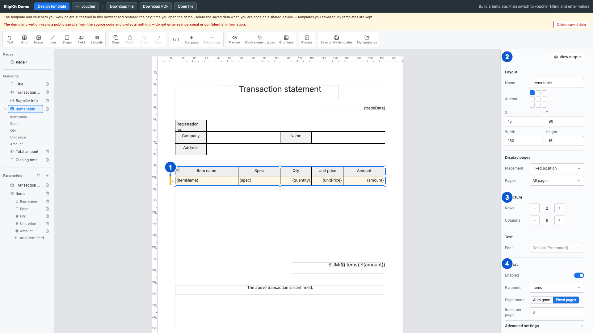

# SCR-006 그리드 행과 셀 편집

최종 갱신: 2026-09-28

## 개요

그리드의 행, 열, 셀, 병합, 반복 방식과 행 구간을 편집하고 샘플 값으로 출력 배치를 확인하는 화면을
정의합니다.

## 변경 이력

| 날짜 | 구분 | 변경 내용 |
| --- | --- | --- |
| 2026-09-28 | 신규 작성 | 그리드 전체와 셀 선택, 구조, 반복, 행 구간과 출력 보기 동작을 각각 정의했습니다. |

## 설계 범위

- 그리드 전체, 행과 셀을 선택하고 구조·값·스타일을 편집하는 화면을 정의합니다.
- 반복 목록, 행 구간, 페이지 방식과 출력 결과 보기의 입력·표시 규칙을 정의합니다.
- 수식 입력 모달은 SCR-007, 조건부 서식 규칙은 SCR-008에서 정의합니다.

## 진입·종료 조건

### 진입 조건

- SCR-002 캔버스 또는 SCR-003 요소 목록에서 그리드를 고르면 그리드 전체 편집 상태로 진입합니다.
- 캔버스의 셀 또는 SCR-003의 셀 하위 항목을 고르면 셀 편집 상태로 진입합니다.

### 종료 조건

- 다른 요소, 페이지 또는 파라미터를 고르면 해당 대상의 속성 화면으로 바뀝니다.
- 미리보기 버튼을 누르면 편집 화면을 숨기고 SCR-013을 표시합니다.

## 화면 이미지

## 화면 구성

| 번호 | 화면 항목 | 위치와 표시 내용 | 동작과 조건 | 상세 설계 |
| --- | --- | --- | --- | --- |
| 1 | 캔버스 그리드 | 행 번호, 열 경계, 셀 값, 병합, 행 구간 색상과 선택 테두리를 표시합니다. 그리드를 선택했을 때 표시합니다. | 편집 상태에서 행과 셀을 선택할 수 있습니다. | — |
| 2 | 출력 보기 버튼 | 현재 그리드의 원본 행과 샘플 값으로 계산한 출력 결과를 전환하는 명령을 표시합니다. 그리드 전체를 선택했을 때 표시합니다. | 반복 설정이 유효할 때 사용할 수 있습니다. | — |
| 3 | 구조 설정 | 행 수, 열 수, 행 높이, 열 너비와 셀 병합 설정을 표시합니다. 그리드 전체 또는 셀을 선택했을 때 표시합니다. | 값이 허용 범위 안에 있을 때 수정할 수 있습니다. | — |
| 4 | 반복 설정 | 반복 파라미터, 페이지 방식, 흐름 영역, 항목 수와 행 구간 역할을 표시합니다. 그리드 전체를 선택했을 때 표시합니다. | 목록 파라미터와 유효한 행 범위가 있을 때 수정할 수 있습니다. | — |

## 이벤트와 호출 기능

| 번호·화면 항목 | 사용자 동작 | 동작과 결과 | 관련 기능 |
| --- | --- | --- | --- |
| 1 캔버스 그리드 | 바깥 테두리를 고릅니다. | 그리드 전체를 선택하고 반복 설정과 공통 스타일을 4번 영역에 표시합니다. | FNC-020 |
| 1 캔버스 그리드 | 셀을 고릅니다. | 원본 보기에서 셀 하나를 선택하고 값, 구조와 스타일 설정을 3번 영역에 표시합니다. | FNC-021 |
| 1 캔버스 그리드 | Ctrl 또는 Command를 누른 채 셀을 고릅니다. | 원본 보기에서 해당 셀을 다중 선택에 추가하거나 제거합니다. | FNC-021 |
| 1 캔버스 그리드 | Shift를 누른 채 다른 셀을 고릅니다. | 먼저 고른 셀이 있으면 두 셀 사이의 직사각형 범위를 선택합니다. | FNC-021 |
| 1 캔버스 그리드 | 행 번호를 고릅니다. | 해당 행을 행 구간 편집 범위로 선택합니다. | FNC-021 |
| 1 캔버스 그리드 | Shift를 누른 채 다른 행 번호를 고릅니다. | 먼저 고른 행부터 해당 행까지 연속 범위를 선택합니다. | FNC-021 |
| 3 구조 설정 | 행 구간 역할을 골라 행을 추가합니다. | 반복 목록이 연결되어 있으면 고른 역할의 행을 추가하고 행 구간에 등록합니다. | FNC-008·FNC-021 |
| 3 구조 설정 | 행 높이 또는 열 너비를 입력합니다. | 2mm 이상의 숫자면 선택한 행이나 열에 반영합니다. 그렇지 않으면 기존 크기를 유지하고 입력란 아래에 최솟값을 표시합니다. | FNC-021 |
| 3 구조 설정 | 셀 값 원본을 고릅니다. | 직접 입력, 파라미터, 수식 중 고른 원본으로 바꾸고 필요한 입력을 아래에 표시합니다. | FNC-004·FNC-006·FNC-021 |
| 3 구조 설정 | 병합할 행 수와 열 수를 입력합니다. | 범위가 그리드 안에 있고 다른 병합과 겹치지 않으면 선택 셀에서 아래쪽과 오른쪽으로 병합합니다. 오류가 있으면 기존 병합을 유지하고 원인을 표시합니다. | FNC-021 |
| 4 반복 설정 | 목록 파라미터를 고릅니다. | 그리드를 해당 목록의 항목 수만큼 반복하도록 연결하고 페이지 방식과 행 구간 입력을 표시합니다. | FNC-008·FNC-021 |
| 4 반복 설정 | 자동 확장을 고릅니다. | 각 출력 페이지의 흐름 영역에 들어가는 만큼 항목을 배치하도록 설정합니다. | FNC-008·FNC-021 |
| 4 반복 설정 | 고정 페이지를 고릅니다. | 지정한 페이지당 항목 수를 기준으로 항목을 나누도록 설정합니다. | FNC-008·FNC-021 |
| 4 반복 설정 | 선택한 행 범위의 역할을 고릅니다. | 머리말, 항목, 꼬리말 중 고른 역할을 저장하고 페이지 계획을 다시 계산합니다. | FNC-008·FNC-021 |
| 2 출력 보기 | 출력 보기 버튼을 누릅니다. | 반복 설정과 페이지 계획이 유효하면 샘플 항목을 반영한 출력 결과를 표시합니다. 오류가 있으면 원본 보기를 유지하고 4번 영역에 원인을 표시합니다. | FNC-007 |
| 2 출력 보기 | 원본 보기 버튼을 누릅니다. | 행과 셀 구조를 편집하는 원본 보기로 돌아갑니다. | FNC-007 |
| 2 출력 보기 | 이전 페이지 버튼을 누릅니다. | 앞 출력 페이지가 있으면 해당 페이지를 표시합니다. | FNC-007 |
| 2 출력 보기 | 다음 페이지 버튼을 누릅니다. | 뒤 출력 페이지가 있으면 해당 페이지를 표시합니다. | FNC-007 |

## 상태별 표시

| 상태 | 시작 조건 | 화면 표시 | 가능한 다음 동작 |
| --- | --- | --- | --- |
| 그리드 전체 선택 | 그리드 테두리 또는 목록 항목을 골랐습니다. | 그리드 선택 테두리와 구조, 반복, 행 구간 설정을 표시합니다. | 그리드 이동, 크기, 구조와 반복 설정을 수정할 수 있습니다. |
| 단일 셀 선택 | 셀 하나를 골랐습니다. | 셀 선택 테두리와 값, 병합, 스타일 설정을 표시합니다. | 선택 셀의 모든 설정을 수정할 수 있습니다. |
| 여러 셀 선택 | 보조키로 셀을 둘 이상 골랐습니다. | 모든 선택 셀을 강조하고 공통 스타일 설정을 표시합니다. | 선택 셀의 스타일을 한 번에 바꿀 수 있습니다. |
| 행 구간 선택 | 행 번호 또는 행 범위를 골랐습니다. | 선택 행의 색상 표식과 역할 편집기를 표시합니다. | 역할과 범위를 수정할 수 있습니다. |
| 자동 확장 | 페이지 방식을 자동 확장으로 정했습니다. | 흐름 영역과 최소 항목 수 입력을 표시합니다. | 자동 배치 설정과 행 구간을 수정할 수 있습니다. |
| 고정 페이지 | 페이지 방식을 고정 페이지로 정했습니다. | 페이지당 항목 수 입력을 표시합니다. | 고정 배치 설정과 행 구간을 수정할 수 있습니다. |
| 출력 결과 보기 | 출력 보기 버튼을 눌렀습니다. | 샘플 항목과 빈 항목을 배치한 출력 조각과 페이지 이동을 표시합니다. | 출력 페이지 이동과 원본 보기 전환을 사용할 수 있습니다. |
| 페이지 계획 오류 | 반복 설정으로 출력 페이지를 만들 수 없습니다. | 캔버스 위쪽에 오류를 표시하고 그리드에 오류 테두리를 표시합니다. 특정 행 구간이 원인이면 오른쪽 행 구간 목록에도 오류를 표시합니다. | 원본 보기에서 반복 설정과 행 구간을 수정할 수 있습니다. |

## 입력 검증과 오류 표시

| 발생 위치 | 발생 조건 | 표시 방법 | 처리와 복구 |
| --- | --- | --- | --- |
| 행 높이 | 2mm보다 작거나 유한한 숫자가 아닙니다. | 행 높이 입력 아래에 붉은 오류 문구를 표시합니다. | 잘못된 높이를 저장하지 않습니다. 2mm 이상의 숫자를 입력합니다. |
| 열 너비 | 2mm보다 작거나 유한한 숫자가 아닙니다. | 열 너비 입력 아래에 붉은 오류 문구를 표시합니다. | 잘못된 너비를 저장하지 않습니다. 2mm 이상의 숫자를 입력합니다. |
| 셀 병합 | 범위를 벗어나거나 다른 병합과 겹칩니다. | 병합 입력 아래에 범위 또는 겹침 오류를 표시합니다. | 기존 병합 상태를 유지합니다. 겹치지 않는 행 수와 열 수를 입력합니다. |
| 행 구간 범위 | 시작 행이 끝 행보다 뒤이거나 그리드 범위를 벗어납니다. | 오른쪽 속성 패널의 해당 시작 행·끝 행 입력 아래에 오류를 표시합니다. | 잘못된 행 구간을 저장하지 않습니다. 유효한 시작 행과 끝 행을 입력합니다. |
| 반복 구조 | 항목 구간이 없거나 둘 이상입니다. | 캔버스 위쪽에 원인을 표시하고 그리드에 오류 테두리를 표시합니다. 오른쪽 행 구간 목록에도 원인이 된 구간의 오류를 표시합니다. | 출력 보기를 막고 원본 구조를 유지합니다. 항목 구간을 정확히 하나로 정합니다. |
| 페이지 배치 | 필수 행 묶음이 흐름 영역 또는 한 페이지에 들어가지 않습니다. | 캔버스 위쪽에 원인을 표시하고 그리드에 오류 테두리를 표시합니다. 특정 행 구간이 원인이면 오른쪽 행 구간 목록에도 붉은 오류를 표시합니다. | 실패한 출력 결과를 표시하지 않습니다. 행 높이, 흐름 영역 또는 페이지 방식을 조정합니다. |
| 셀 수식 문법 | 수식 문법이 올바르지 않거나 함수의 인자 수가 맞지 않습니다. | 오른쪽 속성 패널의 수식 입력 아래에 붉은 오류를 표시합니다. | 잘못된 수식을 셀에 저장하지 않습니다. SCR-007에서 수식을 고칩니다. |
| 셀 수식 계산 | 문법은 맞지만 현재 샘플 값으로 계산할 수 없습니다. | 오른쪽 속성 패널의 수식 입력 아래에 경고를 표시하고 캔버스의 해당 셀에 수식 오류를 표시합니다. | 수식은 셀에 저장합니다. 수식 또는 샘플 값을 고칩니다. |

## 화면 전이

| 사용자 동작 | 화면 변화 | 유지하는 내용 | 초기화하는 내용 |
| --- | --- | --- | --- |
| 그리드 전체 선택에서 셀을 고릅니다. | 단일 셀 선택 | 그리드, 현재 페이지와 스크롤 | 행 구간 선택과 출력 보기 |
| 단일 셀 선택에서 그리드 테두리를 고릅니다. | 그리드 전체 선택 | 그리드와 현재 페이지 | 셀 선택과 셀 입력 오류 |
| 그리드 전체 선택에서 출력 보기 버튼을 누릅니다. | 출력 결과 보기 | 그리드, 샘플 값과 페이지 계획 | 셀과 행 구간 선택 |
| 출력 결과 보기에서 원본 보기 버튼을 누릅니다. | 그리드 전체 선택 | 그리드와 마지막 출력 페이지 번호 | 출력 조각 표시 |
| 셀 수식 상태에서 수식 버튼을 누릅니다. | SCR-007 | 셀 좌표, 그리드와 현재 수식 | 이전 수식 모달 초안 |
| 모든 상태에서 다른 요소를 고릅니다. | SCR-004의 해당 요소 속성 | 양식과 현재 페이지 | 그리드 편집 선택과 출력 보기 |

## 관련 데이터·인터페이스·오류

| 구분 | 식별자 | 관계 |
| --- | --- | --- |
| 데이터 | DAT-005 | 그리드 행, 열, 셀, 병합과 스타일을 편집합니다. |
| 데이터 | DAT-006 | 반복 목록과 셀 값 원본으로 파라미터를 사용합니다. |
| 데이터 | DAT-007 | 페이지 방식, 흐름 영역, 행 구간과 출력 페이지를 편집합니다. |
| 인터페이스 | IF-005 | 그리드 편집 결과를 호스트에 알리는 시점과 전달 내용을 정의합니다. |
| 오류 | ERR-002 | 셀 수식과 참조 오류를 표시합니다. |
| 오류 | ERR-003 | 반복 그리드의 페이지 배치 오류를 표시합니다. |
| 오류 | ERR-005 | 구조와 입력값 오류를 표시합니다. |

## 근거

- `packages/elements/src/designer/render/grid-props.ts`
- `packages/elements/src/designer/render/canvas.ts`
- `packages/elements/src/designer/controllers/grid-edit.ts`
- `packages/elements/src/designer/controllers/grid-commands.ts`
- `packages/elements/src/designer/controllers/page-plan.ts`
