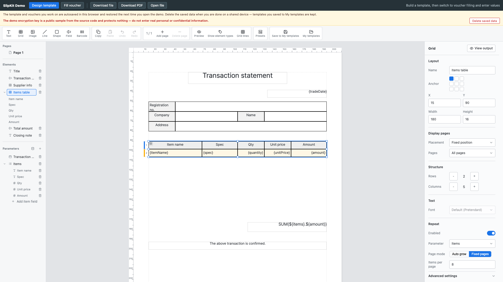

# SCR-006 그리드 행·셀 편집

최종 갱신: 2026-09-28

## 개요

그리드의 크기, 셀, 병합, 반복 방식과 행 구간을 함께 편집하는 화면을 정의합니다.

## 변경 이력

| 날짜 | 구분 | 변경 내용 |
| --- | --- | --- |
| 2026-09-28 | 신규 작성 | 그리드 선택, 구조·반복·행 구간 편집과 출력 보기를 정의했습니다. |

## 진입·종료 조건

요소 목록 또는 캔버스에서 그리드나 셀을 선택하면 진입합니다. 다른 대상을 선택하면 해당 속성 화면으로
바뀝니다.

## 화면 이미지

## 화면 영역

| 영역 | 입력·출력 항목 | 표시·활성화 조건 |
| --- | --- | --- |
| 캔버스 그리드 | 행 번호, 셀, 반복 값과 선택 테두리 | 현재 그리드를 강조합니다. |
| 구조 | 행·열 수, 셀 병합·분할 | 구조 편집이 가능한 선택에서 활성화합니다. |
| 반복 | 파라미터, 자동·고정 페이지, 항목 수 | 반복을 켠 그리드에 표시합니다. |
| 행 구간 | 위치, 페이지 필터, 스타일 | 각 행을 구간으로 지정합니다. |

## 이벤트와 호출 기능

| 사용자 동작 | 호출 기능 | 결과 |
| --- | --- | --- |
| 행·열·병합 변경 | FNC-021 | 유효한 그리드 구조로 갱신합니다. |
| 반복 설정 변경 | FNC-008·FNC-021 | 계획과 캔버스 표시를 다시 계산합니다. |
| 출력 보기 | FNC-007 | 샘플 값의 출력 조각을 표시합니다. |

## 상태별 표시

그리드 전체와 셀 선택을 구분합니다. 자동·고정 페이지에 필요한 입력만 표시하고 고급 설정은 접어서
정보 밀도를 조절합니다.

## 입력 검증과 오류 표시

병합 겹침, 범위 밖 셀, 필수 항목 구간과 페이지에 들어가지 않는 행 구성을 해당 영역에 표시합니다.

## 화면 전이

셀을 고르면 셀 속성으로, 수식 버튼을 누르면 SCR-007로 이동합니다.

## 관련 데이터·인터페이스·오류

| 구분 | 식별자 | 관계 |
| --- | --- | --- |
| 데이터 | DAT-005·DAT-007 | 그리드와 페이지 계획 구조를 편집합니다. |
| 인터페이스 | IF-005 | 디자이너 문서 변경 계약입니다. |
| 오류 | ERR-003·ERR-005 | 배치·입력 오류를 표시합니다. |

## 근거

- `packages/elements/src/designer/render/grid-props.ts`
- `packages/elements/src/designer/controllers/grid-edit.ts`
