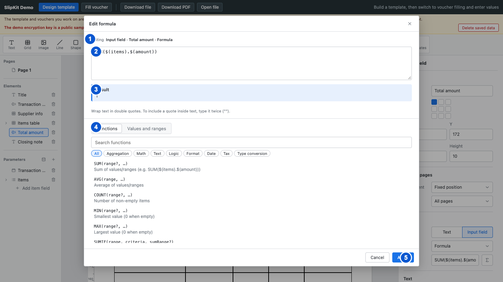

# SCR-007 수식 편집 모달

최종 갱신: 2026-09-28

## 개요

요소, 그리드 셀 또는 조건부 서식 규칙의 수식을 편집하고 현재 샘플 값으로 계산 결과를 확인하는
모달을 정의합니다. 함수와 값 참조는 목록에서 골라 현재 커서 위치에 넣을 수 있습니다.

## 변경 이력

| 날짜 | 구분 | 변경 내용 |
| --- | --- | --- |
| 2026-09-28 | 신규 작성 | 편집 대상, 수식 검사 상태, 참조 탐색과 적용·취소 동작을 각각 정의했습니다. |

## 설계 범위

- 수식 입력, 검사 결과, 함수·값 참조 탐색과 적용·취소 동작을 정의합니다.
- 현재 편집 대상과 샘플 항목에 따라 계산 결과가 바뀌는 규칙을 정의합니다.
- 수식 문법과 계산 규칙 자체는 FNC-004와 FNC-005에서 정의합니다.

## 진입·종료 조건

### 진입 조건

- 수식을 지원하는 필드, 바코드, 그리드 셀 또는 조건부 서식 규칙에서 수식 버튼을 누르면 엽니다.
- 모달을 열 때 편집 대상과 기존 수식을 복사해 초안을 만듭니다.

### 종료 조건

- 적용 버튼을 누르면 유효한 초안을 대상에 저장하고 모달을 닫습니다.
- 취소 버튼, 닫기 버튼, 배경 또는 Escape를 사용하면 초안을 버리고 모달을 닫습니다.
- 모달을 연 뒤 대상이 삭제되거나 바뀌면 적용을 막고 닫기만 허용합니다.

## 화면 이미지

## 화면 구성

| 번호 | 화면 항목 | 위치와 표시 내용 | 동작과 조건 | 상세 설계 |
| --- | --- | --- | --- | --- |
| 1 | 편집 대상 | 요소 이름, 셀 위치 또는 조건부 서식 규칙 번호를 표시합니다. 대상이 유지되는 동안 표시합니다. | 표시 전용입니다. | — |
| 2 | 수식 입력 | 수식 원문을 여러 줄 입력란에 표시합니다. | 대상이 유지되는 동안 편집할 수 있습니다. | — |
| 3 | 검사 결과 | 계산값, 빈 값 안내, 경고 또는 오류를 제목과 설명으로 표시합니다. 수식 입력 아래에 항상 표시합니다. | 표시 전용이며 입력할 때마다 갱신합니다. | — |
| 4 | 참조 탐색 | 함수 탭에는 검색, 범주, 함수 목록과 사용법을 표시하고 값 탭에는 파라미터와 예약 참조를 표시합니다. | 현재 탭에서 사용할 수 있는 항목을 수식에 넣을 수 있습니다. | — |
| 5 | 하단 명령 | 취소와 적용 버튼을 표시합니다. | 검사 결과가 적용 가능할 때만 적용할 수 있습니다. | — |

## 이벤트와 호출 기능

| 번호·화면 항목 | 사용자 동작 | 동작과 결과 | 관련 기능 |
| --- | --- | --- | --- |
| 2 수식 입력 | 글을 입력합니다. | 입력할 때마다 문법을 다시 검사하고 현재 샘플 값으로 계산한 결과를 3번 영역에 표시합니다. | FNC-004·FNC-005 |
| 4 참조 탐색 | 함수 탭을 고릅니다. | 함수 검색, 범주와 함수 목록을 표시합니다. | FNC-006 |
| 4 참조 탐색 | 함수 이름, 사용 형식 또는 설명을 검색합니다. | 검색어가 포함된 함수만 목록에 남깁니다. | FNC-006 |
| 4 참조 탐색 | 함수 범주와 함수를 차례로 고릅니다. | 해당 범주의 함수만 표시하고 고른 함수의 인자, 반환값과 설명을 보여줍니다. | FNC-006 |
| 4 참조 탐색 | 함수 삽입 버튼을 누릅니다. | 함수를 골랐으면 사용 형식을 수식 입력의 현재 커서 위치에 넣습니다. | FNC-006 |
| 4 참조 탐색 | 값 탭을 고릅니다. | 현재 위치에서 사용할 수 있는 파라미터와 예약 참조를 표시합니다. | FNC-006 |
| 4 참조 탐색 | 값 참조를 고릅니다. | 해당 참조 표기를 수식 입력의 현재 커서 위치에 넣습니다. | FNC-006 |
| 3 검사 결과 | 이전 샘플 항목 버튼을 누릅니다. | 앞 항목이 있으면 해당 값으로 계산 결과를 다시 표시합니다. | FNC-005 |
| 3 검사 결과 | 다음 샘플 항목 버튼을 누릅니다. | 뒤 항목이 있으면 해당 값으로 계산 결과를 다시 표시합니다. | FNC-005 |
| 3 검사 결과 | 샘플 항목 번호를 입력합니다. | 범위 안의 번호면 해당 항목의 값으로 계산 결과를 다시 표시합니다. | FNC-005 |
| 5 하단 명령 | 적용 버튼을 누릅니다. | 대상이 유지되고 검사 결과가 적용 가능하면 초안을 한 번의 문서 변경으로 저장하고 창을 닫습니다. | FNC-021 |
| 5 하단 명령 | 취소 또는 닫기 버튼을 누릅니다. | 초안을 버리고 원래 문서를 유지한 채 창을 닫습니다. | FNC-021 |

## 상태별 표시

| 상태 | 시작 조건 | 화면 표시 | 가능한 다음 동작 |
| --- | --- | --- | --- |
| 정상 계산 | 수식이 유효하고 현재 값으로 계산할 수 있습니다. | 성공 상태 제목과 계산 결과를 표시합니다. | 수식 적용과 계속 편집을 사용할 수 있습니다. |
| 빈 셀 수식 | 셀 수식 입력이 공백입니다. | 셀을 비우는 수식이라는 안내를 표시합니다. | 빈 수식을 적용해 셀 수식을 지울 수 있습니다. |
| 필수 수식 누락 | 셀이 아닌 대상의 수식이 공백입니다. | 수식이 필요하다는 오류를 표시합니다. | 수식 편집과 취소만 사용할 수 있습니다. |
| 계산 경고 | 문법은 유효하지만 현재 데이터로 계산하지 못합니다. | 경고 상태와 저장 뒤 대상에 경고가 남는다는 안내를 표시합니다. | 경고를 이해한 뒤 적용하거나 수식을 고칠 수 있습니다. |
| 문법 오류 | 수식 원문을 분석할 수 없습니다. | 오류 상태와 가능한 경우 원인 문구를 표시합니다. | 수식 편집과 취소만 사용할 수 있습니다. |
| 논리값 오류 | 조건식 결과가 논리값이 아닙니다. | 조건은 논리값이어야 한다는 오류를 표시합니다. | 조건식 편집과 취소만 사용할 수 있습니다. |
| 대상 변경 | 모달을 연 뒤 대상이 삭제되거나 구조가 바뀌었습니다. | 편집 대상이 바뀌었다는 오류를 표시합니다. | 모달을 닫을 수 있습니다. |

## 입력 검증과 오류 표시

| 발생 위치 | 발생 조건 | 표시 방법 | 처리와 복구 |
| --- | --- | --- | --- |
| 수식 문법 | 괄호, 문자열, 연산자 또는 함수 사용 형식이 올바르지 않습니다. | 수식 입력 바로 아래 검사 결과 영역에 붉은 오류 제목과 원인을 표시합니다. | 적용 버튼을 비활성화하고 문서를 바꾸지 않습니다. 원인에 맞게 수식을 고칩니다. |
| 값 참조 | 존재하지 않는 값이거나 현재 계산 위치에서 값을 얻을 수 없는 참조입니다. | 검사 결과 영역에 계산할 수 없다는 경고와 원인을 표시합니다. 값 탭에서는 현재 대상에 넣을 수 없는 예약 참조의 삽입 버튼을 비활성화합니다. | 수식 문법이 맞으면 경고가 있어도 적용할 수 있습니다. 값 탭에서 현재 대상에 사용할 수 있는 참조를 골라 바꿉니다. |
| 조건식 결과 | 현재 계산 결과가 논리값이 아닙니다. | 검사 결과 영역에 붉은 오류를 표시합니다. | 조건부 서식 규칙에 반영하지 않습니다. 비교식 또는 논리 함수를 사용해 논리값을 반환하게 합니다. |
| 샘플 항목 번호 | 비어 있거나 숫자가 아니거나 범위를 벗어납니다. | 입력값을 가장 가까운 유효 번호 또는 현재 번호로 되돌립니다. | 계산 문맥을 잘못된 번호로 바꾸지 않습니다. 1부터 전체 항목 수 사이의 정수를 입력합니다. |

## 화면 전이

| 사용자 동작 | 화면 변화 | 유지하는 내용 | 초기화하는 내용 |
| --- | --- | --- | --- |
| 속성 패널에서 수식 버튼을 누릅니다. | 수식 편집 모달 | 편집 대상, 기존 수식과 디자이너 선택 | 이전 수식 초안, 검색과 검사 상태 |
| 수식 편집 모달에서 적용 버튼을 누릅니다. | 원래 속성 패널 | 디자이너 선택과 적용한 수식 | 모달 초안과 검색 상태 |
| 수식 편집 모달에서 취소 버튼을 누릅니다. | 원래 속성 패널 | 디자이너 선택과 적용 전 수식 | 모달 초안과 검사 상태 |
| 수식 편집 모달에서 Escape를 누릅니다. | 원래 속성 패널 | 디자이너 선택과 적용 전 수식 | 모달 초안과 검사 상태 |

## 관련 데이터·인터페이스·오류

| 구분 | 식별자 | 관계 |
| --- | --- | --- |
| 데이터 | DAT-006 | 파라미터와 목록 하위 필드를 값 참조로 표시합니다. |
| 데이터 | DAT-008 | 수식 원문, 조건식과 계산 문맥을 편집합니다. |
| 인터페이스 | IF-005 | 디자이너 내부 문서 변경과 화면 상태를 사용합니다. |
| 오류 | ERR-002 | 수식 문법, 참조, 계산과 결과 종류 오류를 표시합니다. |

## 근거

- `packages/elements/src/designer/render/formula-modal.ts`
- `packages/elements/src/designer/controllers/formula-draft.ts`
- `packages/elements/src/designer/formula-check.ts`
- `packages/elements/src/designer/formula-context.ts`
