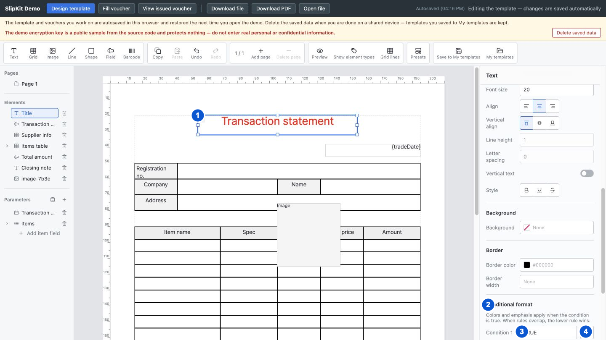

# SCR-008 조건부 서식 편집

최종 갱신: 2026-09-28

## 개요

글자 요소, 입력 필드 또는 그리드 셀의 속성 패널 안에서 조건부 서식 규칙을 추가하고 편집하는 구역을
정의합니다. 이 화면은 독립 모달이 아니며 규칙은 위에서 아래 순서로 적용됩니다.

## 변경 이력

| 날짜 | 구분 | 변경 내용 |
| --- | --- | --- |
| 2026-09-28 | 신규 작성 | 실제 속성 패널 내 편집 구조와 규칙별 조건, 효과, 순서, 삭제 동작을 정의했습니다. |

## 설계 범위

- 조건부 서식 규칙의 추가, 조건식, 효과, 적용 순서와 삭제 입력을 정의합니다.
- 규칙이 없을 때와 계산할 수 없을 때의 표시를 정의합니다.
- 조건식을 자세히 편집하는 모달은 SCR-007에서 정의합니다.

## 진입·종료 조건

### 진입 조건

- SCR-004에서 조건부 서식을 지원하는 글자 요소, 입력 필드 또는 그리드 셀을 선택하면 속성 패널 아래에 표시합니다.
- 규칙이 없으면 추가 버튼만 표시하고, 규칙이 있으면 선언 순서대로 모두 표시합니다.

### 종료 조건

- 다른 대상을 선택하면 해당 대상의 속성 패널로 바뀝니다.
- 조건식의 수식 버튼을 누르면 같은 규칙을 유지한 채 SCR-007을 위에 엽니다.
- 미리보기 버튼을 누르면 속성 패널을 숨기고 SCR-013을 표시합니다.

## 화면 이미지

## 화면 구성

| 번호 | 화면 항목 | 위치와 표시 내용 | 동작과 조건 | 상세 설계 |
| --- | --- | --- | --- | --- |
| 1 | 선택 요소 | 조건부 서식을 편집할 현재 요소와 캔버스 결과를 표시합니다. 지원 요소를 선택했을 때 표시합니다. | 캔버스 또는 목록에서 다른 대상을 선택할 수 있습니다. | — |
| 2 | 조건부 서식 구역 | 규칙 순서 안내, 색상, 글자 강조, 순서 명령과 규칙 추가 버튼을 아래로 이어 표시합니다. 지원 대상을 선택했을 때 표시합니다. | 규칙 수가 상한보다 적을 때 추가할 수 있습니다. | — |
| 3 | 조건식 | 규칙 번호와 조건식 입력을 표시합니다. 규칙마다 표시합니다. | 유효한 논리식으로 수정할 수 있습니다. | — |
| 4 | 수식 편집 버튼 | 현재 조건식을 SCR-007에서 편집하는 버튼을 표시합니다. 규칙마다 조건식 옆에 표시합니다. | 언제든지 사용할 수 있습니다. | — |

## 이벤트와 호출 기능

| 번호·화면 항목 | 사용자 동작 | 동작과 결과 | 관련 기능 |
| --- | --- | --- | --- |
| 2 조건부 서식 구역 | 규칙 추가 버튼을 누릅니다. | 규칙 수가 상한보다 적으면 기본 조건과 글자색을 가진 규칙을 목록 끝에 추가합니다. | FNC-009·FNC-021 |
| 3 조건식 | 조건식을 입력하고 변경을 확정합니다. | 논리값을 내는 올바른 수식이면 규칙에 반영합니다. 그렇지 않으면 기존 조건식을 유지하고 입력란 아래에 이유를 표시합니다. | FNC-004·FNC-009 |
| 4 수식 편집 | 버튼을 누릅니다. | 해당 규칙의 조건식을 편집하도록 SCR-007을 엽니다. | FNC-004·FNC-021 |
| 2 조건부 서식 구역 | 글자색, 배경색 또는 테두리색을 고릅니다. | 올바른 색상 값이면 조건이 참일 때 적용할 효과로 저장합니다. | FNC-009·FNC-021 |
| 2 조건부 서식 구역 | 굵게, 기울임, 밑줄 또는 취소선의 상태를 고릅니다. | 각 효과를 상위 스타일 유지, 켜기, 끄기 중 하나로 저장합니다. 모든 효과가 유지 상태가 되면 규칙이 비게 된다는 오류를 표시하고 마지막 효과를 유지합니다. | FNC-009·FNC-021 |
| 2 조건부 서식 구역 | 위로 또는 아래로 이동 버튼을 누릅니다. | 해당 방향에 규칙이 있으면 두 규칙의 순서를 바꾸고 적용 우선순위를 갱신합니다. | FNC-009·FNC-021 |
| 2 조건부 서식 구역 | 삭제 버튼을 누릅니다. | 해당 규칙을 제거하고 뒤 규칙의 번호를 하나씩 당깁니다. | FNC-009·FNC-021 |

## 상태별 표시

| 상태 | 시작 조건 | 화면 표시 | 가능한 다음 동작 |
| --- | --- | --- | --- |
| 규칙 없음 | 대상에 조건부 서식이 없습니다. | 규칙 추가 버튼만 표시합니다. | 첫 규칙을 추가할 수 있습니다. |
| 규칙 편집 | 규칙이 하나 이상 있습니다. | 모든 규칙의 조건과 효과를 선언 순서대로 표시합니다. | 조건, 효과, 순서와 삭제를 수정할 수 있습니다. |
| 색상 선택 | 색상 입력을 열었습니다. | 색상 선택 팝업과 현재 색을 표시합니다. | 색을 적용하거나 해제할 수 있습니다. |
| 조건식 오류 | 입력한 조건식을 저장할 수 없습니다. | 해당 조건식 입력 아래에 오류를 표시합니다. | 조건식 수정과 다른 규칙 편집을 사용할 수 있습니다. |
| 계산 시 미적용 | 조건식 평가 중 0으로 나누기, 값 종류 불일치, 잘못된 함수 인자 수 또는 데이터 부족으로 계산 오류가 발생했습니다. | 편집 화면은 규칙을 유지하고 캔버스에서는 해당 규칙 효과를 적용하지 않습니다. | 샘플 값 또는 조건식을 수정할 수 있습니다. |

## 입력 검증과 오류 표시

| 발생 위치 | 발생 조건 | 표시 방법 | 처리와 복구 |
| --- | --- | --- | --- |
| 조건식 | 문법이 올바르지 않거나 결과가 논리값이 아닙니다. | 해당 조건식 입력을 위험 색으로 표시하고 바로 아래에 오류를 표시합니다. | 잘못된 조건식을 규칙에 반영하지 않습니다. 조건식을 고치거나 SCR-007에서 검사합니다. |
| 규칙 효과 | 색과 글자 강조를 모두 제거하려고 합니다. | 해당 규칙 효과 아래에 하나 이상의 효과가 필요하다는 오류를 표시합니다. | 마지막 효과를 제거하지 않고 기존 규칙을 유지합니다. 다른 효과를 먼저 지정하거나 규칙 전체를 삭제합니다. |
| 색상 | 16진수 색상 형식이 올바르지 않습니다. | 색상 선택 창의 색상 코드 입력 바로 아래에 오류를 표시합니다. | 잘못된 색을 저장하지 않습니다. 올바른 색을 고르거나 입력합니다. |
| 규칙 수 | 규칙 수가 스키마 상한에 도달했습니다. | 규칙 추가 버튼을 비활성화합니다. | 새 규칙을 추가하지 않습니다. 기존 규칙을 삭제한 뒤 추가합니다. |

## 화면 전이

| 사용자 동작 | 화면 변화 | 유지하는 내용 | 초기화하는 내용 |
| --- | --- | --- | --- |
| 규칙 편집에서 수식 버튼을 누릅니다. | SCR-007의 조건식 편집 | 현재 대상, 규칙 목록과 선택 | 이전 수식 모달 초안 |
| SCR-007에서 적용 버튼을 누릅니다. | 규칙 편집 | 대상, 규칙 순서와 적용한 조건식 | 수식 모달 상태 |
| 규칙 편집에서 다른 요소를 고릅니다. | SCR-004의 새 대상 속성 | 양식과 현재 페이지 | 이전 대상의 패널 스크롤과 색상 팝업 |
| 규칙 편집에서 미리보기 버튼을 누릅니다. | SCR-013 | 양식과 샘플 값 | 열린 색상 팝업 |

## 관련 데이터·인터페이스·오류

| 구분 | 식별자 | 관계 |
| --- | --- | --- |
| 데이터 | DAT-005 | 요소 또는 그리드 셀에 조건부 서식 규칙을 저장합니다. |
| 데이터 | DAT-008 | 조건식을 현재 계산 문맥으로 평가합니다. |
| 인터페이스 | IF-005 | 규칙 변경 결과를 호스트에 알리는 시점과 전달 내용을 정의합니다. |
| 오류 | ERR-002 | 조건식 문법과 결과 종류 오류를 표시합니다. |
| 오류 | ERR-005 | 색상과 필수 효과 입력 오류를 표시합니다. |

## 근거

- `packages/elements/src/designer/render/conditional-formats.ts`
- `packages/elements/src/designer/render/property-panel.ts`
- `packages/elements/src/designer/render/grid-props.ts`
- `packages/core/src/render/conditional.ts`
