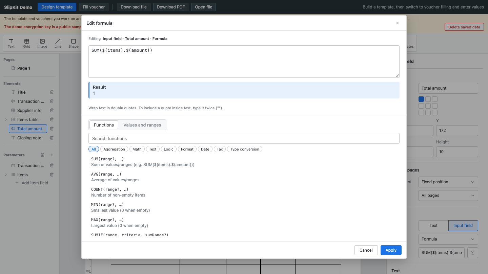

# SCR-008 조건부 서식 편집

최종 갱신: 2026-09-28

## 개요

조건식과 참일 때 덮어쓸 색·강조를 규칙별로 추가·정렬·삭제하는 화면을 정의합니다.

## 변경 이력

| 날짜 | 구분 | 변경 내용 |
| --- | --- | --- |
| 2026-09-28 | 신규 작성 | 조건부 서식 규칙의 편집 항목, 순서와 오류 표시를 정의했습니다. |

## 진입·종료 조건

조건부 서식을 지원하는 요소나 셀의 속성 패널에서 규칙을 추가하거나 편집하면 진입합니다.

## 화면 이미지

## 화면 영역

| 영역 | 입력·출력 항목 | 표시·활성화 조건 |
| --- | --- | --- |
| 규칙 목록 | 조건, 색, 굵게·기울임·밑줄·취소선 | 선언 순서대로 표시합니다. |
| 수식 편집 | 조건식 | SCR-007 편집기를 사용합니다. |
| 규칙 명령 | 추가, 이동, 삭제 | 현재 선택에 따라 활성화합니다. |

## 이벤트와 호출 기능

| 사용자 동작 | 호출 기능 | 결과 |
| --- | --- | --- |
| 조건 수정 | FNC-004·FNC-021 | 문법을 확인해 규칙에 반영합니다. |
| 서식 수정 | FNC-009·FNC-021 | 샘플 값으로 결과를 다시 표시합니다. |

## 상태별 표시

빈 목록, 선택 규칙과 계산 결과 미적용 상태를 구분합니다. 뒤 규칙이 같은 속성을 덮는 순서를
목록 순서로 보여 줍니다.

## 입력 검증과 오류 표시

문법 오류와 논리값이 아닌 조건을 표시합니다. 데이터 의존 평가 오류는 규칙 미적용으로 미리보기합니다.

## 화면 전이

조건 수식 편집은 SCR-007을 열고 닫으면 현재 규칙으로 돌아옵니다.

## 관련 데이터·인터페이스·오류

| 구분 | 식별자 | 관계 |
| --- | --- | --- |
| 데이터 | DAT-008 | 조건과 서식 덮어쓰기를 편집합니다. |
| 인터페이스 | IF-005 | 양식 변경 이벤트를 보냅니다. |
| 오류 | ERR-002·ERR-005 | 조건 문법과 화면 입력 오류를 표시합니다. |

## 근거

- `packages/elements/src/designer/render/conditional-formats.ts`
- `packages/core/src/render/conditional.ts`

