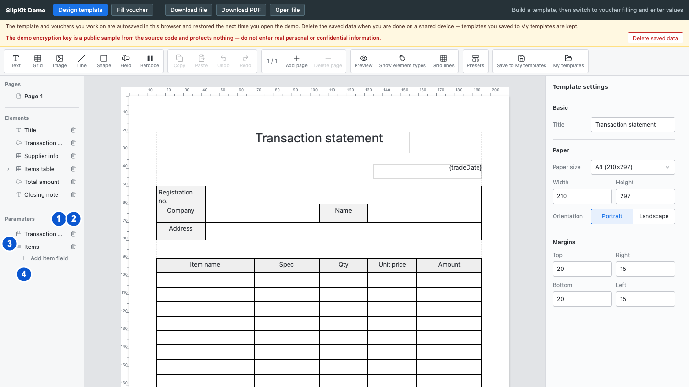

# SCR-009 파라미터 관리

최종 갱신: 2026-09-28

## 개요

양식의 파라미터와 목록 파라미터의 하위 필드를 추가하고 정의하는 화면을 설명합니다. 파라미터는 왼쪽
목록에서 선택하고 오른쪽 속성 패널에서 표시 이름, 키와 값 종류를 수정합니다.

## 변경 이력

| 날짜 | 구분 | 변경 내용 |
| --- | --- | --- |
| 2026-09-28 | 신규 작성 | 최상위 파라미터와 하위 필드의 추가, 선택, 이름·키 변경, 종류 변경과 삭제를 각각 정의했습니다. |

## 진입·종료 조건

### 진입 조건

- SCR-003에서 파라미터를 고르면 파라미터 편집 상태로 진입합니다.
- 목록 파라미터를 펼치고 하위 필드를 고르면 하위 필드 편집 상태로 진입합니다.

### 종료 조건

- 페이지, 요소 또는 그리드 셀을 고르면 해당 대상의 속성 화면으로 바뀝니다.
- 미리보기 버튼을 누르면 파라미터 편집 화면을 숨기고 SCR-013을 표시합니다.

## 화면 이미지

## 화면 구성

| 번호 | 화면 항목 | 표시 내용 | 표시 조건 | 활성화 조건 |
| --- | --- | --- | --- | --- |
| 1 | 샘플 값 버튼 | SCR-010을 여는 데이터베이스 아이콘 버튼을 표시합니다. | 파라미터 구역 제목 옆에 표시합니다. | 모달이 닫혀 있을 때 사용할 수 있습니다. |
| 2 | 파라미터 추가 버튼 | 새 파라미터를 만드는 더하기 아이콘 버튼을 표시합니다. | 파라미터 구역 제목 옆에 표시합니다. | 모달이 닫혀 있을 때 사용할 수 있습니다. |
| 3 | 파라미터 목록 | 값 종류 배지, 표시 이름, 펼치기와 삭제 버튼을 표시합니다. | 편집 상태에서 표시합니다. | 파라미터와 펼친 하위 필드를 선택할 수 있습니다. |
| 4 | 하위 필드 추가 | 목록 파라미터에 하위 필드를 추가하는 명령을 표시합니다. | 목록 파라미터를 펼쳤을 때 표시합니다. | 모달이 닫혀 있을 때 사용할 수 있습니다. |

## 이벤트와 호출 기능

| 화면 항목 | 사용자 동작 | 호출 기능 | 결과 | 실행할 수 없는 조건 |
| --- | --- | --- | --- | --- |
| 파라미터 추가 버튼 | 버튼을 누릅니다. | FNC-021 | 고유한 기본 키를 가진 문자열 파라미터를 추가하고 선택합니다. | 모달 또는 미리보기 상태 |
| 파라미터 항목 | 항목을 고릅니다. | FNC-021 | 오른쪽 속성 패널에 파라미터 정의를 표시합니다. | 모달 또는 미리보기 상태 |
| 파라미터 펼치기 버튼 | 버튼을 누릅니다. | FNC-022 | 목록의 하위 필드를 펼치거나 접습니다. | 하위 필드가 없는 상태 |
| 파라미터 삭제 버튼 | 버튼을 누릅니다. | FNC-021 | 아무 요소도 사용하지 않는 명시적 정의를 삭제합니다. 요소가 사용 중이면 정의를 유지하고 사용 위치를 오류로 표시합니다. | 명시적 정의가 없는 상태 |
| 표시 이름 입력 | 값을 입력하고 변경을 확정합니다. | FNC-021 | 화면에 표시할 이름을 바꿉니다. 값을 비우면 별도 표시 이름을 제거하고 키를 이름으로 표시합니다. | 없음 |
| 키 입력 | 값을 입력하고 변경을 확정합니다. | FNC-006, FNC-021 | 정의, 해석할 수 있는 요소·수식 참조와 샘플 값의 키를 한 번에 바꿉니다. 문법 오류가 있어 해석할 수 없는 수식 문자열은 바꾸지 않습니다. | 키가 비었거나 다른 최상위 키와 중복된 상태 |
| 값 종류 목록 | 종류를 고릅니다. | FNC-021 | 파라미터 값 종류를 바꾸고 종류별 입력과 하위 구조를 갱신합니다. | 현재 위치에서 허용하지 않는 종류 |
| 하위 필드 추가 버튼 | 버튼을 누릅니다. | FNC-021 | 목록에 고유한 기본 키를 가진 문자열 하위 필드를 추가합니다. | 선택한 파라미터가 목록이 아닌 상태 |
| 하위 필드 항목 | 항목을 고릅니다. | FNC-021 | 오른쪽 속성 패널에 하위 필드 정의를 표시합니다. | 모달 또는 미리보기 상태 |
| 하위 필드 표시 이름 | 값을 입력하고 변경을 확정합니다. | FNC-021 | 목록 입력과 샘플 표에 표시할 이름을 바꿉니다. 값을 비우면 별도 표시 이름을 제거하고 키를 이름으로 표시합니다. | 없음 |
| 하위 필드 키 | 값을 입력하고 변경을 확정합니다. | FNC-006, FNC-021 | 해석할 수 있는 셀 참조, 수식, 그룹 설정과 모든 샘플 항목의 키를 한 번에 바꿉니다. 문법 오류가 있어 해석할 수 없는 수식 문자열은 바꾸지 않습니다. | 키가 비었거나 같은 목록에서 중복된 상태 |
| 하위 필드 종류 | 종류를 고릅니다. | FNC-021 | 하위 필드의 값 종류를 바꿉니다. | 하위 필드에서 허용하지 않는 목록 종류 |
| 하위 필드 삭제 버튼 | 버튼을 누릅니다. | FNC-021 | 하위 필드 정의를 삭제하고 같은 목록을 반복하는 그리드의 항목 셀에서 해당 파라미터 연결을 제거합니다. 샘플 항목의 같은 키 값과 수식 문자열은 유지합니다. | 모달 또는 미리보기 상태 |
| 샘플 값 버튼 | 버튼을 누릅니다. | FNC-021 | 현재 정의를 입력 항목으로 사용해 SCR-010을 엽니다. | 다른 모달이 열린 상태 |

## 상태별 표시

| 상태 | 진입 조건 | 표시 내용 | 허용 동작 |
| --- | --- | --- | --- |
| 파라미터 없음 | 정의와 요소 참조가 모두 없습니다. | 목록에 대시를 표시하고 추가 버튼을 유지합니다. | 파라미터 추가와 샘플 값 편집을 사용할 수 있습니다. |
| 파라미터 선택 | 최상위 파라미터를 골랐습니다. | 해당 행과 오른쪽 파라미터 속성을 강조합니다. | 표시 이름, 키, 값 종류와 삭제를 사용할 수 있습니다. |
| 목록 파라미터 | 값 종류가 목록입니다. | 펼치기 버튼, 하위 필드와 하위 필드 추가 버튼을 표시합니다. | 하위 필드를 추가하고 편집할 수 있습니다. |
| 하위 필드 선택 | 하위 필드를 골랐습니다. | 해당 하위 행과 오른쪽 하위 필드 속성을 강조합니다. | 하위 필드 이름, 키, 종류와 삭제를 사용할 수 있습니다. |
| 유추된 파라미터 | 요소가 참조하지만 명시적 정의가 없습니다. | 참조에서 알아낸 값 종류로 항목을 표시하고 삭제 버튼을 비활성화합니다. | 속성을 수정해 명시적 정의를 만들 수 있습니다. |

## 입력 검증과 오류 표시

| 검사 대상 | 실패 조건 | 표시 위치와 표현 | 문서·화면 처리 | 복구 방법 |
| --- | --- | --- | --- | --- |
| 파라미터 키 | 값이 비었거나 다른 최상위 키와 겹칩니다. | 키 입력을 위험 색으로 표시하고 아래에 오류를 표시합니다. | 정의와 참조를 바꾸지 않습니다. | 고유한 키를 입력합니다. |
| 하위 필드 키 | 값이 비었거나 같은 목록의 다른 하위 필드 키와 겹칩니다. | 키 입력 아래에 오류를 표시합니다. | 정의, 참조와 샘플 항목을 바꾸지 않습니다. | 같은 목록 안에서 고유한 키를 입력합니다. |
| 값 종류 | 하위 필드에 목록처럼 중첩할 수 없는 종류를 선택합니다. | 선택 목록에서 허용하지 않는 항목을 제공하지 않습니다. | 허용하지 않는 구조를 만들지 않습니다. | 제공되는 값 종류 중 하나를 고릅니다. |
| 사용 중인 파라미터 삭제 | 하나 이상의 요소가 해당 파라미터를 사용합니다. | 오른쪽 속성 패널 위쪽에 사용 중인 요소 이름과 페이지를 포함한 오류를 표시합니다. | 파라미터 정의와 참조를 모두 유지합니다. | 표시된 요소의 참조를 제거한 뒤 다시 삭제합니다. |

## 화면 전이

| 시작 상태 | 사용자 동작 | 도착 화면·상태 | 유지 항목 | 초기화 항목 |
| --- | --- | --- | --- | --- |
| 파라미터 없음 | 파라미터 추가 버튼을 누릅니다. | 파라미터 선택 | 양식과 현재 페이지 | 이전 요소와 셀 선택 |
| 파라미터 선택 | 값 종류를 목록으로 바꿉니다. | 목록 파라미터 | 표시 이름과 키 | 목록이 아닌 종류의 값 제약 |
| 목록 파라미터 | 하위 필드를 고릅니다. | 하위 필드 선택 | 상위 파라미터와 양식 | 최상위 파라미터 패널 상태 |
| 모든 파라미터 상태 | 샘플 값 버튼을 누릅니다. | SCR-010 | 양식과 파라미터 정의 | 이전 샘플 모달 초안 |
| 모든 파라미터 상태 | 요소를 고릅니다. | SCR-004의 요소 속성 | 양식과 현재 페이지 | 파라미터 선택 |

## 관련 데이터·인터페이스·오류

| 구분 | 식별자 | 관계 |
| --- | --- | --- |
| 데이터 | DAT-006 | 파라미터 정의, 하위 필드와 샘플 값의 구조를 관리합니다. |
| 데이터 | DAT-008 | 키를 바꿀 때 수식 참조를 함께 변경합니다. |
| 인터페이스 | IF-005 | 정의와 참조 변경을 포함한 양식을 `slip-change`로 알립니다. |
| 오류 | ERR-002 | 수식 참조를 바꿀 수 없는 상태를 표시합니다. |
| 오류 | ERR-005 | 이름, 키와 값 종류 입력 오류를 표시합니다. |

## 근거

- `packages/elements/src/designer/render/sidebar.ts`
- `packages/elements/src/designer/render/form-props.ts`
- `packages/elements/src/designer/parameters.ts`
- `packages/elements/src/slip-designer.ts`
