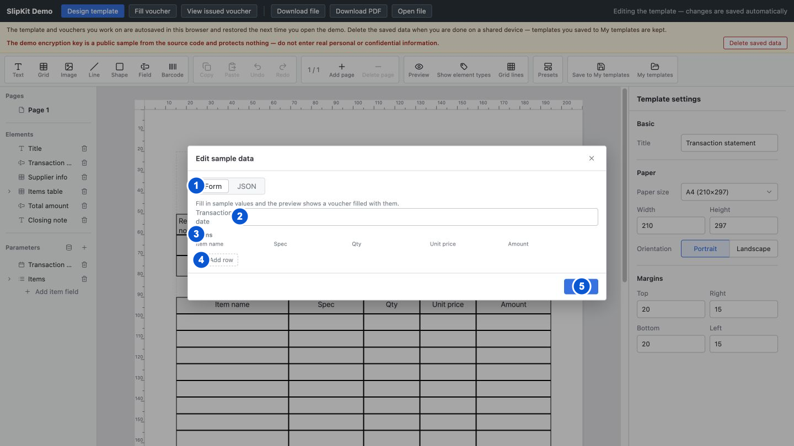

# SCR-010 샘플 값 편집 모달

최종 갱신: 2026-09-28

## 개요

디자이너 캔버스, 수식 계산과 PDF 미리보기에 사용할 샘플 값을 파라미터별 폼 또는 JSON으로 편집하는
모달을 정의합니다. 폼에서 바꾼 값은 즉시 양식에 반영하고, JSON은 적용 버튼을 눌러야 반영합니다.

## 변경 이력

| 날짜 | 구분 | 변경 내용 |
| --- | --- | --- |
| 2026-09-28 | 신규 작성 | 실제 폼·JSON 탭, 목록 행, 이미지 값, 페이지 이동과 서로 다른 저장 시점을 정의했습니다. |

## 설계 범위

- 일반 값, 목록과 이미지의 샘플 값을 폼 또는 JSON으로 편집하는 모달을 정의합니다.
- 페이지 이동, 목록 행 추가·삭제와 JSON 적용 결과를 정의합니다.
- 샘플 값을 사용하는 수식 계산과 미리보기는 SCR-007과 SCR-013에서 정의합니다.

## 진입·종료 조건

### 진입 조건

- SCR-003의 파라미터 구역에서 샘플 값 버튼을 누르면 폼 탭의 첫 페이지로 엽니다.
- 양식에 저장된 샘플 값을 각 파라미터 입력의 현재 값으로 표시합니다.

### 종료 조건

- 폼 탭에서 닫기 버튼, 닫기 아이콘, 배경 또는 Escape를 사용하면 이미 반영된 값을 유지하고 닫습니다.
- JSON 탭에서 적용 버튼을 누르면 유효한 객체를 양식에 반영하지만 모달은 열린 채로 유지합니다.
- JSON 탭에서 닫으면 적용하지 않은 JSON 초안은 버리고 마지막으로 반영된 샘플 값을 유지합니다.

## 화면 이미지

## 화면 구성

| 번호 | 화면 항목 | 위치와 표시 내용 | 동작과 조건 | 상세 설계 |
| --- | --- | --- | --- | --- |
| 1 | 탭 | 폼과 JSON 두 편집 방식을 표시합니다. | 원하는 방식을 선택할 수 있습니다. | — |
| 2 | 일반 값 입력 | 파라미터 표시 이름과 현재 샘플 값을 일반 입력으로 표시합니다. 폼 탭의 일반 파라미터에 표시합니다. | 값을 수정할 수 있습니다. | — |
| 3 | 목록 샘플 표 | 목록 파라미터의 하위 필드 제목과 샘플 항목을 표로 표시합니다. 반복 그리드에서 열 구조를 찾은 목록 파라미터에 표시합니다. | 셀 입력과 행 삭제를 사용할 수 있습니다. | — |
| 4 | 행 추가 버튼 | 빈 샘플 항목을 추가하는 명령을 표시합니다. 목록 샘플 표 아래에 표시합니다. | 언제든지 사용할 수 있습니다. | — |
| 5 | 하단 명령 | 폼 탭에는 닫기, JSON 탭에는 적용과 닫기 버튼을 표시합니다. | JSON이 유효한 객체일 때만 적용할 수 있습니다. | — |

## 이벤트와 호출 기능

| 번호·화면 항목 | 사용자 동작 | 동작과 결과 | 관련 기능 |
| --- | --- | --- | --- |
| 1 탭 | 폼 탭을 고릅니다. | 파라미터별 입력과 현재 입력 페이지를 표시합니다. | FNC-021 |
| 1 탭 | JSON 탭을 고릅니다. | 현재 파라미터 정의와 샘플 값을 합친 JSON 초안을 편집기에 표시합니다. | FNC-021 |
| 2 일반 값 입력 | 값을 입력하고 변경을 확정합니다. | 숫자로 읽을 수 있으면 숫자로, 그렇지 않으면 문자열로 샘플 값에 바로 반영합니다. | FNC-005·FNC-021 |
| 3 목록 샘플 표 | 셀 값을 입력합니다. | 해당 샘플 항목의 하위 필드 값을 바로 반영합니다. | FNC-005·FNC-021 |
| 4 행 추가 | 버튼을 누릅니다. | 빈 샘플 항목을 목록 끝에 추가합니다. | FNC-021 |
| 3 목록 샘플 표 | 행의 삭제 버튼을 누릅니다. | 해당 샘플 항목을 목록에서 제거합니다. | FNC-021 |
| 2 일반 값 입력 | 이미지 선택 버튼을 누르고 파일을 고릅니다. | 허용 형식과 크기를 만족하면 이미지 값을 반영합니다. 오류가 있으면 기존 값을 유지하고 폼 본문 위에 이유를 표시합니다. | FNC-011·FNC-021 |
| 2 일반 값 입력 | 이미지 지우기 버튼을 누릅니다. | 이미지 값이 있으면 해당 샘플 값을 제거합니다. | FNC-021 |
| 2 일반 값 입력 | 이전, 페이지 번호 또는 다음 버튼을 누릅니다. | 범위 안의 입력 페이지를 표시합니다. | FNC-022 |
| 1 탭 | JSON 초안을 입력합니다. | 초안만 바꾸고 JSON 구문과 최상위 값이 객체인지 다시 검사합니다. | FNC-021 |
| 5 하단 명령 | 적용 버튼을 누릅니다. | 초안이 올바른 객체면 샘플 값에 반영하고 캔버스와 페이지 계획을 갱신합니다. | FNC-021 |
| 5 하단 명령 | 닫기 버튼을 누릅니다. | 창을 닫고 현재 샘플 값으로 디자이너를 다시 표시합니다. | FNC-021 |

## 상태별 표시

| 상태 | 시작 조건 | 화면 표시 | 가능한 다음 동작 |
| --- | --- | --- | --- |
| 폼 기본 | 모달을 처음 열었습니다. | 첫 파라미터 페이지와 닫기 버튼을 표시합니다. | 값 편집, 페이지 이동과 닫기를 사용할 수 있습니다. |
| 파라미터 없음 | 양식에 표시할 파라미터가 없습니다. | 폼 본문에 대시를 표시합니다. | JSON 탭 전환과 닫기를 사용할 수 있습니다. |
| 목록 편집 | 목록 파라미터에 열 구조가 있습니다. | 하위 필드를 열로, 샘플 항목을 행으로 표시합니다. | 셀 수정과 행 추가·삭제를 사용할 수 있습니다. |
| 이미지 선택 오류 | 고른 파일을 이미지 값으로 사용할 수 없습니다. | 폼 본문 위에 붉은 오류 문구를 표시합니다. | 다른 값 편집과 새 파일 선택을 사용할 수 있습니다. |
| JSON 정상 | 초안이 비어 있거나 유효한 객체입니다. | 오류 문구 없이 적용 버튼을 활성화합니다. | 적용, 편집, 탭 전환과 닫기를 사용할 수 있습니다. |
| JSON 오류 | 구문이 잘못되었거나 최상위 값이 객체가 아닙니다. | JSON 입력 아래에 붉은 구문 오류를 표시하고 적용 버튼을 비활성화합니다. | 초안 수정, 탭 전환과 닫기를 사용할 수 있습니다. |

## 입력 검증과 오류 표시

| 발생 위치 | 발생 조건 | 표시 방법 | 처리와 복구 |
| --- | --- | --- | --- |
| JSON 구문 | JSON을 분석할 수 없습니다. | JSON 입력 바로 아래 상태 영역에 붉은 구문 오류를 표시합니다. | 적용 버튼을 비활성화하고 기존 샘플 값을 유지합니다. 올바른 JSON으로 고칩니다. |
| JSON 최상위 값 | 배열, 문자열, 숫자, 논리값 또는 `null`입니다. | JSON 입력 아래에 객체가 필요하다는 오류를 표시합니다. | 기존 샘플 값을 유지합니다. 최상위를 키와 값으로 된 객체로 바꿉니다. |
| 샘플 이미지 | 이미지 파일이 아니거나 읽지 못했거나 화면에 안내한 최대 크기를 넘습니다. | 폼 본문 위에 붉은 오류 문구를 표시하고 보조 기술에도 즉시 알립니다. | 기존 이미지 값을 유지합니다. 지원하는 작은 이미지 파일을 다시 고릅니다. |
| 목록 샘플 원본 | 기존 값이 객체 배열이 아닙니다. | 폼 탭에서는 편집 가능한 객체 행만 표시하고 나머지는 표시하지 않습니다. | 사용자가 폼에서 변경하기 전까지 원본 값은 유지합니다. JSON 탭에서 값 구조를 객체 배열로 고칩니다. |

## 화면 전이

| 사용자 동작 | 화면 변화 | 유지하는 내용 | 초기화하는 내용 |
| --- | --- | --- | --- |
| SCR-003에서 샘플 값 버튼을 누릅니다. | 폼 기본 | 양식과 현재 샘플 값 | 폼 페이지, JSON 초안과 이미지 오류 |
| 폼 탭에서 JSON 탭을 고릅니다. | JSON 정상 또는 JSON 오류 | 현재까지 반영된 샘플 값 | 이전 JSON 초안 |
| JSON 탭에서 폼 탭을 고릅니다. | 폼 기본 | 적용한 샘플 값 | 적용하지 않은 JSON 초안의 화면 표시 |
| 모든 모달 상태에서 닫기 버튼을 누릅니다. | SCR-001의 이전 편집 상태 | 양식, 반영된 샘플 값과 선택 | 모달 페이지, 초안과 오류 |

## 관련 데이터·인터페이스·오류

| 구분 | 식별자 | 관계 |
| --- | --- | --- |
| 데이터 | DAT-006 | 파라미터 정의와 샘플 값의 저장 구조를 정의합니다. |
| 데이터 | DAT-009 | 이미지 샘플 값을 데이터 URL로 보관합니다. |
| 인터페이스 | IF-005 | 샘플 값 변경 결과를 호스트에 알리는 시점과 전달 내용을 정의합니다. |
| 오류 | ERR-001 | JSON과 샘플 값 구조 오류를 표시합니다. |
| 오류 | ERR-005 | 이미지 파일 선택 오류를 표시합니다. |

## 근거

- `packages/elements/src/designer/render/dialogs.ts`
- `packages/elements/src/designer/controllers/sample-draft.ts`
- `packages/elements/src/designer/render/sample-values.ts`
- `packages/elements/src/slip-designer.ts`
