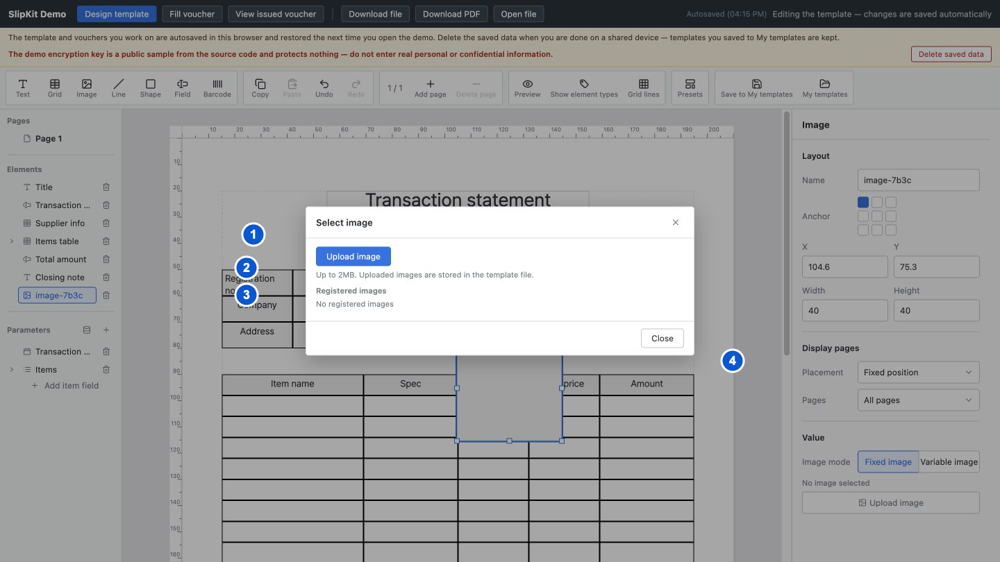

# SCR-011 이미지 선택 모달

최종 갱신: 2026-09-28

## 개요

고정 이미지 요소에 사용할 파일을 올리거나 현재 양식에서 이미 사용 중인 이미지를 다시 고르는 모달을
정의합니다. 고정 이미지와 파라미터 이미지의 원본 종류는 SCR-004에서 정하며 이 모달에서는 바꾸지 않습니다.

## 변경 이력

| 날짜 | 구분 | 변경 내용 |
| --- | --- | --- |
| 2026-09-28 | 신규 작성 | 실제 파일 선택, 크기 안내, 기존 이미지 재사용과 즉시 적용 흐름을 정의했습니다. |

## 진입·종료 조건

### 진입 조건

- SCR-004에서 고정 원본을 사용하는 이미지 요소를 선택하고 이미지 선택 버튼을 누르면 엽니다.
- 현재 요소의 이미지와 양식에서 사용 중인 다른 고정 이미지를 찾아 선택 목록으로 만듭니다.

### 종료 조건

- 새 파일 또는 기존 이미지를 고르면 즉시 요소에 적용하고 모달을 닫습니다.
- 닫기 버튼, 닫기 아이콘, 배경 또는 Escape를 사용하면 기존 이미지를 유지하고 닫습니다.

## 화면 이미지

## 화면 구성

| 번호 | 화면 항목 | 표시 내용 | 표시 조건 | 활성화 조건 |
| --- | --- | --- | --- | --- |
| 1 | 이미지 파일 선택 버튼 | 로컬 이미지 파일을 고르는 명령을 표시합니다. | 모달이 열려 있을 때 표시합니다. | 파일 선택 대화상자를 열 수 있습니다. |
| 2 | 파일 크기 안내 | `maxImageBytes`에 따른 허용 최대 크기를 읽기 쉬운 단위로 표시합니다. | 파일 선택 버튼 아래에 표시합니다. | 표시 전용입니다. |
| 3 | 사용 중인 이미지 | 양식 요소에서 사용 중인 고정 이미지를 미리보기 단추로 표시합니다. 파일 선택이 실패하면 이 구역 위에 오류를 표시합니다. | 재사용할 이미지 또는 파일 오류가 있을 때 표시합니다. | 이미지 하나를 선택할 수 있습니다. |
| 4 | 닫기 명령 | 머리말의 닫기 아이콘과 하단 닫기 버튼을 표시합니다. | 모달이 열려 있을 때 표시합니다. | 언제든지 사용할 수 있습니다. |

## 이벤트와 호출 기능

| 화면 항목 | 사용자 동작 | 호출 기능 | 결과 | 실행할 수 없는 조건 |
| --- | --- | --- | --- | --- |
| 이미지 파일 선택 버튼 | 버튼을 누릅니다. | FNC-011 | 운영체제 파일 선택 대화상자를 엽니다. | 없음 |
| 파일 선택 대화상자 | 이미지 파일을 고릅니다. | FNC-011, FNC-019 | 형식과 크기를 검사한 뒤 데이터 URL을 요소에 저장하고 모달을 닫습니다. | 파일이 이미지가 아니거나 읽지 못하거나 허용 크기를 넘는 상태 |
| 파일 선택 대화상자 | 선택을 취소합니다. | FNC-011 | 모달과 기존 요소 이미지를 그대로 유지합니다. | 없음 |
| 사용 중인 이미지 | 미리보기 하나를 고릅니다. | FNC-019 | 해당 데이터 URL을 요소에 저장하고 모달을 닫습니다. | 목록이 비어 있는 상태 |
| 닫기 버튼 | 버튼을 누릅니다. | FNC-019 | 이미지를 바꾸지 않고 모달을 닫습니다. | 없음 |
| 닫기 아이콘 | 버튼을 누릅니다. | FNC-019 | 닫기 버튼과 같은 결과로 모달을 닫습니다. | 없음 |

## 상태별 표시

| 상태 | 진입 조건 | 표시 내용 | 허용 동작 |
| --- | --- | --- | --- |
| 재사용 목록 있음 | 양식에 자리 표시자가 아닌 고정 이미지가 있습니다. | 각 이미지를 정사각형 미리보기 버튼으로 표시하고 현재 이미지를 강조합니다. | 새 파일 선택, 기존 이미지 선택과 닫기를 사용할 수 있습니다. |
| 재사용 목록 없음 | 양식에 재사용할 고정 이미지가 없습니다. | 등록된 이미지가 없다는 안내를 표시합니다. | 새 파일 선택과 닫기를 사용할 수 있습니다. |
| 파일 선택 취소 | 운영체제 파일 대화상자를 취소했습니다. | 모달의 이전 상태를 그대로 표시합니다. | 다시 파일을 고르거나 닫을 수 있습니다. |
| 파일 오류 | 고른 파일을 사용할 수 없습니다. | 파일 크기 안내 아래에 붉은 오류 문구를 표시합니다. | 다른 파일 선택, 기존 이미지 선택과 닫기를 사용할 수 있습니다. |

## 입력 검증과 오류 표시

| 검사 대상 | 실패 조건 | 표시 위치와 표현 | 문서·화면 처리 | 복구 방법 |
| --- | --- | --- | --- | --- |
| 파일 종류 | 고른 파일의 MIME과 내용이 지원 이미지가 아닙니다. | 파일 선택 버튼 아래에 `role="alert"`인 붉은 오류를 표시합니다. | 기존 요소 이미지를 유지하고 모달을 닫지 않습니다. | PNG 또는 JPEG 이미지 파일을 고릅니다. |
| 파일 크기 | 파일이 `maxImageBytes`를 넘습니다. | 허용 최대 크기를 포함한 붉은 오류를 표시합니다. | 큰 파일을 읽어 양식에 넣지 않습니다. | 이미지를 줄이거나 더 작은 파일을 고릅니다. |
| 파일 읽기 | 브라우저가 파일을 읽지 못합니다. | 파일을 읽지 못했다는 붉은 오류를 표시합니다. | 기존 요소 이미지를 유지합니다. | 파일 권한과 상태를 확인한 뒤 다시 고릅니다. |
| 편집 대상 | 모달을 연 뒤 이미지 요소가 삭제되거나 다른 종류로 바뀝니다. | 모달을 닫고 현재 디자이너 선택을 다시 표시합니다. | 사라진 대상에 이미지 값을 쓰지 않습니다. | 이미지 요소를 다시 선택하고 모달을 엽니다. |

## 화면 전이

| 시작 상태 | 사용자 동작 | 도착 화면·상태 | 유지 항목 | 초기화 항목 |
| --- | --- | --- | --- | --- |
| SCR-004 이미지 속성 | 이미지 선택 버튼을 누릅니다. | 이미지 선택 모달 | 선택한 이미지 요소와 기존 이미지 | 이전 파일 오류 |
| 이미지 선택 모달 | 유효한 파일을 고릅니다. | SCR-004 이미지 속성 | 선택 요소와 새 이미지 | 모달과 파일 오류 |
| 이미지 선택 모달 | 사용 중인 이미지를 고릅니다. | SCR-004 이미지 속성 | 선택 요소와 고른 이미지 | 모달과 파일 오류 |
| 이미지 선택 모달 | 닫기 버튼을 누릅니다. | SCR-004 이미지 속성 | 선택 요소와 기존 이미지 | 모달과 파일 오류 |

## 관련 데이터·인터페이스·오류

| 구분 | 식별자 | 관계 |
| --- | --- | --- |
| 데이터 | DAT-005 | 고정 이미지 요소의 `src`를 수정합니다. |
| 데이터 | DAT-009 | 이미지 데이터 URL과 허용 형식을 사용합니다. |
| 인터페이스 | IF-005 | `maxImageBytes` 설정과 양식 변경 이벤트를 사용합니다. |
| 오류 | ERR-001 | 이미지 형식과 데이터 손상을 확인합니다. |
| 오류 | ERR-005 | 파일 선택과 읽기 오류를 표시합니다. |

## 근거

- `packages/elements/src/designer/render/dialogs.ts`
- `packages/elements/src/designer/image-pick.ts`
- `packages/elements/src/image-file.ts`
- `packages/elements/src/slip-designer.ts`
