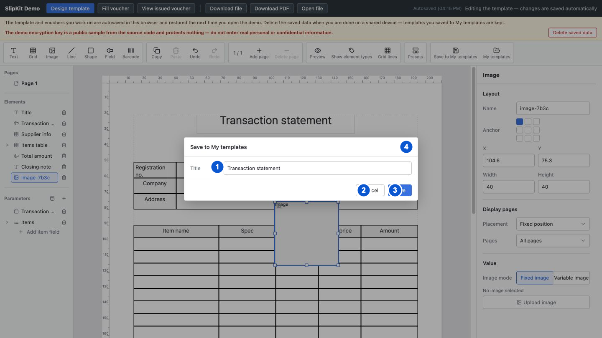
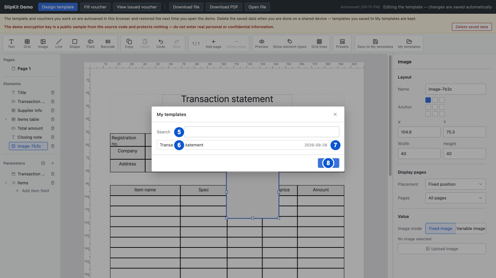

# SCR-012 내 양식 저장, 목록과 삭제 모달

최종 갱신: 2026-09-28

## 개요

호스트가 제공한 저장소에 현재 양식을 저장하고, 저장된 양식을 검색해 불러오거나 확인 후 삭제하는 세
모달을 정의합니다. 저장소가 없는 디자이너에는 관련 명령을 표시하지 않습니다.

## 변경 이력

| 날짜 | 구분 | 변경 내용 |
| --- | --- | --- |
| 2026-09-28 | 신규 작성 | 저장 모달, 목록 모달과 삭제 확인 모달의 항목, 상태와 개별 동작을 정의했습니다. |

## 설계 범위

- 현재 양식 저장, 저장된 양식 검색·불러오기·삭제에 사용하는 세 모달을 정의합니다.
- 저장 제목, 덮어쓰기, 목록 페이지와 삭제 확인의 상태 변화를 정의합니다.
- 저장소 호출 형식과 목록 커서는 IF-003과 FNC-016에서 정의합니다.

## 진입·종료 조건

### 진입 조건

- 저장 기능을 연결한 디자이너에서 내 양식으로 저장 버튼을 누르면 저장 창을 엽니다.
- 저장 기능을 연결한 디자이너에서 내 양식 버튼을 누르면 목록 창을 열고 저장된 양식 목록을 새로 읽습니다.
- 목록 항목의 삭제 버튼을 누르면 목록 모달 위에 삭제 확인 모달을 엽니다.

### 종료 조건

- 저장 성공, 양식 불러오기 성공 또는 각 모달의 닫기 동작으로 해당 모달을 닫습니다.
- 삭제 성공 또는 취소는 삭제 확인 모달만 닫고 목록 모달은 유지합니다.
- 실행 중 저장 기능 연결이 해제되면 다음 화면 갱신부터 저장 명령을 숨깁니다. 이미 열린 창은 사용자가 닫을 때까지 유지합니다.

## 화면 이미지

첫 이미지는 저장 모달, 두 번째 이미지는 내 양식 목록 모달의 번호를 표시합니다. 새 양식으로 저장,
오류, 목록 페이지 이동과 삭제 확인은 조건에 따라 같은 위치에 추가되며 상태 표에서 설명합니다.

## 화면 구성

| 번호 | 화면 항목 | 위치와 표시 내용 | 동작과 조건 | 상세 설계 |
| --- | --- | --- | --- | --- |
| 1 | 양식 제목 입력 | 현재 양식 제목을 저장 이름의 초깃값으로 표시합니다. 저장 모달에 표시합니다. | 비어 있지 않은 제목으로 수정할 수 있습니다. | — |
| 2 | 저장 취소 버튼 | 입력한 제목을 반영하지 않고 저장 모달을 닫는 명령을 표시합니다. 저장 모달에 표시합니다. | 언제든지 사용할 수 있습니다. | — |
| 3 | 저장 버튼 | 현재 양식을 저장소에 쓰는 명령을 표시합니다. 저장 모달에 표시합니다. | 언제든지 누를 수 있으며 잘못된 제목이나 양식이면 모달에 오류를 표시합니다. | — |
| 4 | 저장 모달 닫기 버튼 | 입력한 제목을 반영하지 않고 저장 모달을 닫는 아이콘 버튼을 표시합니다. 저장 모달에 표시합니다. | 언제든지 사용할 수 있습니다. | — |
| 5 | 검색 입력 | 저장된 양식 제목을 검색할 입력을 표시합니다. 목록 모달에 표시합니다. | 목록을 읽는 동안에도 입력할 수 있습니다. | — |
| 6 | 양식 열기 버튼 | 저장된 양식의 제목과 갱신 날짜를 표시합니다. 목록 조회에 성공하고 항목이 있을 때 표시합니다. | 해당 양식을 불러올 수 있습니다. | — |
| 7 | 양식 삭제 버튼 | 저장된 양식 하나의 삭제 확인을 여는 아이콘 버튼을 표시합니다. 각 양식 항목 오른쪽에 표시합니다. | 해당 양식의 삭제 확인을 열 수 있습니다. | — |
| 8 | 목록 모달 닫기 버튼 | 현재 편집 양식을 바꾸지 않고 목록 모달을 닫는 명령을 표시합니다. 목록 모달에 표시합니다. | 삭제 확인 모달이 닫혀 있을 때 사용할 수 있습니다. | — |

## 이벤트와 호출 기능

| 번호·화면 항목 | 사용자 동작 | 동작과 결과 | 관련 기능 |
| --- | --- | --- | --- |
| 1 양식 제목 | 제목을 입력합니다. | 저장에 사용할 제목 초안을 바꿉니다. | FNC-016 |
| 1 양식 제목 | Enter를 누릅니다. | 3번 저장 버튼과 같은 검증과 저장 작업을 실행합니다. | FNC-016 |
| 1 양식 제목 | 새 양식으로 저장을 선택합니다. | 이미 저장된 양식을 편집 중일 때 다음 저장에 새 식별자를 사용하도록 정합니다. | FNC-016 |
| 3 저장 | 버튼을 누릅니다. | 제목과 양식이 유효하고 저장에 성공하면 양식 제목과 저장 식별자를 갱신하고 창을 닫습니다. 오류가 있으면 현재 양식과 창을 유지하고 원인을 표시합니다. | FNC-016 |
| 2 저장 취소 | 버튼을 누릅니다. | 입력 초안을 반영하지 않고 저장 창을 닫습니다. | FNC-016 |
| 5 검색 | 검색어를 입력합니다. | 제목에 검색어가 포함된 양식만 남기고 첫 결과 페이지를 표시합니다. | FNC-016 |
| 6 양식 열기 | 항목을 고릅니다. | 저장 내용을 읽어 유효한 양식이면 현재 편집 문서로 엽니다. 읽기 또는 검증에 실패하면 기존 양식을 유지하고 목록 위에 이유를 표시합니다. | FNC-016 |
| 7 양식 삭제 | 버튼을 누릅니다. | 해당 양식 이름과 되돌릴 수 없다는 안내를 담은 삭제 확인 창을 엽니다. | FNC-016 |
| 6 양식 열기 | 이전, 페이지 번호 또는 다음 버튼을 누릅니다. | 범위 안의 검색 결과 페이지를 표시합니다. | FNC-016 |
| 7 양식 삭제 | 삭제 취소 버튼을 누릅니다. | 저장 내용을 바꾸지 않고 삭제 확인 창을 닫습니다. | FNC-016 |
| 7 양식 삭제 | 삭제 확인 버튼을 누릅니다. | 삭제에 성공하면 대상 양식 하나를 목록에서 제거합니다. 실패하면 목록을 유지하고 확인 창에 이유를 표시합니다. | FNC-016 |
| 8 목록 닫기 | 삭제 확인 창이 닫힌 상태에서 버튼을 누릅니다. | 현재 편집 양식을 바꾸지 않고 목록 창을 닫습니다. | FNC-016 |

## 상태별 표시

| 상태 | 시작 조건 | 화면 표시 | 가능한 다음 동작 |
| --- | --- | --- | --- |
| 새 양식 저장 | 현재 양식에 저장 ID가 없습니다. | 제목 입력, 취소와 저장 버튼을 표시합니다. | 새 ID로 저장하거나 취소할 수 있습니다. |
| 기존 양식 저장 | 현재 양식에 저장 ID가 있습니다. | 새 양식으로 저장 선택 항목을 함께 표시합니다. | 같은 ID 덮어쓰기 또는 새 ID 저장을 고를 수 있습니다. |
| 저장 실패 | 양식 검증 또는 저장소 저장이 실패했습니다. | 저장 모달 본문에 붉은 오류를 표시합니다. | 제목 수정, 다시 저장과 취소를 사용할 수 있습니다. |
| 목록 갱신 중 | 목록 모달을 열고 저장된 양식 메타데이터를 읽고 있습니다. | 전용 로딩 표시는 없습니다. 이전에 읽은 항목이 있으면 그대로 표시하고, 처음 여는 경우에는 빈 목록 안내를 표시합니다. 읽기가 끝나면 새 결과로 바꿉니다. | 검색하거나 모달을 닫을 수 있습니다. |
| 목록 있음 | 조회 또는 검색 결과가 있습니다. | 현재 페이지의 제목과 갱신 날짜를 표시합니다. | 검색, 페이지 이동, 불러오기와 삭제를 사용할 수 있습니다. |
| 목록 없음 | 저장된 양식 또는 검색 결과가 없습니다. | 저장된 양식이 없다는 안내를 표시합니다. | 검색어 수정과 닫기를 사용할 수 있습니다. |
| 목록 오류 | 저장소 목록 조회가 실패했습니다. | 목록 본문에 붉은 오류를 표시하고 항목은 표시하지 않습니다. | 모달을 닫은 뒤 다시 열 수 있습니다. |
| 삭제 확인 | 삭제 버튼을 눌렀습니다. | 목록 위에 삭제 확인 창을 표시하고 배경 목록 조작을 막습니다. | 취소 또는 삭제 확인만 사용할 수 있습니다. |
| 삭제 실패 | 저장소 삭제가 실패했습니다. | 확인 모달을 닫고 목록 모달의 오류 영역에 원인을 표시합니다. | 다시 삭제하거나 목록을 닫을 수 있습니다. |

## 입력 검증과 오류 표시

| 발생 위치 | 발생 조건 | 표시 방법 | 처리와 복구 |
| --- | --- | --- | --- |
| 저장 제목 | 앞뒤 공백을 제거한 제목이 비었습니다. | 저장 모달의 오류 영역에 필수 제목 오류를 표시합니다. | 저장소를 호출하지 않고 모달 입력을 유지합니다. 비어 있지 않은 제목을 입력합니다. |
| 현재 양식 | 저장 직전 검증에 실패합니다. | 저장 모달에 검증 세부 내용을 포함한 오류를 표시합니다. | 잘못된 양식을 저장하지 않습니다. 모달을 닫고 디자이너에서 원인을 고칩니다. |
| 저장소 저장 | 양식 저장 요청이 실패합니다. | 저장 모달 본문에 저장소 오류를 표시합니다. | 모달, 제목과 현재 양식을 유지합니다. 저장소 상태를 확인하고 다시 저장합니다. |
| 저장소 목록 | 저장된 양식 목록을 읽지 못합니다. | 목록 모달 본문에 저장소 오류를 표시합니다. | 목록을 비우고 현재 편집 양식을 유지합니다. 모달을 닫은 뒤 저장소 상태를 확인하고 다시 엽니다. |
| 불러온 파일 | 파일을 읽지 못하거나 저장 내용이 편집할 수 있는 양식이 아닙니다. | 목록 창 본문에 오류를 표시합니다. | 목록 창과 현재 편집 양식을 유지합니다. 다른 양식을 고르거나 저장 파일을 복구합니다. |
| 저장소 삭제 | 양식 삭제 요청이 실패합니다. | 목록 모달 본문에 저장소 오류를 표시합니다. | 대상 항목을 목록에서 제거하지 않습니다. 저장소 상태를 확인하고 다시 삭제합니다. |

## 화면 전이

| 사용자 동작 | 화면 변화 | 유지하는 내용 | 초기화하는 내용 |
| --- | --- | --- | --- |
| SCR-001에서 내 양식으로 저장 버튼을 누릅니다. | 새 양식 저장 또는 기존 양식 저장 | 현재 양식과 저장 ID | 이전 저장 제목 초안과 오류 |
| 저장 모달에서 저장에 성공합니다. | SCR-001 편집 상태 | 저장한 양식, 현재 선택과 새 저장 ID | 저장 모달과 오류 |
| SCR-001에서 내 양식 버튼을 누릅니다. | 목록 갱신 중 | 현재 편집 양식과 이전 목록 항목 | 이전 검색어, 페이지와 목록 오류 |
| 목록 있음에서 양식 항목을 고릅니다. | SCR-001에서 불러온 양식 | 불러온 양식과 저장 ID | 이전 편집 기록, 선택, 미리보기와 목록 모달 |
| 목록 있음에서 삭제 버튼을 누릅니다. | 삭제 확인 | 목록, 검색어와 현재 페이지 | 이전 삭제 대상 |
| 삭제 확인에서 취소 버튼을 누릅니다. | 목록 있음 | 목록, 검색어와 현재 페이지 | 삭제 대상 |
| 삭제 확인에서 삭제에 성공합니다. | 갱신된 목록 있음 또는 목록 없음 | 검색어와 가능한 현재 페이지 | 삭제한 항목과 삭제 대상 |

## 관련 데이터·인터페이스·오류

| 구분 | 식별자 | 관계 |
| --- | --- | --- |
| 데이터 | DAT-002 | 현재 양식의 제목과 본문을 저장하고 불러옵니다. |
| 데이터 | DAT-011 | 저장된 양식의 ID, 제목과 갱신 시각을 목록에 표시합니다. |
| 인터페이스 | IF-003 | 호스트가 제공한 저장소의 저장, 목록, 읽기와 삭제 기능을 사용합니다. |
| 인터페이스 | IF-005 | 불러온 양식을 새 편집 문서로 여는 초기화 범위를 정의합니다. |
| 오류 | ERR-001 | 저장하거나 불러올 `.slip` 파일을 검증합니다. |
| 오류 | ERR-004 | 저장소 작업 실패를 표시합니다. |
| 오류 | ERR-005 | 모달 입력과 화면 상태 오류를 표시합니다. |

## 근거

- `packages/elements/src/designer/render/dialogs.ts`
- `packages/elements/src/designer/controllers/forms-storage.ts`
- `packages/elements/src/slip-designer.ts`
