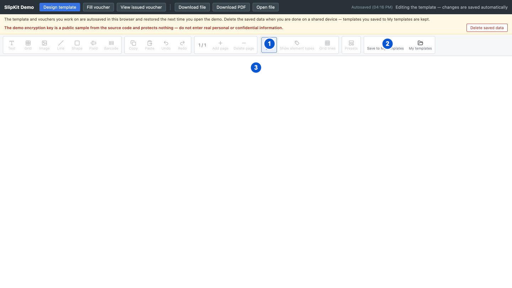

# SCR-013 출력 결과 미리보기

최종 갱신: 2026-09-28

## 개요

현재 양식과 샘플 값으로 만든 PDF를 `<slip-designer>` 안에서 확인하는 읽기 전용 상태를 정의합니다.
이 화면은 별도 컴포넌트가 아니라 SCR-001의 편집 영역을 PDF 영역으로 바꾼 상태입니다.

## 변경 이력

| 날짜 | 구분 | 변경 내용 |
| --- | --- | --- |
| 2026-09-28 | 신규 작성 | 실제 미리보기 화면, 로딩·완료·오류 상태, 재생성과 편집 복귀 동작을 정의했습니다. |

## 설계 범위

- 디자이너 편집 영역을 PDF 미리보기로 바꾸는 로딩·성공·오류 상태를 정의합니다.
- 편집으로 돌아갈 때 보존하는 페이지, 선택과 스크롤 위치를 정의합니다.
- PDF 페이지를 만드는 처리와 오류 분류는 FNC-013과 ERR-003에서 정의합니다.

## 진입·종료 조건

### 진입 조건

- SCR-001의 미리보기 버튼을 누르면 현재 양식과 샘플 값으로 PDF 생성을 시작합니다.
- 생성 중에는 편집 화면 대신 로딩 상태를 표시합니다.

### 종료 조건

- 편집 버튼을 누르면 현재 PDF 주소를 해제하고 이전 페이지와 선택을 유지한 편집 화면으로 돌아갑니다.
- 다른 양식을 열거나 디자이너 화면을 닫으면 미리보기 파일과 진행 중인 생성 작업을 정리합니다.

## 화면 이미지

첫 이미지는 미리보기 상태의 도구 모음과 PDF 영역을, 두 번째 이미지는 PDF 영역에 표시되는 실제 출력
첫 페이지를 보여 줍니다.

## 화면 구성

| 번호 | 화면 항목 | 위치와 표시 내용 | 동작과 조건 | 상세 설계 |
| --- | --- | --- | --- | --- |
| 1 | 편집 버튼 | PDF 주소를 정리하고 이전 편집 상태로 돌아가는 명령을 표시합니다. 미리보기 상태에서 표시합니다. | 언제든지 사용할 수 있습니다. | — |
| 2 | 저장 명령 | 저장 기능이 연결되어 있으면 내 양식으로 저장과 내 양식 버튼을 표시합니다. | 로딩, 완료와 오류 상태에서 사용할 수 있습니다. | SCR-012 |
| 3 | 미리보기 영역 | PDF를 만드는 동안에는 진행 안내, 성공하면 PDF, 실패하면 오류 문구를 같은 영역에 표시합니다. | PDF가 표시되면 브라우저가 제공하는 확대, 페이지 이동, 인쇄와 내려받기를 사용할 수 있습니다. | — |

## 이벤트와 호출 기능

| 번호·화면 항목 | 사용자 동작 | 동작과 결과 | 관련 기능 |
| --- | --- | --- | --- |
| 3 미리보기 영역 | SCR-017의 미리보기 버튼을 누릅니다. | 유효한 양식이면 편집 도구를 숨기고 PDF 생성을 시작합니다. | FNC-013·FNC-022 |
| 1 편집 | 버튼을 누릅니다. | 진행 중인 생성 결과를 버리고 미리보기 파일을 정리한 뒤 이전 편집 상태로 돌아갑니다. | FNC-022 |
| 2 저장 명령 | 내 양식으로 저장 버튼을 누릅니다. | 현재 양식을 저장하는 SCR-012를 엽니다. | FNC-016 |
| 2 저장 명령 | 내 양식 버튼을 누릅니다. | 저장된 양식 목록을 표시하는 SCR-012를 엽니다. | FNC-016 |
| 3 미리보기 영역 | 브라우저 PDF 명령을 사용합니다. | 사용 중인 브라우저가 제공하는 범위에서 확대, 페이지 이동, 인쇄 또는 내려받기를 실행합니다. | FNC-013 |

## 상태별 표시

| 상태 | 시작 조건 | 화면 표시 | 가능한 다음 동작 |
| --- | --- | --- | --- |
| 로딩 | 미리보기에 진입했지만 PDF 생성이 끝나지 않았습니다. | 가운데에 PDF를 만드는 중이라는 안내를 표시합니다. | 편집 복귀와 저장소 명령을 사용할 수 있습니다. |
| 완료 | 최신 PDF 생성에 성공했습니다. | 생성한 PDF를 편집 영역 전체에 표시합니다. | PDF 뷰어, 편집 복귀와 저장 명령을 사용할 수 있습니다. |
| 오류 | 최신 PDF 생성에 실패했습니다. | 가운데에 미리보기를 만들 수 없다는 오류를 표시합니다. | 편집 화면으로 돌아가 원인을 수정할 수 있습니다. |
| 재생성 | 미리보기 중 양식, 로케일 또는 SlipKit 설정이 바뀌었습니다. | 기존 결과를 정리하고 다시 로딩 상태를 표시합니다. | 편집 화면으로 돌아갈 수 있습니다. |

## 입력 검증과 오류 표시

| 발생 위치 | 발생 조건 | 표시 방법 | 처리와 복구 |
| --- | --- | --- | --- |
| 양식과 샘플 값 | PDF 생성 전에 파일 검증을 통과하지 못합니다. | 미리보기 영역 가운데에 현재 로케일의 오류 문구를 표시합니다. | 실패한 PDF를 표시하지 않고 편집 문서는 유지합니다. 편집 화면에서 값과 구조를 고칩니다. |
| 레이아웃 | 요소 또는 반복 그리드를 출력 페이지에 배치할 수 없습니다. | 미리보기 영역에 PDF 생성 오류를 표시합니다. | 이전 PDF 주소를 해제하고 실패 결과를 버립니다. SCR-004 또는 SCR-006에서 배치를 고칩니다. |
| 폰트 | 필요한 글꼴을 가져오거나 넣지 못합니다. | 미리보기 영역에 PDF 생성 오류를 표시합니다. | 불완전한 PDF를 표시하지 않습니다. 호스트 글꼴 설정과 글꼴 데이터를 확인합니다. |
| 이미지 또는 바코드 | 데이터가 손상되었거나 출력할 수 없습니다. | 미리보기 영역에 PDF 생성 오류를 표시합니다. | 불완전한 PDF를 표시하지 않습니다. 이미지 값 또는 바코드 값을 고칩니다. |
| 오래된 비동기 결과 | 새 생성 요청 뒤 이전 요청이 늦게 끝납니다. | 별도 오류를 표시하지 않습니다. | 이전 결과를 버리고 최신 요청 결과만 표시합니다. 최신 생성이 끝날 때까지 기다립니다. |

## 화면 전이

| 사용자 동작 | 화면 변화 | 유지하는 내용 | 초기화하는 내용 |
| --- | --- | --- | --- |
| SCR-001 편집 상태에서 미리보기 버튼을 누릅니다. | 로딩 | 양식, 샘플 값, 현재 페이지, 선택과 캔버스 스크롤 | 이전 PDF 주소와 오류 |
| 로딩에서 PDF 생성에 성공합니다. | 완료 | 양식, 선택과 새 PDF 주소 | 로딩 문구 |
| 로딩에서 PDF 생성에 실패합니다. | 오류 | 양식, 현재 페이지와 선택 | 이전 PDF 주소와 로딩 문구 |
| 완료 또는 오류에서 편집 버튼을 누릅니다. | SCR-001의 이전 편집 상태 | 양식, 현재 페이지, 선택과 캔버스 스크롤 | PDF 주소와 미리보기 오류 |

## 관련 데이터·인터페이스·오류

| 구분 | 식별자 | 관계 |
| --- | --- | --- |
| 데이터 | DAT-002 | 현재 양식의 페이지와 요소를 출력합니다. |
| 데이터 | DAT-006 | 샘플 값을 전표 값으로 사용해 출력합니다. |
| 데이터 | DAT-009 | PDF에 필요한 이미지와 글꼴 자원을 사용합니다. |
| 인터페이스 | IF-001 | 현재 양식과 출력 설정으로 PDF 바이트를 생성합니다. |
| 인터페이스 | IF-005 | 디자이너의 미리보기 상태와 설정을 사용합니다. |
| 오류 | ERR-003 | PDF 배치와 렌더링 실패를 표시합니다. |
| 오류 | ERR-005 | 미리보기 화면 상태 오류를 표시합니다. |

## 근거

- `packages/elements/src/slip-designer.ts`
- `packages/elements/src/designer/render/toolbar.ts`
- `packages/elements/src/settings.ts`
