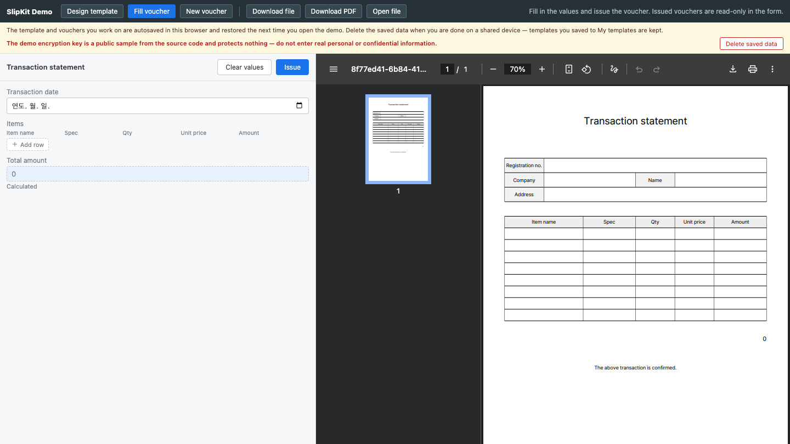

# SCR-014 전표 작성 폼

최종 갱신: 2026-09-28

## 개요

양식의 파라미터를 입력하고 계산값과 PDF를 확인한 뒤 전표를 발행하는 `<slip-form>` 화면을
정의합니다.

## 변경 이력

| 날짜 | 구분 | 변경 내용 |
| --- | --- | --- |
| 2026-09-28 | 신규 작성 | 입력 필드, 목록 행, 계산값, 초기화와 발행 흐름을 정의했습니다. |

## 진입·종료 조건

검증된 양식 또는 미발행 전표를 `src`로 받으면 진입합니다. 발행하면 읽기 전용 뷰어로 전환하거나
호스트가 `slip-issue`를 처리합니다.

## 화면 이미지

## 화면 영역

| 영역 | 입력·출력 항목 | 표시·활성화 조건 |
| --- | --- | --- |
| 입력 패널 | 날짜·숫자·문자열·목록·이미지 값 | 파라미터 정의 순서로 표시합니다. |
| 계산 필드 | 수식 결과 | 읽기 전용으로 표시합니다. |
| 명령 | 값 비우기, 발행 | 발행 전 상태에서 활성화합니다. |
| 출력 영역 | PDF 로딩·문서·오류 | 현재 값을 바꿀 때 다시 생성합니다. |

## 이벤트와 호출 기능

| 사용자 동작 | 호출 기능 | 결과 |
| --- | --- | --- |
| 값·목록 행 변경 | FNC-003·FNC-005 | `slip-change`와 계산·PDF를 갱신합니다. |
| 값 비우기 | FNC-003 | 현재 양식의 빈 전표로 돌아갑니다. |
| 발행 | FNC-003 | 검증된 `issued: true` 전표를 알립니다. |

## 상태별 표시

입력 중, 계산·렌더 중, 오류, 발행 완료를 구분합니다. 발행 전표를 입력으로 받으면 필드를 읽기 전용으로
표시합니다.

## 입력 검증과 오류 표시

필수값, 값 종류, 날짜 패턴, 수식과 이미지 오류를 관련 필드에 표시합니다. 오류가 남아 있으면 발행하지
않습니다.

## 화면 전이

발행 성공은 SCR-015로 이어지며 새 전표는 같은 양식의 빈 작성 상태로 돌아옵니다.

## 관련 데이터·인터페이스·오류

| 구분 | 식별자 | 관계 |
| --- | --- | --- |
| 데이터 | DAT-003·DAT-006·DAT-008 | 전표 값과 계산식을 사용합니다. |
| 인터페이스 | IF-006 | 속성·메서드·이벤트 계약입니다. |
| 오류 | ERR-002·ERR-003·ERR-005 | 값·출력·화면 오류를 표시합니다. |

## 근거

- `packages/elements/src/slip-form.ts`
- `packages/elements/src/styles/slip-form.styles.ts`

