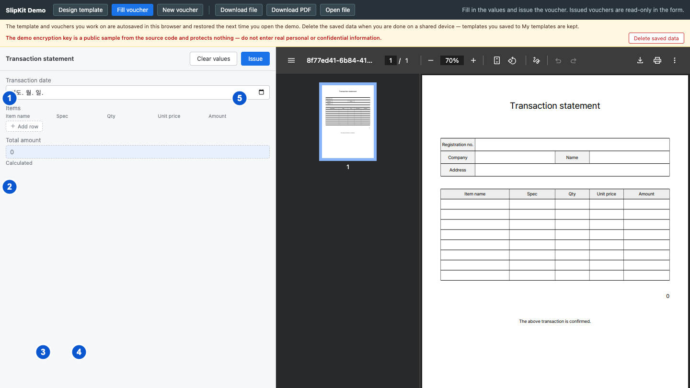

# SCR-014 전표 작성 폼

최종 갱신: 2026-09-28

## 개요

`<slip-form>`이 양식의 파라미터를 입력 항목으로 만들고 현재 값의 PDF를 함께 표시하는 화면을
정의합니다. 사용자는 값을 비우거나 유효한 값을 확정해 전표를 발행할 수 있습니다.

## 변경 이력

| 날짜 | 구분 | 변경 내용 |
| --- | --- | --- |
| 2026-09-28 | 신규 작성 | 값 종류별 입력, 목록 행, PDF 상태, 값 비우기, 발행과 발행 후 잠금 동작을 정의했습니다. |

## 설계 범위

- 양식의 파라미터를 일반 값, 목록과 이미지 입력으로 표시하는 작성 화면을 정의합니다.
- 입력값 변경, 초기화, 전표 발행과 발행 뒤 잠금 상태를 정의합니다.
- 전표 데이터 조립과 PDF 생성 처리는 FNC-003과 FNC-022에서 정의합니다.

## 진입·종료 조건

### 진입 조건

- 작성 화면에 유효한 양식 또는 작성 중 전표를 열면 입력 항목과 PDF를 표시합니다.
- 양식을 받으면 빈 작성 상태로 시작하고, 미발행 전표를 받으면 저장된 값을 입력에 표시합니다.
- 발행 전표를 받으면 입력값을 표시하되 처음부터 읽기 전용 상태로 엽니다.

### 종료 조건

- 발행에 성공하면 같은 화면에서 입력을 잠그고 발행 전표를 호스트에 전달합니다.
- 다른 양식이나 전표를 열면 기존 입력 상태를 버리고 새 파일의 값으로 초기화합니다.
- 호스트가 컴포넌트를 제거하면 PDF 주소와 예약된 미리보기 작업을 정리합니다.

## 화면 이미지

## 화면 구성

| 번호 | 화면 항목 | 위치와 표시 내용 | 동작과 조건 | 상세 설계 |
| --- | --- | --- | --- | --- |
| 1 | 입력 영역 | 일반 값, 이미지와 읽기 전용 수식 결과를 파라미터 순서대로 표시합니다. 유효한 양식 또는 전표를 열었을 때 표시합니다. | 발행 전 상태에서 편집 가능한 값을 수정할 수 있습니다. | — |
| 2 | 목록 입력 | 하위 필드 열, 입력 행, 행 삭제와 행 추가 버튼을 표시합니다. 목록 파라미터가 있을 때 표시합니다. | 값이 객체 배열이고 발행 전일 때 수정할 수 있습니다. | — |
| 3 | 값 비우기 버튼 | 모든 입력을 지우는 명령을 표시합니다. 발행 전 상태에 표시합니다. | 사용할 수 있습니다. | — |
| 4 | 발행 버튼 | 현재 값을 확정해 전표를 발행하는 명령을 표시합니다. 발행 전 상태에 표시합니다. | 누를 수 있으며 값 형식이 잘못되면 폼 위에 오류를 표시합니다. | — |
| 5 | PDF 영역 | 현재 값의 PDF, 로딩 안내 또는 오류를 표시합니다. 유효한 양식 또는 전표를 열었을 때 표시합니다. | PDF 조작은 브라우저 뷰어가 제공합니다. | — |

## 이벤트와 호출 기능

| 번호·화면 항목 | 사용자 동작 | 동작과 결과 | 관련 기능 |
| --- | --- | --- | --- |
| 1 입력 영역 | 문자열, 숫자 또는 날짜를 입력합니다. | 발행 전이면 해당 값을 바꾸고 형식을 검사한 뒤 PDF 갱신을 예약합니다. | FNC-003 |
| 1 입력 영역 | 이미지 선택 버튼을 누르고 파일을 고릅니다. | 발행 전이며 이미지가 유효하면 값을 저장하고 PDF를 갱신합니다. 오류가 있으면 기존 값을 유지하고 입력 아래에 이유를 표시합니다. | FNC-003·FNC-011 |
| 1 입력 영역 | 이미지 지우기 버튼을 누릅니다. | 발행 전이며 이미지 값이 있으면 값을 제거하고 PDF를 갱신합니다. | FNC-003 |
| 2 목록 입력 | 셀 값을 입력합니다. | 발행 전이고 목록 편집이 허용되면 해당 항목의 하위 필드 값을 바꾸고 PDF를 갱신합니다. | FNC-003 |
| 2 목록 입력 | 행 추가 버튼을 누릅니다. | 발행 전이고 목록 편집이 허용되면 빈 항목을 목록 끝에 추가하고 PDF를 갱신합니다. | FNC-003 |
| 2 목록 입력 | 행 삭제 버튼을 누릅니다. | 발행 전이고 목록 편집이 허용되면 해당 항목을 제거하고 PDF를 갱신합니다. | FNC-003 |
| 3 값 비우기 | 버튼을 누릅니다. | 발행 전이면 모든 입력값과 발행 오류를 지우고 빈 값의 PDF를 만듭니다. | FNC-003 |
| 4 발행 | 버튼을 누릅니다. | 발행 전표의 값과 파일 구조가 모두 유효하면 편집을 잠그고 발행 완료 결과를 호스트에 전달합니다. 오류가 있으면 입력값을 유지하고 폼 위쪽에 원인을 표시합니다. | FNC-003·FNC-005 |
| 1 입력 영역 | 호스트가 초기화 명령을 실행합니다. | 같은 양식의 빈 작성 상태로 돌아가고 PDF를 다시 만듭니다. | IF-006 |

## 상태별 표시

| 상태 | 시작 조건 | 화면 표시 | 가능한 다음 동작 |
| --- | --- | --- | --- |
| 빈 작성 | 양식을 처음 열거나 값을 비웠습니다. | 파라미터별 빈 입력과 현재 빈 값의 PDF 상태를 표시합니다. | 값 입력과 발행을 사용할 수 있습니다. |
| 입력 중 | 하나 이상의 값을 바꿨습니다. | 현재 값, 필드 오류와 갱신된 PDF를 표시합니다. | 계속 입력, 값 비우기와 유효할 때 발행을 사용할 수 있습니다. |
| 목록 값 잠금 | 입력 전표의 목록 값이 행과 열로 표시할 수 있는 구조가 아닙니다. | 기존 값을 보존하고 해당 목록 편집을 비활성화합니다. | 값 비우기 또는 화면 초기화 명령으로 복구할 수 있습니다. |
| PDF 로딩 | 입력 변경 뒤 PDF를 생성하고 있습니다. | PDF 영역에 로딩 안내를 표시합니다. | 입력을 계속 수정할 수 있습니다. |
| PDF 오류 | 현재 값으로 PDF를 만들지 못했습니다. | PDF 영역에 오류를 표시합니다. | 입력과 값을 고쳐 재생성할 수 있습니다. |
| 발행 완료 | 발행이 성공했거나 발행 전표를 입력으로 받았습니다. | 발행 완료 배지와 보관 안내를 표시하고 모든 입력을 잠급니다. | PDF 확인만 할 수 있습니다. |
| 발행 실패 | 최종 전표의 파일 검증이 실패했습니다. | 머리말 아래에 붉은 오류 안내를 표시하고 보조 기술에도 즉시 알립니다. | 입력값을 유지합니다. 안내된 값을 고친 뒤 다시 발행합니다. |

## 입력 검증과 오류 표시

| 발생 위치 | 발생 조건 | 표시 방법 | 처리와 복구 |
| --- | --- | --- | --- |
| 숫자 값 | 숫자 파라미터 값이 유한한 숫자가 아닙니다. | 해당 입력을 오류 상태로 표시합니다. | 잘못된 값을 전표 초안에 보존하되 발행하지 않습니다. 유효한 숫자를 입력합니다. |
| 날짜 값 | 날짜 문자열이 `YYYY-MM-DD` 형식이 아니거나 실제로 존재하지 않는 날짜입니다. | 해당 날짜 입력 바로 아래에 오류를 표시합니다. | 입력을 유지하되 발행하지 않습니다. 실제 날짜를 `YYYY-MM-DD` 형식으로 입력합니다. |
| 목록 값 | 값이 행과 열로 표시할 수 있는 구조가 아닙니다. | 목록 영역에 편집할 수 없는 값이라는 오류를 표시하고 입력을 잠급니다. | 원본 값을 자동으로 지우거나 바꾸지 않습니다. 값 비우기 또는 화면 초기화 명령을 실행합니다. |
| 이미지 파일 | 파일이 이미지가 아니거나 손상되었거나 크기 상한을 넘습니다. | 모든 입력 위의 폼 오류 안내에 대상 이름과 원인을 표시합니다. | 기존 이미지 값을 유지합니다. 지원하는 이미지 파일을 다시 고릅니다. |
| 수식 | 계산할 수 없거나 결과 종류가 맞지 않습니다. | 해당 수식 결과 입력 아래에 계산 오류를 표시하고 PDF 영역에도 생성 오류를 표시할 수 있습니다. | 수식 결과를 비워 표시합니다. 수식 오류만으로 발행을 막지는 않습니다. 원본 양식의 수식 또는 입력값을 고칩니다. |
| 발행 처리 | 발행 완료 파일에 외부 URL 이미지가 남는 등 최종 파일 검증이 실패합니다. | 폼 머리말 아래의 오류 안내에 원인을 표시합니다. | 입력을 잠그지 않고 발행 결과도 전달하지 않습니다. 원인을 고친 뒤 다시 발행합니다. |

## 화면 전이

| 사용자 동작 | 화면 변화 | 유지하는 내용 | 초기화하는 내용 |
| --- | --- | --- | --- |
| 빈 작성에서 값을 입력합니다. | 입력 중 | 양식과 입력한 값 | 이전 발행 오류 |
| 입력 중에서 값 비우기 버튼을 누릅니다. | 빈 작성 | 양식과 로케일 | 모든 값, 입력 오류와 발행 오류 |
| 입력 중에서 발행 버튼을 누르고 검증에 성공합니다. | 발행 완료 | 발행 전표와 PDF | 편집 가능 상태와 이전 발행 오류 |
| 입력 중에서 발행 버튼을 누르고 검증에 실패합니다. | 발행 실패 | 양식과 현재 값 | 이전 발행 오류 |
| 다른 양식 또는 전표를 엽니다. | 새 파일에 맞는 상태 | 새 양식 또는 전표 | 이전 값, 오류, 미리보기 파일과 발행 상태 |

## 관련 데이터·인터페이스·오류

| 구분 | 식별자 | 관계 |
| --- | --- | --- |
| 데이터 | DAT-003 | 전표 값과 발행 상태를 만듭니다. |
| 데이터 | DAT-006 | 파라미터 정의로 입력 항목과 값 검사를 만듭니다. |
| 데이터 | DAT-008 | 수식 입력의 읽기 전용 결과를 계산합니다. |
| 데이터 | DAT-009 | 이미지 값을 검사하고 PDF에 사용합니다. |
| 인터페이스 | IF-006 | 파일 입력, 초기화, 값 변경과 발행 완료를 호스트와 주고받는 방식을 정의합니다. |
| 오류 | ERR-002 | 파라미터 값과 수식 오류를 표시합니다. |
| 오류 | ERR-003 | PDF 생성 오류를 표시합니다. |
| 오류 | ERR-005 | 파일 선택과 발행 처리 오류를 표시합니다. |

## 근거

- `packages/elements/src/slip-form.ts`
- `packages/elements/src/styles/slip-form.styles.ts`
- `packages/elements/src/image-file.ts`
