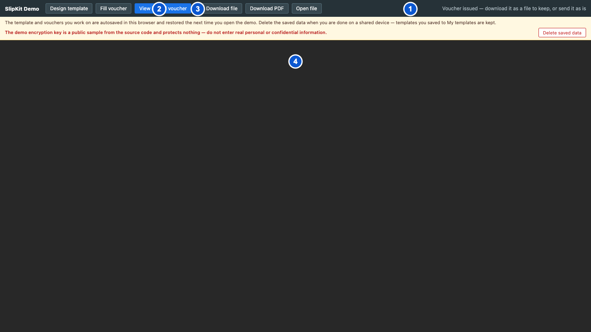
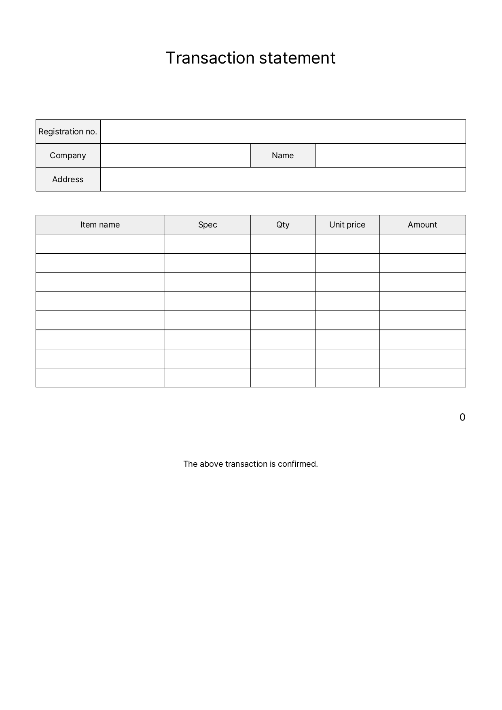

# SCR-015 전표 뷰어

최종 갱신: 2026-09-28

## 개요

`<slip-viewer>`가 유효한 `.slip` 양식 또는 전표를 PDF로 만들어 표시하는 읽기 전용 화면을
정의합니다. 입력과 문서 편집 명령은 제공하지 않습니다.

## 변경 이력

| 날짜 | 구분 | 변경 내용 |
| --- | --- | --- |
| 2026-09-28 | 신규 작성 | 입력 파일 판정, PDF 로딩·표시·오류, 갱신과 종료 동작을 정의했습니다. |

## 진입·종료 조건

### 진입 조건

- 호스트가 `<slip-viewer>`를 화면에 배치하고 `src`에 유효한 양식 또는 전표 문자열을 넣습니다.
- 양식은 샘플 값으로, 전표는 저장된 값으로 PDF 생성을 시작합니다.
- `src`가 비어 있으면 PDF 대신 파일이 없다는 안내를 표시합니다.

### 종료 조건

- 호스트가 다른 화면으로 교체하거나 컴포넌트를 제거하면 PDF 주소를 해제하고 종료합니다.
- 호스트가 새 `src`를 넣으면 기존 PDF와 오류를 지우고 새 파일을 처리합니다.

## 화면 이미지

첫 이미지는 데모 호스트 안의 `<slip-viewer>`를, 두 번째 이미지는 브라우저 PDF 도구와 관계없는 실제
출력 첫 페이지를 보여 줍니다.

## 화면 구성

| 번호 | 화면 항목 | 표시 내용 | 표시 조건 | 활성화 조건 |
| --- | --- | --- | --- | --- |
| 1 | 데모 상태 안내 | 발행 완료와 파일 보관 안내를 표시합니다. | 데모 호스트의 뷰어 모드에서 표시합니다. | 표시 전용이며 `<slip-viewer>` 공개 화면에는 포함되지 않습니다. |
| 2 | 전표 파일 내려받기 | 발행 전표의 `.slip` 파일을 저장하는 호스트 명령을 표시합니다. | 데모 호스트가 발행 전표를 가지고 있을 때 표시합니다. | 발행 전표가 있을 때 사용할 수 있습니다. |
| 3 | PDF 내려받기 | 같은 발행 전표의 PDF를 저장하는 호스트 명령을 표시합니다. | 데모 호스트가 발행 전표를 가지고 있을 때 표시합니다. | PDF 생성에 성공할 수 있을 때 사용합니다. |
| 4 | 뷰어 영역 | 로딩 안내, PDF 또는 오류 가운데 하나를 `<slip-viewer>` 전체에 표시합니다. | 컴포넌트가 연결되어 있을 때 표시합니다. | PDF가 있으면 브라우저 PDF 뷰어 기능을 사용할 수 있습니다. |

## 이벤트와 호출 기능

| 화면 항목 | 사용자 동작 | 호출 기능 | 결과 | 실행할 수 없는 조건 |
| --- | --- | --- | --- | --- |
| 호스트의 `src` 설정 | 양식 또는 전표를 넣습니다. | FNC-013, FNC-022 | 입력을 검증하고 PDF 생성을 시작합니다. | 입력을 해석하거나 검증할 수 없는 상태 |
| 브라우저 PDF 도구 | 확대 명령을 사용합니다. | FNC-013 | 브라우저 안에서 PDF 표시 배율을 바꿉니다. | 브라우저가 확대 도구를 제공하지 않는 상태 |
| 브라우저 PDF 도구 | 페이지 이동 명령을 사용합니다. | FNC-013 | 선택한 출력 페이지를 표시합니다. | 출력 페이지가 하나이거나 브라우저가 도구를 제공하지 않는 상태 |
| 브라우저 PDF 도구 | 인쇄 명령을 사용합니다. | FNC-013 | 브라우저 인쇄 화면을 엽니다. | 브라우저가 인쇄 도구를 제공하지 않는 상태 |
| 브라우저 PDF 도구 | 내려받기 명령을 사용합니다. | FNC-013 | 현재 PDF 파일을 저장합니다. | 브라우저가 내려받기 도구를 제공하지 않는 상태 |
| 데모 전표 내려받기 | 버튼을 누릅니다. | FNC-022 | 발행 전표의 `.slip` 파일을 내려받습니다. | 데모에 발행 전표가 없는 상태 |
| 데모 PDF 내려받기 | 버튼을 누릅니다. | FNC-013 | 같은 발행 전표로 PDF를 만들어 내려받습니다. | 데모에 발행 전표가 없거나 PDF 생성이 실패한 상태 |

## 상태별 표시

| 상태 | 진입 조건 | 표시 내용 | 허용 동작 |
| --- | --- | --- | --- |
| 입력 없음 | `src`가 비어 있습니다. | 전표가 없다는 안내를 표시합니다. | 호스트가 발행 전표를 넣을 때까지 조작을 제공하지 않습니다. |
| 입력 오류 | `src`를 해석하거나 검증하지 못했습니다. | 컴포넌트 가운데에 오류를 표시합니다. | 호스트가 올바른 `src`를 넣을 수 있습니다. |
| 로딩 | 양식 또는 전표를 검증했고 PDF를 만드는 중입니다. | PDF를 만드는 중이라는 안내를 표시합니다. | 완료될 때까지 기다릴 수 있습니다. |
| PDF 표시 | 최신 PDF 생성에 성공했습니다. | PDF `iframe`을 전체 영역에 표시합니다. | 브라우저 PDF 도구를 사용할 수 있습니다. |
| 렌더 오류 | 입력 파일로 PDF를 만들지 못했습니다. | 문서 대신 PDF 생성 오류를 표시합니다. | 호스트가 자원이나 입력을 고쳐 다시 넣을 수 있습니다. |

## 입력 검증과 오류 표시

| 검사 대상 | 실패 조건 | 표시 위치와 표현 | 문서·화면 처리 | 복구 방법 |
| --- | --- | --- | --- | --- |
| `src` 구문 | JSON, 암호화 봉투 또는 `.slip` 스키마가 올바르지 않습니다. | 뷰어 영역 가운데에 오류 문구를 표시합니다. | 기존 PDF 주소를 해제하고 잘못된 파일을 표시하지 않습니다. | 올바른 발행 전표 문자열을 넣습니다. |
| PDF 생성 | 레이아웃, 폰트, 이미지 또는 바코드 처리에 실패합니다. | 뷰어 영역 가운데에 렌더 오류를 표시합니다. | 불완전한 PDF를 표시하지 않습니다. | 호스트 설정과 입력 파일의 자원을 복구합니다. |
| 오래된 비동기 결과 | 새 `src` 처리 뒤 이전 생성이 늦게 끝납니다. | 별도 오류를 표시하지 않습니다. | 이전 결과를 버리고 최신 `src`의 결과만 표시합니다. | 최신 생성이 끝날 때까지 기다립니다. |

## 화면 전이

| 시작 상태 | 사용자 동작 | 도착 화면·상태 | 유지 항목 | 초기화 항목 |
| --- | --- | --- | --- | --- |
| 입력 없음 또는 오류 | 호스트가 양식 또는 전표 `src`를 넣습니다. | 로딩 | 새 입력 파일 | 이전 오류와 PDF 주소 |
| 로딩 | PDF 생성에 성공합니다. | PDF 표시 | 입력 파일과 새 PDF 주소 | 로딩 안내 |
| 로딩 | PDF 생성에 실패합니다. | 렌더 오류 | 입력 파일 | 로딩 안내와 이전 PDF 주소 |
| 모든 상태 | 호스트가 새 `src`를 넣습니다. | 새 입력에 맞는 상태 | 새 입력만 유지합니다. | 이전 전표, 오류와 PDF 주소 |
| 모든 상태 | 호스트가 컴포넌트를 제거합니다. | 종료 | 호스트가 별도로 보관한 데이터 | PDF 주소와 내부 요청 상태 |

## 관련 데이터·인터페이스·오류

| 구분 | 식별자 | 관계 |
| --- | --- | --- |
| 데이터 | DAT-002 | 양식의 페이지, 요소와 샘플 값을 사용합니다. |
| 데이터 | DAT-003 | 전표의 양식 스냅샷과 값을 사용합니다. |
| 데이터 | DAT-009 | PDF에 포함할 이미지와 글꼴 자원을 사용합니다. |
| 인터페이스 | IF-007 | `<slip-viewer>`의 `src`, `slipkit`과 `locale` 계약을 사용합니다. |
| 오류 | ERR-001 | 입력 파일의 구문과 구조 오류를 표시합니다. |
| 오류 | ERR-003 | PDF 생성 오류를 표시합니다. |
| 오류 | ERR-005 | 컴포넌트 화면 상태 오류를 표시합니다. |

## 근거

- `packages/elements/src/slip-viewer.ts`
- `packages/elements/src/styles/slip-viewer.styles.ts`
- `examples/shared/src/index.ts`
