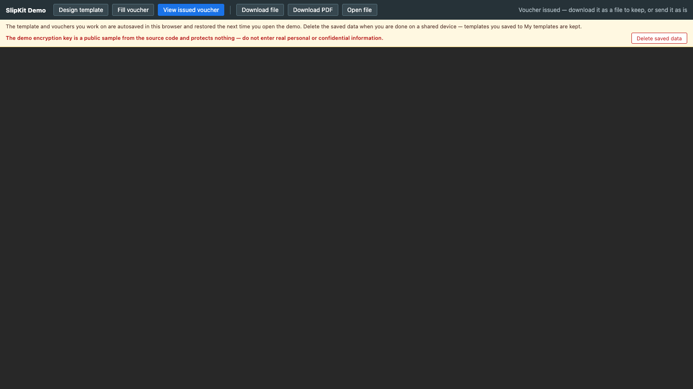

# SCR-015 전표 뷰어

최종 갱신: 2026-09-28

## 개요

발행 전표를 수정 없이 PDF로 표시하는 `<slip-viewer>` 화면을 정의합니다.

## 변경 이력

| 날짜 | 구분 | 변경 내용 |
| --- | --- | --- |
| 2026-09-28 | 신규 작성 | 발행 전표 표시, 출력 상태와 읽기 전용 경계를 정의했습니다. |

## 진입·종료 조건

검증된 발행 전표를 `src`로 받으면 진입합니다. 다른 모드 선택, 새 파일 열기 또는 연결 해제로
종료합니다.

## 화면 이미지

브라우저 PDF 플러그인과 무관하게 확인한 실제 출력 첫 페이지입니다.

## 화면 영역

| 영역 | 입력·출력 항목 | 표시·활성화 조건 |
| --- | --- | --- |
| 상태 안내 | 발행 완료와 보관 안내 | 데모의 뷰어 모드에서 표시합니다. |
| PDF 영역 | 로딩·발행 문서·오류 | 렌더 상태에 따라 하나만 표시합니다. |
| 외부 명령 | 파일·PDF 내려받기 | 호스트 또는 데모가 제공합니다. |

## 이벤트와 호출 기능

| 사용자 동작 | 호출 기능 | 결과 |
| --- | --- | --- |
| 발행 전표 열기 | FNC-013·FNC-022 | 스냅샷과 값으로 PDF를 표시합니다. |
| PDF 내려받기 | FNC-013 | 같은 전표의 PDF를 저장합니다. |

## 상태별 표시

로딩, PDF 표시와 오류를 구분합니다. 입력 필드나 문서 편집 명령은 제공하지 않습니다.

## 입력 검증과 오류 표시

양식 또는 미발행 전표는 뷰어 입력으로 허용하지 않습니다. 렌더 오류는 문서 대신 오류 상태로
표시합니다.

## 화면 전이

새 전표 명령은 SCR-014로, 양식 편집 명령은 SCR-001로 이동하며 발행 전표 자체는 바꾸지 않습니다.

## 관련 데이터·인터페이스·오류

| 구분 | 식별자 | 관계 |
| --- | --- | --- |
| 데이터 | DAT-003·DAT-009 | 발행 스냅샷과 자원을 표시합니다. |
| 인터페이스 | IF-007 | 읽기 전용 입력 계약입니다. |
| 오류 | ERR-003·ERR-005 | 렌더·화면 오류를 표시합니다. |

## 근거

- `packages/elements/src/slip-viewer.ts`
- `packages/elements/src/styles/slip-viewer.styles.ts`

