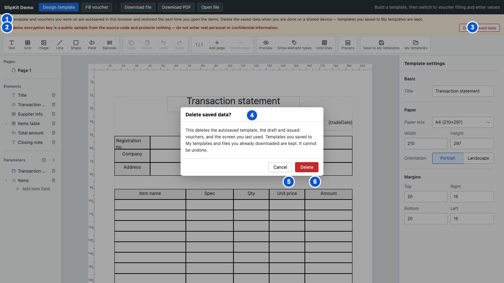

# SCR-016 데모 저장 안내와 데이터 삭제

최종 갱신: 2026-09-28

## 개요

바닐라, React와 Vue 데모가 작업 내용을 현재 브라우저에 저장한다는 사실을 알리고, 사용자가 데모의
자동 저장 데이터만 확인 후 삭제하는 화면을 정의합니다. 이 화면은 SlipKit 컴포넌트가 아니라 데모
호스트가 제공합니다.

## 변경 이력

| 날짜 | 구분 | 변경 내용 |
| --- | --- | --- |
| 2026-09-28 | 신규 작성 | 저장 안내, 개인정보 경고, 삭제 범위, 확인, 성공과 실패 상태를 정의했습니다. |

## 진입·종료 조건

### 진입 조건

- 세 데모를 열면 현재 화면 모드와 관계없이 저장 안내와 저장 데이터 삭제 버튼을 표시합니다.
- 저장 데이터 삭제 버튼을 누르면 삭제 범위와 유지 항목을 설명하는 확인 모달을 엽니다.

### 종료 조건

- 취소 버튼, 닫기 아이콘, 배경 또는 Escape를 사용하면 아무 데이터도 지우지 않고 모달을 닫습니다.
- 삭제에 성공하면 모달을 닫고 초기 양식 편집 화면으로 이동합니다.
- 삭제 버튼을 누르면 브라우저가 확인 모달을 먼저 닫습니다. 삭제에 실패하면 현재 데모 화면 위쪽의 상태 안내에 오류를 표시합니다.

## 화면 이미지

## 화면 구성

| 번호 | 화면 항목 | 표시 내용 | 표시 조건 | 활성화 조건 |
| --- | --- | --- | --- | --- |
| 1 | 브라우저 저장 안내 | 양식과 전표가 현재 브라우저에 자동 저장되고 다음 방문에 복원된다는 내용을 표시합니다. | 데모를 연 동안 항상 표시합니다. | 표시 전용입니다. |
| 2 | 개인정보 경고 | 공용 기기 사용 주의와 공개 샘플 키에 개인정보를 넣지 말라는 내용을 표시합니다. | 데모를 연 동안 항상 표시합니다. | 표시 전용입니다. |
| 3 | 저장 데이터 삭제 버튼 | 데모 자동 저장 데이터를 지우는 명령을 표시합니다. | 안내 영역에 항상 표시합니다. | 사용할 수 있습니다. |
| 4 | 삭제 확인 모달 | 삭제할 자동 저장 데이터, 유지할 내 양식과 내려받은 파일, 되돌릴 수 없다는 안내를 표시합니다. | 저장 데이터 삭제 버튼을 누르면 표시합니다. | 모달의 명령 외에는 조작할 수 없습니다. |
| 5 | 취소 버튼 | 아무 데이터도 지우지 않고 모달을 닫는 명령을 표시합니다. | 확인 모달에 표시합니다. | 사용할 수 있습니다. |
| 6 | 삭제 버튼 | 안내한 데모 자동 저장 데이터만 지우는 위험 색 명령을 표시합니다. | 확인 모달에 표시합니다. | 사용할 수 있습니다. |

## 이벤트와 호출 기능

| 화면 항목 | 사용자 동작 | 호출 기능 | 결과 | 실행할 수 없는 조건 |
| --- | --- | --- | --- | --- |
| 저장 데이터 삭제 버튼 | 버튼을 누릅니다. | FNC-023 | 삭제 확인 모달을 열고 배경 화면 조작을 막습니다. | 이미 확인 모달이 열린 상태 |
| 취소 버튼 | 버튼을 누릅니다. | FNC-023 | 저장값과 현재 화면을 바꾸지 않고 모달을 닫습니다. | 없음 |
| 닫기 아이콘 | 버튼을 누릅니다. | FNC-023 | 취소와 같은 결과로 모달을 닫습니다. | 없음 |
| 삭제 버튼 | 버튼을 누릅니다. | FNC-023 | 확인 모달을 닫고 예약된 자동 저장을 취소한 뒤 데모 전용 키 네 개를 삭제합니다. | 없음 |
| 삭제 성공 처리 | 저장소 삭제가 모두 끝납니다. | FNC-023 | 초기 양식, 양식 편집 모드, 빈 작성 상태와 빈 발행 상태로 초기화합니다. | 없음 |

## 상태별 표시

| 상태 | 진입 조건 | 표시 내용 | 허용 동작 |
| --- | --- | --- | --- |
| 기본 안내 | 데모를 열었습니다. | 저장 안내, 개인정보 경고와 삭제 버튼을 현재 로케일로 표시합니다. | 데모 사용과 삭제 확인 열기를 사용할 수 있습니다. |
| 삭제 확인 | 삭제 버튼을 눌렀습니다. | 삭제 범위, 유지 항목, 되돌릴 수 없다는 안내와 확인 명령을 표시합니다. | 취소 또는 삭제만 사용할 수 있습니다. |
| 삭제 성공 | 네 데모 키 삭제와 화면 초기화가 끝났습니다. | 모달을 닫고 초기 양식 편집 화면을 표시합니다. | 새 데모 작업을 시작할 수 있습니다. |
| 삭제 실패 | 키 삭제 중 저장소 오류가 발생했습니다. | 닫힌 확인 모달은 다시 열지 않고 현재 데모 화면 위쪽의 상태 안내에 현재 로케일의 오류를 표시합니다. | 저장 데이터 삭제 버튼을 눌러 다시 시도할 수 있습니다. |

## 입력 검증과 오류 표시

| 검사 대상 | 실패 조건 | 표시 위치와 표현 | 문서·화면 처리 | 복구 방법 |
| --- | --- | --- | --- | --- |
| 삭제 대상 | 데모 전용 키가 없거나 일부만 있습니다. | 오류로 표시하지 않습니다. | 존재하는 대상 키만 지우고 정상 초기화를 계속합니다. | 별도 복구가 필요하지 않습니다. |
| 브라우저 저장소 | `removeItem` 또는 저장소의 `delete`가 예외를 던집니다. | 현재 데모 화면 위쪽의 상태 안내에 삭제 실패와 원인을 표시합니다. | 메모리의 현재 양식과 전표 상태를 유지하고 성공으로 표시하지 않습니다. 앞에서 삭제한 키가 있으면 삭제된 상태로 남습니다. | 브라우저 저장소 권한과 용량 상태를 확인한 뒤 저장 데이터 삭제 버튼을 눌러 다시 시도합니다. |
| 자동 저장 경쟁 | 삭제 직전에 예약된 자동 저장이 남아 있습니다. | 별도 오류를 표시하지 않습니다. | 예약 작업을 먼저 취소하고 삭제 뒤 즉시 다시 저장하지 않습니다. | 별도 복구가 필요하지 않습니다. |
| 삭제 범위 | 내 양식 또는 다른 사이트 데이터까지 삭제하려고 합니다. | 화면에서 해당 동작을 제공하지 않습니다. | 정해진 자동 저장 키와 화면 모드 키만 삭제합니다. | 다른 데이터는 각 기능의 삭제 명령을 사용합니다. |

## 화면 전이

| 시작 상태 | 사용자 동작 | 도착 화면·상태 | 유지 항목 | 초기화 항목 |
| --- | --- | --- | --- | --- |
| 기본 안내 | 저장 데이터 삭제 버튼을 누릅니다. | 삭제 확인 | 현재 양식, 전표, 화면 모드와 자동 저장 데이터 | 이전 삭제 오류 |
| 삭제 확인 | 취소 버튼을 누릅니다. | 기본 안내의 원래 화면 | 현재 화면과 모든 저장 데이터 | 확인 모달 |
| 삭제 확인 | 삭제 버튼을 누르고 삭제에 성공합니다. | 초기 양식 편집 화면 | 내 양식 저장소와 내려받은 파일 | 자동 저장 양식, 작성 중 전표, 발행 전표, 화면 모드와 확인 모달 |
| 삭제 확인 | 삭제 버튼을 누르고 삭제에 실패합니다. | 삭제 실패 | 현재 메모리 상태와 삭제되지 않은 저장 데이터 | 확인 모달 |

## 관련 데이터·인터페이스·오류

| 구분 | 식별자 | 관계 |
| --- | --- | --- |
| 데이터 | DAT-011 | 데모 자동 저장 키와 마지막 화면 모드를 관리합니다. |
| 인터페이스 | IF-003 | 내 양식 저장소는 삭제 대상에서 제외합니다. |
| 인터페이스 | IF-008 | 바닐라, React와 Vue 데모가 같은 저장 안내와 삭제 동작을 제공합니다. |
| 오류 | ERR-004 | 브라우저 저장소 삭제 실패를 표시합니다. |
| 오류 | ERR-005 | 확인 모달과 초기화 화면 오류를 표시합니다. |

## 근거

- `examples/shared/src/index.ts`
- `examples/shared/test/clear-demo-storage.test.ts`
- `examples/demo/src/main.ts`
- `examples/react-demo/src/App.tsx`
- `examples/vue-demo/src/App.vue`
- [ADR-084](../../DECISIONS.md#adr-084)
