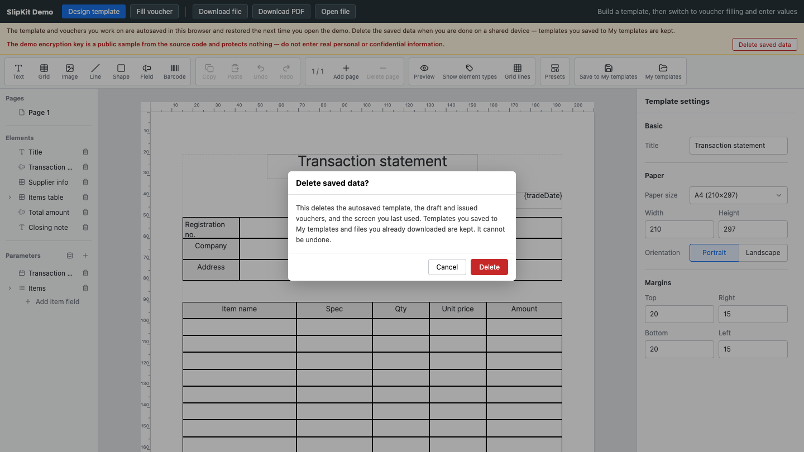

# SCR-016 데모 저장 안내와 데이터 삭제

최종 갱신: 2026-09-28

## 개요

데모가 브라우저에 작업 내용을 저장한다는 사실과 공개 샘플 키의 한계를 알리고, 사용자가 저장 데이터를
확인 후 삭제하는 화면을 정의합니다.

## 변경 이력

| 날짜 | 구분 | 변경 내용 |
| --- | --- | --- |
| 2026-09-28 | 신규 작성 | 저장 안내, 개인정보 경고와 삭제 확인 모달을 정의했습니다. |

## 진입·종료 조건

바닐라·React·Vue 데모의 모든 모드에서 안내와 삭제 버튼을 표시합니다. 삭제 버튼으로 확인 모달에
진입하고 취소·성공·실패로 종료합니다.

## 화면 이미지

## 화면 영역

| 영역 | 입력·출력 항목 | 표시·활성화 조건 |
| --- | --- | --- |
| 저장 안내 | 자동 저장·복원과 공용 기기 주의 | 항상 표시합니다. |
| 키 경고 | 공개 샘플 키와 개인정보 금지 | 샘플 키를 쓰는 데모에서 표시합니다. |
| 삭제 확인 | 삭제 범위, 보존 범위, 취소·삭제 | 삭제 버튼을 누르면 표시합니다. |

## 이벤트와 호출 기능

| 사용자 동작 | 호출 기능 | 결과 |
| --- | --- | --- |
| 삭제 취소 | FNC-023 | 저장값과 현재 화면을 유지합니다. |
| 삭제 확인 | FNC-023 | 예약 저장을 끝낸 뒤 데모 키만 삭제합니다. |

## 상태별 표시

기본 안내, 확인 모달, 삭제 성공과 실패를 ko·en·ja로 제공합니다. 모달에서는 배경 조작과 초점 이탈을
막습니다.

## 입력 검증과 오류 표시

삭제 실패는 구체적인 저장소 오류를 상태 영역에 표시하고 현재 메모리 상태를 유지합니다.

## 화면 전이

성공하면 초기 양식 편집 화면과 빈 작성·발행 상태로 돌아가며 즉시 자동 저장하지 않습니다.

## 관련 데이터·인터페이스·오류

| 구분 | 식별자 | 관계 |
| --- | --- | --- |
| 데이터 | DAT-011 | 데모 저장 키와 화면 모드를 관리합니다. |
| 인터페이스 | IF-003·IF-008 | 저장소와 프레임워크 데모를 사용합니다. |
| 오류 | ERR-004·ERR-005 | 삭제·화면 오류를 표시합니다. |

## 근거

- `examples/shared/src/index.ts`
- `examples/shared/test/clear-demo-storage.test.ts`
- [ADR-084](../../DECISIONS.md#adr-084)
