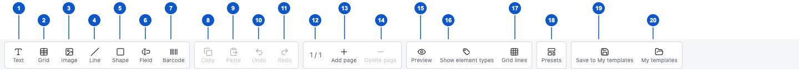

# SCR-017 디자이너 상단 도구 모음

최종 갱신: 2026-09-28

## 개요

디자이너에서 요소를 추가하고 편집 기록, 페이지, 화면 표시와 저장 기능을 실행하는 상단 도구 모음을
정의합니다. 버튼은 왼쪽부터 작업 종류가 같은 것끼리 묶어 배치합니다.

## 변경 이력

| 날짜 | 구분 | 변경 내용 |
| --- | --- | --- |
| 2026-09-28 | 신규 작성 | 상단 도구 모음의 버튼별 위치, 실행 조건과 결과를 정의했습니다. |

## 설계 범위

- 도구 모음에 표시하는 스무 항목의 순서, 버튼 상태와 실행 결과를 정의합니다.
- 요소를 실제로 배치하고 선택하는 방법은 SCR-002에서, 페이지 목록은 SCR-005에서 정의합니다.
- 저장 모달과 저장된 양식 목록은 SCR-012에서, PDF 미리보기는 SCR-013에서 정의합니다.

## 진입·종료 조건

### 진입 조건

- 편집할 양식을 정상적으로 열면 디자이너 맨 위에 도구 모음을 표시합니다.
- 미리보기 중에도 도구 모음을 유지하되 편집 명령은 사용할 수 없게 표시합니다.

### 종료 조건

- 양식을 읽을 수 없거나 디자이너 화면을 닫으면 도구 모음을 숨깁니다.
- 모달을 열면 도구 모음의 포인터 조작을 막고 모달을 닫을 때 다시 허용합니다.

## 화면 이미지

각 번호는 아래 화면 구성과 이벤트 표의 같은 번호를 가리킵니다.

## 화면 구성

도구 모음은 가로 한 줄로 표시합니다. 각 버튼은 최소 44×44px이며, 버튼 묶음의 안쪽 여백과 테두리,
도구 모음의 위아래 5px 여백을 포함해 전체 높이는 최소 61px입니다. 너비가 부족하면 도구 모음 안에
가로 스크롤을 제공하고 아이콘 아래에 명령 이름을 표시합니다.

| 번호 | 화면 항목 | 위치와 표시 내용 | 동작과 조건 | 상세 설계 |
| --- | --- | --- | --- | --- |
| 1 | 글자 추가 | 첫 번째 명령 묶음의 글자 아이콘과 이름 | 편집 중에 선택하면 다음 캔버스 클릭 위치에 글자를 추가합니다. | SCR-002 |
| 2 | 그리드 추가 | 글자 추가 오른쪽의 표 아이콘과 이름 | 편집 중에 선택하면 다음 캔버스 클릭 위치에 기본 그리드를 추가합니다. | SCR-002·SCR-006 |
| 3 | 이미지 추가 | 그리드 추가 오른쪽의 이미지 아이콘과 이름 | 편집 중에 선택하면 다음 캔버스 클릭 위치에 이미지 요소를 추가합니다. | SCR-002·SCR-011 |
| 4 | 선 추가 | 이미지 추가 오른쪽의 선 아이콘과 이름 | 편집 중에 선택하면 캔버스 끌기로 선을 추가합니다. | SCR-002 |
| 5 | 도형 추가 | 선 추가 오른쪽의 도형 아이콘과 이름 | 편집 중에 선택하면 사각형·타원·삼각형·오각형·육각형 메뉴를 엽니다. | SCR-002 |
| 6 | 입력 필드 추가 | 도형 추가 오른쪽의 입력 필드 아이콘과 이름 | 편집 중에 선택하면 다음 캔버스 클릭 위치에 입력 필드를 추가합니다. | SCR-002 |
| 7 | 바코드 추가 | 첫 번째 명령 묶음의 마지막 바코드 아이콘과 이름 | 편집 중에 선택하면 다음 캔버스 클릭 위치에 바코드를 추가합니다. | SCR-002 |
| 8 | 복사 | 두 번째 명령 묶음의 복사 아이콘과 이름 | 요소를 하나 이상 선택했을 때 주 선택 요소를 복사합니다. | FNC-020 |
| 9 | 붙여넣기 | 복사 오른쪽의 붙여넣기 아이콘과 이름 | 복사한 요소가 있을 때 현재 페이지의 빈 위치에 새 요소로 붙여넣습니다. | FNC-020 |
| 10 | 실행 취소 | 붙여넣기 오른쪽의 왼쪽 화살표와 이름 | 실행 취소 기록이 있으면 직전 문서 변경 전 상태를 복원합니다. | FNC-020 |
| 11 | 다시 실행 | 두 번째 명령 묶음의 마지막 오른쪽 화살표와 이름 | 다시 실행 기록이 있으면 방금 취소한 문서 변경을 다시 적용합니다. | FNC-020 |
| 12 | 페이지 번호 | 세 번째 명령 묶음의 `현재 / 전체` 숫자 | 현재 페이지가 바뀌거나 페이지를 추가·삭제하면 숫자를 즉시 갱신합니다. | SCR-005 |
| 13 | 페이지 추가 | 페이지 번호 오른쪽의 더하기 아이콘과 이름 | 편집 중에 누르면 현재 페이지 뒤에 빈 페이지를 추가하고 새 페이지를 선택합니다. | SCR-005 |
| 14 | 페이지 삭제 | 세 번째 명령 묶음의 마지막 빼기 아이콘과 이름 | 페이지가 두 개 이상이면 현재 페이지를 삭제하고 가까운 남은 페이지를 선택합니다. | SCR-005 |
| 15 | 미리보기·편집 | 네 번째 명령 묶음의 눈 또는 연필 아이콘과 이름 | 편집 중에는 미리보기를 열고, 미리보기 중에는 이전 편집 화면으로 돌아갑니다. | SCR-013 |
| 16 | 요소 종류 표시 | 미리보기 오른쪽의 꼬리표 아이콘과 이름 | 편집 중에 누르면 모든 요소의 종류 배지를 계속 표시하거나 선택할 때만 표시하도록 바꿉니다. | SCR-002 |
| 17 | 격자 | 네 번째 명령 묶음의 마지막 격자 아이콘과 이름 | 편집 중에 누르면 격자 숨김, 간격과 색을 고르는 메뉴를 엽니다. | SCR-002 |
| 18 | 프리셋 | 다섯 번째 명령 묶음의 화면 아이콘과 이름 | 편집 중에 누르면 사용할 수 있는 양식 프리셋 메뉴를 엽니다. | FNC-019 |
| 19 | 내 양식으로 저장 | 저장 기능을 연결한 경우에만 표시하는 디스크 아이콘과 이름 | 누르면 현재 양식 제목을 채운 저장 모달을 엽니다. | SCR-012 |
| 20 | 내 양식 | 저장 기능을 연결한 경우에만 표시하는 폴더 아이콘과 이름 | 누르면 저장된 양식을 새로 읽고 목록 모달을 엽니다. | SCR-012 |

## 이벤트와 호출 기능

| 번호·화면 항목 | 사용자 동작 | 동작과 결과 | 관련 기능 |
| --- | --- | --- | --- |
| 1 글자 추가 | 버튼을 누릅니다. | 버튼을 눌림 상태로 표시합니다. 캔버스의 빈 곳을 누르면 그 위치에 기본 글자를 추가하고 도구 선택을 해제합니다. | FNC-019 |
| 2 그리드 추가 | 버튼을 누릅니다. | 버튼을 눌림 상태로 표시합니다. 캔버스의 빈 곳을 누르면 그 위치에 기본 그리드를 추가하고 도구 선택을 해제합니다. | FNC-019·FNC-021 |
| 3 이미지 추가 | 버튼을 누릅니다. | 버튼을 눌림 상태로 표시합니다. 캔버스의 빈 곳을 누르면 그 위치에 빈 이미지 요소를 추가합니다. | FNC-019 |
| 4 선 추가 | 버튼을 누릅니다. | 버튼을 눌림 상태로 표시합니다. 캔버스를 끌면 시작점과 끝점을 사용해 선을 추가합니다. | FNC-019 |
| 5 도형 추가 | 버튼을 누릅니다. | 버튼 아래에 도형 메뉴를 열고 첫 항목으로 키보드 초점을 옮깁니다. | FNC-019 |
| 5 도형 추가 | 메뉴에서 도형을 고릅니다. | 메뉴를 닫고 고른 도형 버튼을 눌림 상태로 표시합니다. 캔버스의 빈 곳을 누르면 그 도형을 추가합니다. | FNC-019 |
| 6 입력 필드 추가 | 버튼을 누릅니다. | 버튼을 눌림 상태로 표시합니다. 캔버스의 빈 곳을 누르면 기본 입력 필드를 추가합니다. | FNC-019 |
| 7 바코드 추가 | 버튼을 누릅니다. | 버튼을 눌림 상태로 표시합니다. 캔버스의 빈 곳을 누르면 기본 바코드를 추가합니다. | FNC-019 |
| 8 복사 | 버튼을 누릅니다. | 선택한 요소가 있을 때 주 선택 요소의 내용과 스타일을 내부 복사 공간에 보관합니다. | FNC-020 |
| 9 붙여넣기 | 버튼을 누릅니다. | 복사한 요소가 있을 때 새 식별자를 부여하고 현재 페이지의 빈 위치에 추가한 뒤 새 요소를 선택합니다. | FNC-020 |
| 10 실행 취소 | 버튼을 누릅니다. | 실행 취소 기록이 있으면 직전 문서 변경 전 상태와 그때의 선택을 복원합니다. | FNC-020 |
| 11 다시 실행 | 버튼을 누릅니다. | 다시 실행 기록이 있으면 방금 취소한 문서 변경과 그때의 선택을 복원합니다. | FNC-020 |
| 13 페이지 추가 | 버튼을 누릅니다. | 현재 페이지 뒤에 빈 페이지를 만들고 새 페이지의 캔버스와 페이지 설정을 표시합니다. | FNC-019 |
| 14 페이지 삭제 | 버튼을 누릅니다. | 페이지가 두 개 이상이면 현재 페이지를 삭제합니다. 같은 위치의 다음 페이지가 있으면 그 페이지를, 없으면 이전 페이지를 선택합니다. | FNC-019 |
| 15 미리보기·편집 | 미리보기를 누릅니다. | 현재 양식과 샘플 값으로 PDF 생성을 시작하고 SCR-013을 표시합니다. | FNC-013·FNC-022 |
| 15 미리보기·편집 | 편집을 누릅니다. | 미리보기 전의 페이지, 선택과 스크롤 위치로 편집 화면을 복원합니다. | FNC-022 |
| 16 요소 종류 표시 | 버튼을 누릅니다. | 모든 요소의 종류 배지를 계속 표시하는 상태와 선택·가리키기 때만 표시하는 상태를 전환합니다. | FNC-022 |
| 17 격자 | 버튼을 누릅니다. | 버튼 아래에 격자 메뉴를 열고 현재 간격과 색을 선택 상태로 표시합니다. | FNC-022 |
| 17 격자 | 메뉴에서 숨김을 고릅니다. | 캔버스의 격자를 숨기고 메뉴를 닫습니다. 이 화면 설정은 양식 파일에 저장하지 않습니다. | FNC-022 |
| 17 격자 | 메뉴에서 간격을 고릅니다. | 1mm·2mm·5mm·10mm 가운데 고른 간격으로 캔버스 격자를 표시하고 메뉴를 닫습니다. | FNC-022 |
| 17 격자 | 메뉴에서 색을 고릅니다. | 현재 격자 간격은 유지하고 고른 색으로 격자를 다시 표시합니다. | FNC-022 |
| 18 프리셋 | 버튼을 누릅니다. | 버튼 아래에 프리셋 메뉴를 열고 첫 항목으로 키보드 초점을 옮깁니다. | FNC-019 |
| 18 프리셋 | 프리셋을 고릅니다. | 현재 양식을 고른 프리셋으로 바꾸고 첫 페이지를 표시하며 선택과 실행 취소 기록을 초기화합니다. | FNC-019 |
| 19 내 양식으로 저장 | 버튼을 누릅니다. | SCR-012의 저장 모달을 엽니다. 이전에 저장한 양식이면 덮어쓰기와 새 항목 저장 가운데 하나를 고르게 합니다. | FNC-016 |
| 20 내 양식 | 버튼을 누릅니다. | 저장된 양식을 새로 읽는 동안 진행 상태를 표시한 뒤 SCR-012의 목록 모달을 엽니다. | FNC-016 |

## 상태별 표시

| 상태 | 시작 조건 | 화면 표시 | 가능한 다음 동작 |
| --- | --- | --- | --- |
| 편집 기본 | 양식을 열고 별도 도구를 선택하지 않았습니다. | 사용할 수 있는 버튼을 정상 색으로, 조건을 만족하지 않은 버튼을 흐리게 표시합니다. | 요소 추가, 편집, 페이지, 보기와 저장 명령을 실행할 수 있습니다. |
| 요소 추가 대기 | 1~7번 가운데 하나를 선택했습니다. | 선택한 버튼의 배경과 테두리를 강조합니다. | 캔버스에서 요소를 만들거나 Escape로 취소할 수 있습니다. |
| 메뉴 열림 | 도형, 격자 또는 프리셋 버튼을 눌렀습니다. | 버튼 아래에 메뉴를 표시하고 버튼을 강조합니다. | 항목 선택, 바깥 누르기 또는 Escape로 메뉴를 닫을 수 있습니다. |
| 미리보기 | 15번으로 미리보기를 열었습니다. | 15번을 편집 버튼으로 바꾸고 1~14번, 16~18번을 사용할 수 없게 표시합니다. | 편집으로 돌아가거나 19~20번 저장 명령을 실행할 수 있습니다. |
| 저장 완료 | 19번 저장이 성공했습니다. | 저장 명령 오른쪽에 짧은 완료 문구를 표시한 뒤 자동으로 숨깁니다. | 계속 편집하거나 다시 저장할 수 있습니다. |

## 입력 검증과 오류 표시

| 발생 위치 | 발생 조건 | 표시 방법 | 처리와 복구 |
| --- | --- | --- | --- |
| 프리셋 메뉴 | 사용할 수 있는 프리셋이 없습니다. | 메뉴를 열지 않고 프리셋 버튼을 사용할 수 없게 표시합니다. | 호스트가 프리셋을 제공하면 버튼을 사용할 수 있게 합니다. |
| 저장 명령 | 저장 기능을 연결하지 않았습니다. | 19번과 20번 명령 묶음을 표시하지 않습니다. | 호스트가 저장 기능을 연결하면 다음 화면 갱신부터 표시합니다. |
| 저장 작업 | 저장·목록 읽기 작업이 실패했습니다. | SCR-012의 현재 모달 안에 작업명과 실패 원인을 표시합니다. | 현재 양식과 입력값을 유지하고 다시 실행하거나 모달을 닫을 수 있습니다. |
| 미리보기 | PDF 생성이 실패했습니다. | SCR-013의 결과 영역 가운데에 실패 원인을 표시합니다. | 편집으로 돌아가 원인을 수정한 뒤 미리보기를 다시 실행합니다. |

## 화면 전이

| 사용자 동작 | 화면 변화 | 유지하는 내용 | 초기화하는 내용 |
| --- | --- | --- | --- |
| 요소 추가 도구를 고른 뒤 캔버스를 조작합니다. | SCR-002에 새 요소를 추가하고 그 요소를 선택합니다. | 현재 페이지와 실행 취소 기록 | 요소 추가 도구 선택 |
| 미리보기를 누릅니다. | 도구 모음 아래를 SCR-013으로 바꾸고 15번을 편집으로 표시합니다. | 양식, 현재 페이지, 선택과 캔버스 스크롤 | 열린 도구 모음 메뉴 |
| 편집을 누릅니다. | SCR-001의 편집 화면을 복원하고 15번을 미리보기로 표시합니다. | 양식, 현재 페이지, 선택과 캔버스 스크롤 | PDF 주소와 미리보기 오류 |
| 저장 명령을 누릅니다. | SCR-012의 저장 또는 목록 모달을 도구 모음 위에 표시합니다. | 양식, 선택과 편집 기록 | 이전 모달 입력과 오류 |

## 관련 데이터·인터페이스·오류

| 구분 | 식별자 | 관계 |
| --- | --- | --- |
| 데이터 | DAT-002·DAT-004 | 페이지와 요소를 추가·삭제하고 화면 표시 설정을 분리합니다. |
| 인터페이스 | IF-005 | 프리셋과 저장 기능의 제공 여부, 양식 변경 알림을 정의합니다. |
| 오류 | ERR-003·ERR-005 | 미리보기와 저장 작업 실패를 표시합니다. |

## 근거

- `packages/elements/src/designer/render/toolbar.ts`
- `packages/elements/src/styles/designer/layout.styles.ts`
- `packages/elements/src/slip-designer.ts`
