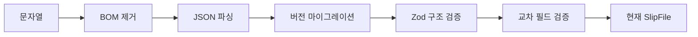

# FNC-001 파일 파싱과 검증

최종 갱신: 2026-09-28

## 개요

외부 JSON 문자열 또는 알 수 없는 객체를 현재 `SlipFile`로 변환하고 구조·의미 규칙을 검사하는
처리 흐름을 정의합니다.

## 변경 이력

| 날짜 | 구분 | 변경 내용 |
| --- | --- | --- |
| 2026-09-28 | 신규 작성 | 문자열 파싱, 버전 처리, 스키마·교차 필드 검증과 오류 계약을 정의했습니다. |

## 호출 조건

파일 업로드, 저장소 조회, MCP 읽기와 암호화 봉투 복호화 뒤의 평문을 신뢰하기 전에 호출합니다.
이미 객체인 값은 `validateSlipFile()`, JSON 문자열은 `parseSlipFile()`을 사용합니다.

## 입력·출력

| 구분 | 항목 | 조건 |
| --- | --- | --- |
| 입력 | JSON 문자열 또는 알 수 없는 값 | 문자열은 UTF-8로 읽은 결과이며 맨 앞 BOM 한 개를 허용합니다. |
| 설정 | 선택적 로케일 | 검증 오류 메시지에 사용합니다. |
| 출력 | `SlipTemplateFile` 또는 `SlipVoucherFile` | 현재 버전으로 마이그레이션되고 전체 검증을 통과합니다. |

## 사전·사후 조건

입력은 신뢰하지 않습니다. 성공 결과는 현재 스키마 버전이고 정의하지 않은 구조 프로퍼티, 중복 ID와
교차 필드 위반이 없습니다. 호출자는 성공 결과를 별도 구조 검사 없이 Core 기능에 전달할 수 있습니다.

## 정상 처리 흐름

객체 입력은 JSON 파싱을 생략하고 마이그레이션과 검증을 수행합니다. 전처리 중에도 원본 객체를 업무
상태로 사용하지 않으며 성공한 결과만 반환합니다.

## 분기와 예외 흐름

- JSON 문법 오류와 스키마·의미 오류는 `SlipParseError`로 경로와 원인을 알립니다.
- 버전 형식, 미래 버전과 마이그레이션 경로 없음은 `SlipMigrationError`입니다.
- 파일 종류와 본문 조합이 맞지 않으면 구조 오류입니다.
- 이미지의 선언 MIME, 파일 서명 또는 크기가 맞지 않으면 해당 경로의 검증 오류입니다.

## 데이터 조회·변경

파일 시스템이나 저장소를 직접 읽지 않습니다. 입력값을 현재 형식으로 변환할 뿐 외부 상태를
변경하지 않습니다.

## 하위 기능과 시퀀스

FNC-002 버전 마이그레이션, Zod 스키마, 이미지 검사와 교차 필드 정제가 순서대로 실행됩니다.
JSON Schema는 외부 구조 검사에 사용할 수 있지만 이 전체 흐름을 대신하지 않습니다.

## 오류·복구

오류가 나면 저장·렌더링을 진행하지 않습니다. 사용자는 보고된 경로와 원인을 수정한 뒤 전체 파일을
다시 검증합니다. 알 수 없는 프로퍼티를 자동 삭제하거나 미래 버전을 현재 버전으로 추정하지 않습니다.

## 검증 기준

BOM, 잘못된 JSON, 미래·이전 버전, 모든 요소 종류, 중복·누락·범위 오류와 로케일별 메시지를 시험합니다.

## 관련 설계와 근거

- 데이터: DAT-001~DAT-010
- 인터페이스: IF-002
- 오류: ERR-001
- `packages/core/src/format/schema.ts`
- [파일 형식 명세 22](../../SPEC.md)
