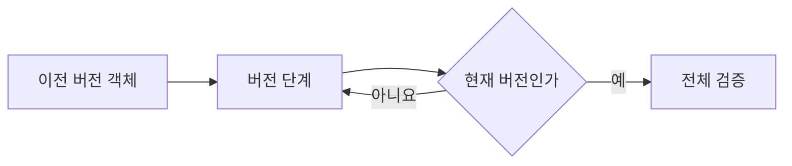

# FNC-002 버전 마이그레이션과 정규화

최종 갱신: 2026-09-28

## 개요

이전 `.slip` 문서를 현재 스키마 버전으로 순차 변환하고, 숫자 파라미터의 빈 입력을 계산 가능한 값으로
정규화하는 두 처리 경계를 정의합니다.

## 변경 이력

| 날짜 | 구분 | 변경 내용 |
| --- | --- | --- |
| 2026-09-28 | 신규 작성 | 버전 단계 적용과 숫자 파라미터 정규화의 입력·출력을 정의했습니다. |

## 호출 조건

마이그레이션은 파일 구조 검증 전에 실행합니다. 값 정규화는 작성 폼, 디자이너 미리보기와 PDF
렌더링에서 같은 파라미터 정의를 기준으로 실행합니다.

## 입력·출력

| 구분 | 항목 | 자료형·단위 | 필수 여부·기본값 | 제약과 보장 |
| --- | --- | --- | --- | --- |
| 입력 | 이전 파일 | `schemaVersion`이 있는 JSON 객체 | 필수 | 지원하는 이전 버전이어야 합니다. |
| 입력 | 마이그레이션 단계 | `from`, `to`, 변환 함수 목록 | 필수 | 현재 버전까지 끊김과 순환이 없어야 합니다. |
| 입력 | 정규화할 값 | JSON 키-값 객체와 파라미터 정의 | 숫자 정규화 때 필수 | 숫자 파라미터의 미입력 값만 대상입니다. |
| 출력 | 현재 파일 또는 값 | 새 객체 | 성공 시 반환 | 원본을 바꾸지 않고 버전 이동 또는 빈 숫자값의 0 변환만 반영합니다. |

## 사전·사후 조건

각 마이그레이션 단계는 하나의 `from`에서 `to`로 가는 순수 함수입니다. 현재 내장 단계는 없습니다.
정규화는 최상위 `number` 파라미터만 처리하며 변경할 값이 없으면 원본 객체 참조를 반환합니다.

## 정상 처리 흐름

| 순서 | 처리 | 읽는 값 | 만드는 값·변경하는 값 | 다음 단계 |
| --- | --- | --- | --- | --- |
| 1 | 파일 종류와 버전을 읽어 지원 대상인지 판별합니다. | 이전 버전 객체 | 적용할 마이그레이션 단계 | 단계별 변환 |
| 2 | 원본을 바꾸지 않는 복사본에 다음 버전의 구조 변경을 적용합니다. | 현재 단계 객체 | 한 단계 높은 버전 객체 | 버전 재확인 |
| 3 | 현재 버전이 될 때까지 2번을 반복합니다. | 변환한 객체의 버전 | 현재 버전 후보 객체 | 전체 검증 |
| 4 | 현재 스키마와 교차 필드 규칙을 모두 검사합니다. | 현재 버전 후보 객체 | 검증된 현재 버전 파일 | 반환 |

숫자 정규화는 값이 없거나 `null` 또는 빈 문자열인 숫자 파라미터를 `0`으로 바꿉니다. 다른 값 종류와
목록 하위 필드는 바꾸지 않습니다.

## 분기와 예외 흐름

현재보다 새 버전, SemVer가 아닌 값, 연결되지 않은 단계와 순환 경로는 `SlipMigrationError`입니다.
단계가 만든 결과도 최종 스키마 검증을 통과해야 합니다. 정규화는 잘못된 비어 있지 않은 값을 숨기지
않고 수식·입력 검증 단계에 남깁니다.

## 데이터 조회·변경

외부 상태를 바꾸지 않습니다. 마이그레이션 단계는 새 객체를 반환하고 버전을 `to` 값으로 덮습니다.
정규화는 필요한 경우에만 값 객체를 얕게 복사합니다.

## 하위 기능과 시퀀스

마이그레이션 뒤 FNC-001 전체 검증을 수행합니다. 정규화 뒤 FNC-005 수식 평가와 FNC-013 PDF
변환이 같은 값을 사용합니다.

## 오류·복구

경로가 없는 이전 버전을 임의 해석하지 않습니다. 새 스키마를 도입할 때는 명시적인 단계, 시험,
명세와 `CURRENT_SCHEMA_VERSION`을 함께 갱신합니다.

## 동시 실행·반복 호출

마이그레이션 단계 목록은 호출 중에 바꾸지 않습니다. 같은 이전 버전 객체를 여러 번 전달해도 원본은
변하지 않으며 각 호출은 독립된 현재 버전 객체를 만듭니다. 이미 현재 버전인 객체에는 단계를 다시
적용하지 않고 검증만 수행합니다.

## 검증 기준

현재·미래·연속·누락·순환 버전과 빈 숫자 값의 미입력·`null`·빈 문자열·정상 숫자를 시험합니다.

## 관련 설계와 근거

- 데이터: DAT-001·DAT-006
- 기능: FNC-001·FNC-005·FNC-013
- `packages/core/src/format/migrate.ts`
- `packages/core/src/format/normalize.ts`
