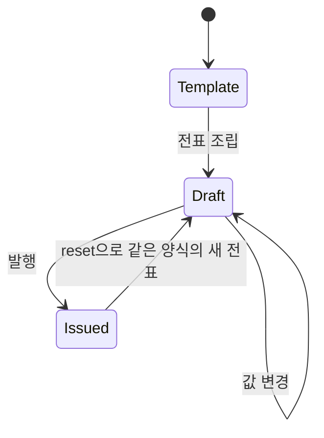

# FNC-003 양식 생성과 전표 발행 생명주기

최종 갱신: 2026-09-28

## 개요

양식과 값에서 독립된 미발행 전표를 만들고 작성 폼에서 변경·발행 상태로 전환하는 생명주기를
정의합니다.

## 변경 이력

| 날짜 | 구분 | 변경 내용 |
| --- | --- | --- |
| 2026-09-28 | 신규 작성 | 전표 조립, 값 변경, 발행과 새 전표 초기화 흐름을 정의했습니다. |

## 호출 조건

호스트나 MCP가 검증된 양식과 초기 값으로 전표를 시작할 때 `buildVoucher()`를 호출합니다. 작성 폼은
양식 또는 기존 전표를 `src`로 받아 같은 흐름을 시작합니다.

## 입력·출력

| 구분 | 항목 | 조건 |
| --- | --- | --- |
| 입력 | `SlipTemplateFile` | 현재 스키마의 검증된 양식입니다. |
| 입력 | `Record<string, JsonValue>` | 파라미터 키별 초기 값입니다. |
| 출력 | `SlipVoucherFile` | 양식 스냅샷, 복사한 값과 `issued: false`를 가집니다. |

## 사전·사후 조건

입력 양식과 값은 호출 뒤 바뀌어도 결과에 영향을 주지 않도록 깊은 복사합니다. 성공 결과는 현재
스키마 버전을 사용하며 원본 양식의 이후 변경과 독립적입니다.

## 정상 처리 흐름

작성 폼은 유효한 값 변경마다 미발행 전표를 `slip-change`로 알리고, 발행 검증이 끝나면
`issued: true` 전표를 `slip-issue`로 알립니다.

## 분기와 예외 흐름

발행 전표 입력은 편집하지 않습니다. 발행 시 수식, 이미지와 값 구조 오류가 남아 있으면 상태를
바꾸지 않고 오류를 표시합니다. MCP는 발행 전표를 생성·교체·수정하지 않습니다.

## 데이터 조회·변경

전표는 `templateSnapshot`, `values`, `issued`만으로 다시 표시할 수 있습니다. 저장 ID, 승인 상태와
감사 정보는 호스트 저장소가 관리합니다.

## 하위 기능과 시퀀스

FNC-002 값 정규화, FNC-005 수식 평가, FNC-011 이미지 확인과 FNC-013 PDF 렌더링을 사용합니다.

## 오류·복구

잘못된 값은 사용자가 고칠 수 있도록 입력 상태에 남깁니다. `reset()`은 현재 원본 양식에서 값을
비우고 발행 잠금을 해제하여 새 전표를 시작합니다.

## 검증 기준

깊은 복사, 양식·미발행·발행 전표 입력, 변경 이벤트, 발행 실패·성공과 `reset()`을 시험합니다.

## 관련 설계와 근거

- 데이터: DAT-002·DAT-003·DAT-006
- 화면: SCR-014·SCR-015
- 인터페이스: IF-001·IF-006
- `packages/core/src/format/voucher.ts`
- `packages/elements/src/slip-form.ts`
