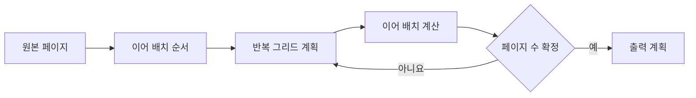

# FNC-007 원본 페이지와 출력 페이지 계획

최종 갱신: 2026-09-28

## 개요

양식 페이지 하나를 반복 그리드와 이어 배치 규칙에 따라 하나 이상의 출력 페이지로 나누는 계획을
정의합니다.

## 변경 이력

| 날짜 | 구분 | 변경 내용 |
| --- | --- | --- |
| 2026-09-28 | 신규 작성 | 출력 페이지 수, 그리드 조각, 이어 배치와 표시 필터 계산을 정의했습니다. |

## 호출 조건

디자이너 캔버스의 출력 계획과 PDF 변환이 검증된 페이지를 배치할 때 호출합니다.

## 입력·출력

| 구분 | 항목 | 조건 |
| --- | --- | --- |
| 입력 | 용지·페이지·그리드별 항목 | 용지 크기와 흐름 영역은 mm 단위입니다. |
| 출력 | `SourcePagePlan` | 출력 수, 그리드 계획과 `after` 요소 위치를 담습니다. |

## 사전·사후 조건

출력 페이지는 최소 한 장입니다. `after` 대상은 먼저 계산하고, 표시 페이지 필터와 마지막 위치를 같은
기준으로 적용합니다. 계획 반복은 여덟 번 안에 안정되어야 합니다.

## 정상 처리 흐름

## 분기와 예외 흐름

`all`, `first`, `continuation`, `non-final`, `last` 필터로 절대 배치 요소의 표시 페이지를 정합니다.
흐름 영역을 벗어나거나 요소끼리 겹치고, 출력 페이지 상한을 넘거나 계획이 안정되지 않으면
`SlipLayoutError`입니다.

## 데이터 조회·변경

페이지와 항목을 읽기만 하며 계획 결과는 새 Map과 위치 값으로 반환합니다.

## 하위 기능과 시퀀스

FNC-008 그리드 계획을 먼저 만들고 `after` 사슬의 마지막 출력 위치를 이어 계산합니다.

## 오류·복구

배치를 임의 축소하거나 요소를 누락하지 않습니다. 사용자는 흐름 영역, 요소 높이, 간격 또는 반복
설정을 고친 뒤 다시 계획합니다.

## 검증 기준

모든 표시 필터, 여러 그리드, 이어 배치 사슬, 마지막 페이지 의존 배치, 겹침과 페이지 상한을
시험합니다.

## 관련 설계와 근거

- 데이터: DAT-002·DAT-007
- 기능: FNC-008·FNC-013
- 오류: ERR-003
- `packages/core/src/layout/page-plan.ts`
- [ADR-065](../../DECISIONS.md#adr-065)

