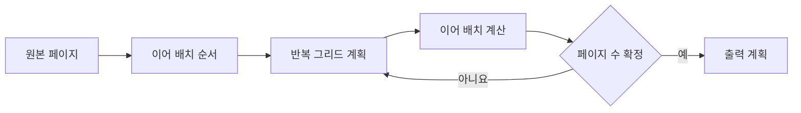

# FNC-007 원본 페이지와 출력 페이지 계획

최종 갱신: 2026-09-28

## 개요

양식 페이지 하나를 반복 그리드와 이어 배치 규칙에 따라 하나 이상의 출력 페이지로 나누는 계획을
정의합니다.

## 변경 이력

| 날짜 | 구분 | 변경 내용 |
| --- | --- | --- |
| 2026-09-28 | 신규 작성 | 출력 페이지 수, 그리드 조각, 이어 배치와 표시 필터 계산을 정의했습니다. |

## 호출 조건

디자이너 캔버스의 출력 계획과 PDF 변환이 검증된 페이지를 배치할 때 호출합니다.

## 입력·출력

| 구분 | 항목 | 자료형·단위 | 필수 여부·기본값 | 제약과 보장 |
| --- | --- | --- | --- | --- |
| 입력 | 원본 페이지 | 페이지·요소·흐름 영역 객체 | 필수 | 위치와 크기는 mm이며 참조가 검증되어야 합니다. |
| 입력 | 전표 값 | JSON 값 객체 | 선택·빈 객체 | 반복 그리드 항목과 수식 계산에 사용합니다. |
| 출력 | 원본 페이지 계획 | `SourcePagePlan` | 성공 시 반환 | 출력 페이지 수, 그리드 조각과 이어 배치 위치가 확정되어 있습니다. |

## 사전·사후 조건

출력 페이지는 최소 한 장입니다. `after` 대상은 먼저 계산하고, 표시 페이지 필터와 마지막 위치를 같은
기준으로 적용합니다. 계획 반복은 여덟 번 안에 안정되어야 합니다.

## 정상 처리 흐름

| 순서 | 처리 | 읽는 값 | 만드는 값·변경하는 값 | 다음 단계 |
| --- | --- | --- | --- | --- |
| 1 | 원본 페이지의 요소를 고정 배치와 이어 배치 순서로 나눕니다. | 원본 페이지 | 배치 순서 | 반복 계획 |
| 2 | 반복 그리드마다 항목, 행 구간과 페이지 분할 규칙으로 조각을 계산합니다. | 그리드, 전표 값 | 그리드 출력 조각 | 이어 배치 |
| 3 | 앞 조각의 실제 끝 위치와 간격을 사용해 다음 요소의 세로 위치를 정합니다. | 배치 순서, 조각 높이 | 페이지별 요소 위치 | 페이지 수 확인 |
| 4 | 새 출력 페이지가 생기면 페이지 시작·끝 구간과 고정 요소를 다시 배치합니다. | 현재 출력 페이지 수 | 갱신한 페이지 계획 | 안정 여부 확인 |
| 5 | 페이지 수와 모든 위치가 더 바뀌지 않을 때 계획을 확정합니다. | 반복 계산 결과 | 출력 페이지 계획 | 반환 |

## 분기와 예외 흐름

`all`, `first`, `continuation`, `non-final`, `last` 필터로 절대 배치 요소의 표시 페이지를 정합니다.
흐름 영역을 벗어나거나 요소끼리 겹치고, 출력 페이지 상한을 넘거나 계획이 안정되지 않으면
`SlipLayoutError`입니다.

## 데이터 조회·변경

페이지와 항목을 읽기만 하며 계획 결과는 새 Map과 위치 값으로 반환합니다.

## 하위 기능과 시퀀스

FNC-008 그리드 계획을 먼저 만들고 `after` 사슬의 마지막 출력 위치를 이어 계산합니다.

## 오류·복구

배치를 임의 축소하거나 요소를 누락하지 않습니다. 사용자는 흐름 영역, 요소 높이, 간격 또는 반복
설정을 고친 뒤 다시 계획합니다.

## 동시 실행·반복 호출

계획기는 입력 파일과 값 배열을 바꾸지 않으며 호출 간 계획 상태를 공유하지 않습니다. 같은 입력에는
출력 페이지 수, 조각 순서와 좌표가 같아야 합니다. 한 렌더링 안에서는 확정한 계획을 모든 요소 변환이
공유하고, 입력이 바뀌면 이전 계획을 재사용하지 않습니다.

## 검증 기준

모든 표시 필터, 여러 그리드, 이어 배치 사슬, 마지막 페이지 의존 배치, 겹침과 페이지 상한을
시험합니다.

## 관련 설계와 근거

- 데이터: DAT-002·DAT-007
- 기능: FNC-008·FNC-013
- 오류: ERR-003
- `packages/core/src/layout/page-plan.ts`
- [ADR-065](../../DECISIONS.md#adr-065)
