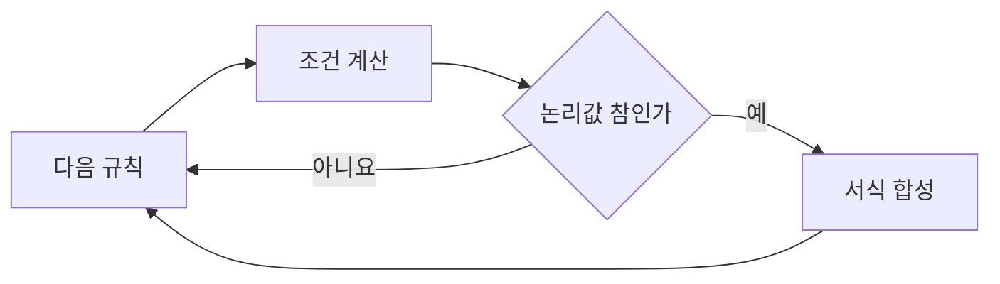

# FNC-009 조건부 서식 평가

최종 갱신: 2026-09-28

## 개요

요소의 조건부 서식 규칙을 선언 순서대로 평가해 기본 서식 위에 적용할 색과 글자 강조를 계산합니다.

## 변경 이력

| 날짜 | 구분 | 변경 내용 |
| --- | --- | --- |
| 2026-09-28 | 신규 작성 | 규칙 평가, 덮어쓰기 순서와 계산 오류 처리 계약을 정의했습니다. |

## 호출 조건

디자이너 캔버스, 작성 폼, 뷰어와 PDF가 같은 조건부 서식 결과를 만들 때 호출합니다.

## 입력·출력

| 구분 | 항목 | 자료형·단위 | 필수 여부·기본값 | 제약과 보장 |
| --- | --- | --- | --- | --- |
| 입력 | 조건부 서식 | 규칙 배열 | 선택·빈 배열 | 최대 20개이며 선언 순서를 유지합니다. |
| 입력 | 평가 문맥 | `FormulaContext` | 필수 | 그리드에서는 현재 항목과 페이지 참조를 포함합니다. |
| 출력 | 표현 덮어쓰기 | `ConditionalFormatOverrides` | 성공 시 반환 | 참인 규칙이 정의한 속성만 뒤 규칙 우선으로 포함합니다. |

## 사전·사후 조건

규칙은 저장된 순서로 합성하며 같은 속성은 뒤 규칙이 덮습니다. 강조의 `false`도 기본 서식을 끄는
명시적 값입니다.

## 정상 처리 흐름

| 순서 | 처리 | 읽는 값 | 만드는 값·변경하는 값 | 다음 단계 |
| --- | --- | --- | --- | --- |
| 1 | 선언 순서의 다음 규칙을 선택해 현재 값 문맥에서 조건식을 계산합니다. | 규칙, 값 문맥 | 조건 결과 또는 평가 오류 | 결과 판정 |
| 2 | 결과가 논리값 참이면 규칙의 색과 글자 효과를 누적 서식에 합칩니다. | 조건 결과, 현재 서식 | 갱신한 누적 서식 | 다음 규칙 |
| 3 | 거짓, 값 없음 또는 평가 오류이면 현재 규칙을 적용하지 않습니다. | 조건 결과 또는 오류 | 변경하지 않은 누적 서식 | 다음 규칙 |
| 4 | 마지막 규칙까지 처리한 뒤 같은 속성은 뒤 규칙의 값을 사용합니다. | 누적 서식 | 최종 조건부 서식 | 반환 |

## 분기와 예외 흐름

빈 조건, 빈 값과 모든 `FormulaEvalError`는 규칙 미적용으로 처리합니다. 문법 오류와 논리값이 아닌
결과는 `SlipRenderError`입니다. 이 구분은 입력 중인 빈 전표가 렌더링을 막지 않게 합니다.

## 데이터 조회·변경

값과 규칙을 읽기만 하며 기본 스타일은 바꾸지 않습니다. 반환값을 적용하는 렌더러가 최종 스타일을
만듭니다.

## 하위 기능과 시퀀스

각 조건은 FNC-005로 평가하고, 참인 규칙의 정의된 프로퍼티만 누적합니다.

## 오류·복구

평가 오류로 건너뛴 규칙은 별도 경고를 만들지 않습니다. 문법 또는 결과 타입 오류는 조건식을 고친 뒤
다시 렌더링해야 합니다.

## 동시 실행·반복 호출

평가는 기본 스타일과 규칙 배열을 바꾸지 않습니다. 같은 규칙 순서와 값 문맥에는 같은 덮어쓰기 객체를
반환합니다. 각 요소와 셀은 자신의 기본 스타일에서 평가를 시작하므로 앞서 평가한 대상의 결과가 다음
대상에 누적되지 않습니다.

## 검증 기준

빈 규칙, 참·거짓, 값 누락, 타입·0 나누기 오류, 문법 오류, 비논리 결과와 여러 규칙의 우선순위를
시험합니다.

## 관련 설계와 근거

- 데이터: DAT-008
- 기능: FNC-005·FNC-013
- 오류: ERR-002·ERR-003
- `packages/core/src/render/conditional.ts`
- [파일 형식 명세 9.4](../../SPEC.md)
