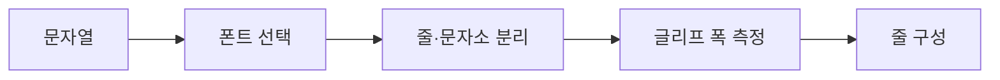

# FNC-010 글자 측정과 줄바꿈

최종 갱신: 2026-09-28

## 개요

등록한 폰트의 실제 글리프 폭을 기준으로 가로·세로 글자를 측정하고 PDF와 화면이 같은 줄 구성을
사용하도록 하는 흐름을 정의합니다.

## 변경 이력

| 날짜 | 구분 | 변경 내용 |
| --- | --- | --- |
| 2026-09-28 | 신규 작성 | 폰트 측정, 줄바꿈, 일본어 금칙과 세로 쓰기 처리를 정의했습니다. |

## 호출 조건

텍스트·그리드 셀·수식 결과를 캔버스와 PDF에 배치하거나 넘침 방식을 계산할 때 사용합니다.

## 입력·출력

| 구분 | 항목 | 조건 |
| --- | --- | --- |
| 입력 | 문자열, 글꼴과 상자 크기 | 크기는 pt와 mm 변환 기준을 공유합니다. |
| 출력 | 줄 목록과 측정 크기 | 선택한 폰트의 실제 글리프 폭을 반영합니다. |

## 사전·사후 조건

폰트 데이터는 FNC-014로 확정되어야 합니다. 한글·일본어·라틴 문자와 결합 문자를 임의 바이트
단위로 자르지 않습니다.

## 정상 처리 흐름

## 분기와 예외 흐름

가로 쓰기는 폭에 맞춰 줄을 나누고 일본어 줄 처음·끝 금칙 문자를 다시 조정합니다. 세로 쓰기는
문자소 단위로 줄을 세웁니다. `clip`, `wrap`, `shrink`는 렌더 변환 단계에서 같은 측정 결과를
사용합니다.

## 데이터 조회·변경

문자열과 폰트를 읽고 측정값만 반환합니다. 원본 내용과 스타일은 바꾸지 않습니다.

## 하위 기능과 시퀀스

`TextMeasurer`, pdfme 줄 분리와 `stackVertically()`를 사용합니다. 이미 나눈 일본어 줄을 다시
나누어 금칙 결과가 달라지지 않도록 한 번의 기준 결과를 렌더러에 전달합니다.

## 오류·복구

글리프가 없거나 폰트가 손상되면 FNC-014 또는 FNC-013의 렌더 오류로 알립니다. 임의 대체 문자로
조용히 바꾸지 않습니다.

## 검증 기준

한·영·일 문장, 일본어 금칙 문자, 긴 단어, 줄바꿈 문자, 결합 문자, 세로 쓰기와 세 넘침 방식을
Node.js와 Chromium에서 비교합니다.

## 관련 설계와 근거

- 데이터: DAT-004·DAT-009
- 기능: FNC-013·FNC-014
- `packages/core/src/render/measure.ts`
- `packages/core/src/render/text-layout.ts`

