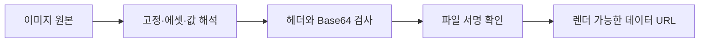

# FNC-011 이미지 확인과 해석

최종 갱신: 2026-09-28

## 개요

고정 이미지, 에셋 참조와 파라미터 이미지를 실제로 PDF에 넣을 수 있는 데이터 URL로 해석하고
구조·크기·내용을 검사하는 흐름을 정의합니다.

## 변경 이력

| 날짜 | 구분 | 변경 내용 |
| --- | --- | --- |
| 2026-09-28 | 신규 작성 | 이미지 원본 해석, 데이터 URL 검사와 렌더 단위 캐시를 정의했습니다. |

## 호출 조건

파일 검증과 PDF 변환에서 이미지 요소 또는 이미지 파라미터를 처리할 때 사용합니다.

## 입력·출력

| 구분 | 항목 | 자료형·단위 | 필수 여부·기본값 | 제약과 보장 |
| --- | --- | --- | --- | --- |
| 입력 | 이미지 원본 | 고정 참조·에셋 참조·파라미터 키 | 필수 | 한 가지 값 소스만 사용합니다. |
| 입력 | 양식 에셋과 전표 값 | 에셋 배열·JSON 값 객체 | 참조 방식에 따라 필수 | 로컬 파일 안의 대상만 해석합니다. |
| 입력 | 크기 상한 | 양의 정수 바이트 | 선택·2MiB | 디코딩한 이미지 한 장에 적용합니다. |
| 출력 | 이미지 데이터 URL | PNG·JPEG Base64 문자열 | 성공 시 반환 | MIME, Base64, 파일 서명과 크기 검사를 통과합니다. |

## 사전·사후 조건

일반 URL과 외부 파일 경로는 허용하지 않습니다. `data:`로 시작해도 쉼표가 없는 일반 문자열은 이미지
데이터 URL로 해석하지 않습니다. 발행 전표는 필요한 이미지 값을 스냅샷 안에서 해결할 수 있어야 합니다.

## 정상 처리 흐름

| 순서 | 처리 | 읽는 값 | 만드는 값·변경하는 값 | 다음 단계 |
| --- | --- | --- | --- | --- |
| 1 | 고정 원본, 에셋 참조 또는 전표 값 가운데 하나를 실제 문자열로 해석합니다. | 이미지 요소, 에셋, 전표 값 | 이미지 원본 문자열 | 형식 판별 |
| 2 | URL 종류와 Base64 문법을 검사하고 선언한 MIME을 읽습니다. | 이미지 원본 문자열 | 형식 정보와 디코딩 대상 | 크기 검사 |
| 3 | Base64를 디코딩해 바이트 상한을 확인합니다. | 디코딩 대상 | 이미지 바이트 | 서명 검사 |
| 4 | PNG·JPEG 파일 서명이 선언한 MIME과 같은지 확인합니다. | 이미지 바이트, MIME | 검증된 이미지 정보 | 렌더 원본 생성 |
| 5 | 검증된 PNG·JPEG만 렌더러가 사용하는 data URL로 반환합니다. | 검증된 이미지 정보 | 렌더 가능한 이미지 원본 | 반환 |

## 분기와 예외 흐름

값이 없을 때 허용되는 화면은 빈 이미지를 표시합니다. MIME 불일치, 잘못된 Base64, 크기 초과와
손상된 내용은 `SlipRenderError` 또는 파일 검증 오류입니다.

## 데이터 조회·변경

파일의 에셋과 값만 읽습니다. 한 번의 PDF 변환에서는 원본 문자열별 검사 결과를 캐시하여 같은 로고가
여러 출력 페이지에 있어도 전체 Base64를 다시 디코딩하지 않습니다.

## 하위 기능과 시퀀스

`inspectImageDataUrl()`, `isEmbeddableImageData()`와 렌더 변환기의 이미지 해석기를 사용합니다.

## 오류·복구

손상 이미지를 빈 이미지로 바꾸지 않습니다. 사용자가 원본 에셋 또는 파라미터 값을 바꾼 뒤 다시
검증합니다.

## 동시 실행·반복 호출

한 PDF 변환에서는 같은 원본 문자열의 검사 결과를 공유합니다. 캐시 키는 원본 문자열 전체이며 성공과
실패 결과를 모두 재사용합니다. 다음 PDF 변환에는 캐시를 넘기지 않아 바뀐 에셋과 값을 새로
검사합니다.

## 검증 기준

PNG·JPEG, 고정·에셋·파라미터, 일반 `data:` 문자열, MIME·서명 불일치, 크기 제한과 여러 페이지의
동일 이미지 캐시를 시험합니다.

## 관련 설계와 근거

- 데이터: DAT-005·DAT-009
- 기능: FNC-013
- 오류: ERR-001·ERR-003
- `packages/core/src/format/image-source.ts`
- `packages/core/src/render/convert.ts`
