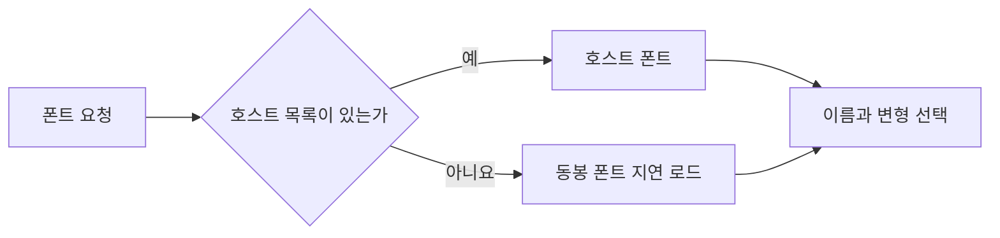

# FNC-014 폰트 제공과 대체

최종 갱신: 2026-09-28

## 개요

호스트 제공 폰트와 동봉 폰트를 조회하고 요소의 글꼴 이름·굵기·기울기에 맞는 실제 글꼴 데이터를
선택하는 흐름을 정의합니다.

## 변경 이력

| 날짜 | 구분 | 변경 내용 |
| --- | --- | --- |
| 2026-09-28 | 신규 작성 | 폰트 조회 공유, 동봉 폰트 대체와 변형 선택 규칙을 정의했습니다. |

## 호출 조건

디자이너 캔버스와 PDF가 글자를 측정하거나 그릴 때 호출합니다.

## 입력·출력

| 구분 | 항목 | 자료형·단위 | 필수 여부·기본값 | 제약과 보장 |
| --- | --- | --- | --- | --- |
| 입력 | 폰트 제공 함수 | `() => SlipFont[] | Promise<SlipFont[]>` | 선택·동봉 폰트 | 이름과 바이트가 있는 목록을 반환합니다. |
| 입력 | 로케일 | BCP 47 문자열 | 선택·`en-US` | `ja`로 시작하면 Noto Sans JP, 그 밖에는 Pretendard를 대체 폰트로 선택합니다. |
| 입력 | 요청 글자 스타일 | 폰트 이름·굵게·기울임 | 선택·기본 글꼴 | 요청 변형이 없으면 정한 대체 순서를 사용합니다. |
| 출력 | 폰트 목록·선택 | `SlipFont[]`와 실제 변형 | 성공 시 반환 | 렌더와 측정이 같은 바이트를 사용합니다. |

## 사전·사후 조건

`createSlipKit()` 인스턴스 안에서는 성공한 폰트 조회 Promise를 공유합니다. 실패한 Promise는 버리고
다음 호출에서 다시 시도합니다.

## 정상 처리 흐름

| 순서 | 처리 | 읽는 값 | 만드는 값·변경하는 값 | 다음 단계 |
| --- | --- | --- | --- | --- |
| 1 | 호스트 글꼴 제공 함수가 있으면 최초 호출의 진행 중 결과를 공유합니다. | 인스턴스 설정 | 호스트 글꼴 목록 또는 오류 | 목록 판정 |
| 2 | 호스트 글꼴이 없으면 로케일에 맞는 동봉 글꼴 묶음을 지연 로드합니다. | 로케일 | 동봉 글꼴 목록 | 변형 선택 |
| 3 | 요청한 글꼴 이름, 굵기와 기울임에 맞는 변형을 찾습니다. | 글꼴 요청, 글꼴 목록 | 선택한 글꼴 또는 대체 후보 | 결과 확정 |
| 4 | 사용할 글꼴 바이트와 PDF 글꼴 이름을 확정합니다. | 선택 결과 | 렌더링용 글꼴 정보 | 반환 |

## 분기와 예외 흐름

호스트 목록이 없거나 비어 있으면 한국어·영어는 Pretendard, 일본어는 Noto Sans JP를 대체 폰트로
지정하되 두 폰트 묶음을 모두 등록합니다. 요청한 이름이나 변형이 없으면 명시한 대체 규칙을 사용하고,
손상된 데이터는 렌더 오류로 알립니다.

## 데이터 조회·변경

동봉 폰트 모듈은 처음 필요할 때 불러오고 로케일별 Promise를 재사용합니다. 폰트 바이트를 수정하지
않습니다.

## 하위 기능과 시퀀스

Elements의 `resolveFonts()`와 Core 렌더러의 폰트 등록·측정 기능이 같은 목록을 사용합니다.

## 오류·복구

필요한 글리프나 변형이 없으면 호스트가 적합한 폰트를 제공해야 합니다. 네트워크 조회 실패는 다음
렌더링에서 다시 시도할 수 있습니다.

## 동시 실행·반복 호출

같은 폰트 제공 함수에 대한 동시 요청은 Promise 하나를 공유합니다. 성공 결과는 해당 SlipKit 또는 UI
설정 수명 동안 재사용하고, 실패한 Promise는 다음 요청에서 다시 시도할 수 있게 제거합니다. 서로 다른
폰트 제공 함수와 로케일의 동봉 폰트 로드는 섞지 않습니다.

## 검증 기준

호스트 우선, 빈 목록 대체, 조회 성공·실패 공유, ko·en·ja 대체, 굵기·기울기와 누락 글리프를
Node.js와 Chromium에서 시험합니다.

## 관련 설계와 근거

- 데이터: DAT-009
- 기능: FNC-010·FNC-013
- 인터페이스: IF-001·IF-004
- `packages/core/src/slipkit.ts`
- `packages/elements/src/default-fonts.ts`
- `packages/elements/src/settings.ts`
