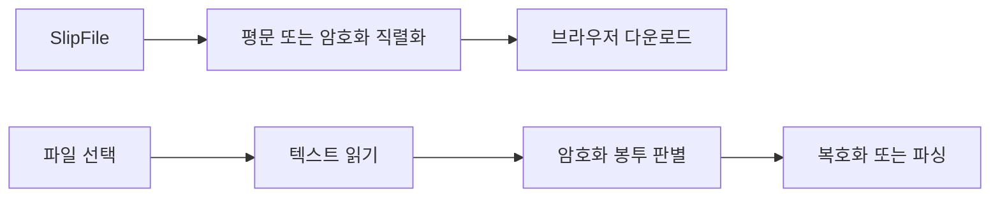

# FNC-018 파일 열기와 내려받기

최종 갱신: 2026-09-28

## 개요

브라우저의 다운로드와 파일 선택 대화상자를 사용해 평문 또는 암호화 `.slip` 파일을 내보내고
불러오는 흐름을 정의합니다.

## 변경 이력

| 날짜 | 구분 | 변경 내용 |
| --- | --- | --- |
| 2026-09-28 | 신규 작성 | 내려받기, 파일 선택, 암호화 감지와 취소 처리를 정의했습니다. |

## 호출 조건

호스트나 데모가 영속 저장소와 별개로 사용자 파일을 내보내거나 열 때 `SlipFileExchange`를 사용합니다.

## 입력·출력

| 구분 | 항목 | 조건 |
| --- | --- | --- |
| 입력 | 파일 이름과 `SlipFile` | `.slip` 확장자가 없으면 덧붙입니다. |
| 입력 | 선택한 `.slip` 또는 JSON 파일 | 브라우저 파일 선택 대화상자를 사용합니다. |
| 출력 | 다운로드 완료 또는 검증된 `SlipFile` | 암호화 봉투는 설정된 키로 풉니다. |

## 사전·사후 조건

다운로드 URL은 작업이 끝나면 반드시 해제합니다. 파일 입력 요소도 성공·취소·실패 뒤 문서에서
제거합니다.

## 정상 처리 흐름

## 분기와 예외 흐름

내보내기 암호화 여부는 생성 옵션을 따르지만 열기는 내용을 자동 판별합니다. 사용자가 대화상자를
닫으면 `cancelled`, 변경 이벤트에 파일이 없으면 `io` 오류입니다.

## 데이터 조회·변경

브라우저가 선택한 파일만 읽고 로컬 저장소에는 기록하지 않습니다. 내려받기용 Blob URL은 일시적으로만
만듭니다.

## 하위 기능과 시퀀스

FNC-001 파싱과 FNC-015 암·복호화를 Elements 저장 직렬화 함수로 조합합니다.

## 오류·복구

취소는 사용자에게 재시도 가능한 상태로 전달합니다. 키 불일치와 파일 형식 오류는 원인을 유지하며
다른 형식으로 추정하지 않습니다.

## 검증 기준

확장자 처리, 평문·암호화 왕복, 선택 취소, 파일 없음, 파싱·키 오류, 입력 요소와 Blob URL 정리를
실제 Chromium에서 시험합니다.

## 관련 설계와 근거

- 데이터: DAT-001·DAT-010
- 기능: FNC-001·FNC-015·FNC-016
- 오류: ERR-004
- `packages/elements/src/storage/file-exchange.ts`
- `packages/elements/src/storage/encryption.ts`

