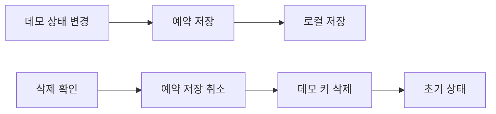

# FNC-023 데모 자동 저장과 데이터 삭제

최종 갱신: 2026-09-28

## 개요

바닐라·React·Vue 데모가 브라우저에 양식·전표·화면 모드를 자동 저장하고, 사용자가 확인한 뒤 이
데이터만 삭제하는 흐름을 정의합니다.

## 변경 이력

| 날짜 | 구분 | 변경 내용 |
| --- | --- | --- |
| 2026-09-28 | 신규 작성 | 자동 저장·복원, 삭제 확인과 저장 경합 방지를 정의했습니다. |

## 호출 조건

데모 시작, 편집·작성 상태 변경과 저장 데이터 삭제 명령에서 실행합니다.

## 입력·출력

| 구분 | 항목 | 조건 |
| --- | --- | --- |
| 입력 | 양식·전표·화면 모드 | 데모가 소유한 정해진 로컬 저장 키만 사용합니다. |
| 출력 | 복원한 상태 또는 초기 상태 | 삭제 성공 뒤 양식 편집·빈 작성·발행 상태로 돌아갑니다. |

## 사전·사후 조건

공용 기기와 공개 샘플 키에 개인정보를 넣지 말라는 안내를 ko·en·ja로 표시합니다. 삭제는 사용자
확인을 받은 뒤 진행합니다.

## 정상 처리 흐름

## 분기와 예외 흐름

사용자가 취소하면 아무것도 바꾸지 않습니다. 삭제 실패는 현재 상태를 유지하고 오류를 알립니다.
성공 직후에는 초기 상태를 자동 저장하지 않아 삭제한 키가 다시 생기지 않게 합니다.

## 데이터 조회·변경

세 자동 저장 키와 화면 모드 키만 지우며 같은 출처의 다른 로컬 저장 데이터는 건드리지 않습니다.

## 하위 기능과 시퀀스

각 데모 프레임워크의 상태 연결부가 공통 저장 키·문구와 삭제 순서를 사용합니다.

## 오류·복구

손상된 저장값은 초기 상태로 복구하되 다른 키를 지우지 않습니다. 저장소 접근 실패는 사용자에게
알리고 메모리 상태로 계속 사용할 수 있게 합니다.

## 검증 기준

저장·복원, 예약 저장 중 삭제, 취소·성공·실패, 성공 직후 무저장, 다른 키 보존과 세 로케일을 세
데모 및 실제 Chromium에서 시험합니다.

## 관련 설계와 근거

- 화면: SCR-016
- 오류: ERR-005
- [ADR-084](../../DECISIONS.md#adr-084)
- `examples/shared/src/index.ts`
