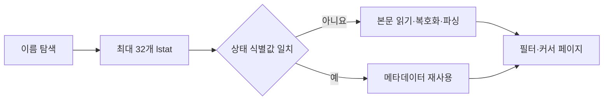

# FNC-024 MCP 파일 접근과 목록 캐시

최종 갱신: 2026-09-28

## 개요

MCP 작업 디렉터리 안에서 안전한 `.slip` 경로를 읽고 쓰며, 목록 조회의 메타데이터 분석 결과를 파일
상태에 맞춰 재사용하는 흐름을 정의합니다.

## 변경 이력

| 날짜 | 구분 | 변경 내용 |
| --- | --- | --- |
| 2026-09-28 | 신규 작성 | 경로 경계, 원자적 저장, 경로별 큐와 목록 캐시 계약을 정의했습니다. |

## 호출 조건

MCP의 목록·읽기·저장·수정·전표 생성·PDF 도구가 파일 시스템에 접근할 때 사용합니다.

## 입력·출력

| 구분 | 항목 | 조건 |
| --- | --- | --- |
| 입력 | 작업 디렉터리 기준 ID와 필터·커서 | ID는 정규화 뒤 작업 디렉터리를 벗어나지 않아야 합니다. |
| 출력 | 검증된 파일 또는 목록 한 페이지 | 목록 기본 크기는 50이며 다음 항목 존재 여부까지 평가합니다. |

## 사전·사후 조건

심볼릭 링크를 파일로 따르지 않습니다. 같은 경로의 변경은 차례대로 처리하고 서로 다른 경로는 병렬로
처리합니다. 저장은 임시 파일 뒤 원자적 교체를 사용합니다.

## 정상 처리 흐름

## 분기와 예외 흐름

캐시는 경로와 `dev·ino·size·mtimeNs·ctimeNs·mode`를 함께 비교합니다. 손상·미지원 파일의 제외 결과도
재사용합니다. 저장·삭제·외부 교체·이름 변경과 키 구성 변화는 다음 조회에서 정확히 무효화됩니다.

## 데이터 조회·변경

캐시는 `FileSystemStorage` 인스턴스 안에만 있고 전체 본문·평문·키를 보관하지 않습니다. 디스크
sidecar, `fs.watch`와 전역 캐시는 사용하지 않습니다.

## 하위 기능과 시퀀스

`PathQueue`, `statCandidates()`, `ListMetadataCache`와 저장소 직렬화가 협력합니다. 같은 파일을 동시에
분석하면 진행 중인 Promise를 공유합니다.

## 오류·복구

파일 하나의 조회 실패는 목록에서 제외할 수 있지만 경로 경계 위반과 저장 실패는 작업 오류로
알립니다. 실패한 저장은 기존 파일과 캐시 결과를 훼손하지 않습니다.

## 검증 기준

경로 탈출·심볼릭 링크, 동시 저장, cold·warm 목록, 외부 생성·수정·교체·삭제·이름 변경, 같은 크기와
복원 mtime, 키 격리, 최대 동시 `lstat` 32와 전체 커서 진행을 시험합니다.

## 관련 설계와 근거

- 데이터: DAT-011
- 인터페이스: IF-009·IF-010
- 오류: ERR-004·ERR-005
- `packages/mcp/src/storage.ts`
- `packages/mcp/src/list-cache.ts`
- `packages/mcp/src/file-queue.ts`

