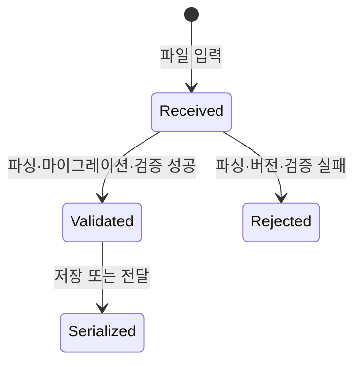
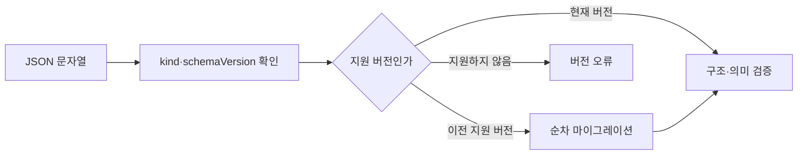

# DAT-001 파일 봉투와 버전

최종 갱신: 2026-09-28

## 개요

일반 `.slip` 파일의 최상위 판별 정보와 스키마 버전 처리 기준을 정의합니다. 파일은 UTF-8 JSON
문서이며 `kind`와 `schemaVersion`으로 해석 경로를 정합니다.

## 변경 이력

| 날짜 | 구분 | 변경 내용 |
| --- | --- | --- |
| 2026-09-28 | 신규 작성 | 일반 파일의 최상위 구조, 종류 판별과 버전 처리 원칙을 정의했습니다. |

## 소유 계층

Core 형식 계층이 파일을 만들고 검증합니다. 디자이너와 작성 폼은 Core가 검증한 전체 파일을 교체하며,
저장소와 MCP는 본문을 해석해 임의 필드를 추가하지 않습니다.

## 구조와 주요 항목

| 경로 | 자료형 | 필수 여부 | 기본값 | 허용 범위·형식 | 의미 |
| --- | --- | --- | --- | --- | --- |
| `schemaVersion` | 문자열 | 필수 | 없음 | 숫자 세 부분으로 된 `major.minor.patch` | 파일을 읽을 스키마 버전 |
| `kind` | 문자열 | 필수 | 없음 | `template` 또는 `voucher` | 최상위 본문의 종류 |
| `template` | 객체 | 양식에 필수 | 없음 | `kind`가 `template`일 때만 존재 | 편집하고 재사용할 양식 본문 |
| `templateSnapshot` | 객체 | 전표에 필수 | 없음 | `kind`가 `voucher`일 때만 존재 | 전표 작성 시작 때 복사한 양식 본문 |
| `values` | 객체 | 전표에 필수 | 없음 | 최상위 키별 값은 모든 JSON 자료형 허용 | 전표에 입력한 값 |
| `issued` | 논리값 | 전표에 필수 | 없음 | `true` 또는 `false` | 작성 완료 여부와 화면 편집 잠금 상태 |

정의하지 않은 최상위 프로퍼티는 거부합니다. 암호화 봉투는 이 구조와 별개이며 복호화한 내부 JSON이
이 계약을 따라야 합니다.

## 데이터 관계

| 기준 데이터 | 대상 데이터 | 관계·개수 | 연결 키 | 삭제·변경 시 처리 |
| --- | --- | --- | --- | --- |
| 양식 파일 | 양식 본문 | 1:1 | `kind=template` | 본문을 빼거나 전표 본문과 함께 둘 수 없습니다. |
| 전표 파일 | 양식 스냅샷 | 1:1 | `kind=voucher` | 원본 양식과 독립적으로 보존합니다. |
| 전표 파일 | 값 객체 | 1:1 | 파라미터 키 | 양식 스냅샷을 바꿔도 값을 자동 변환하지 않습니다. |

## 인코딩과 입력 정규화

파일은 UTF-8로 읽고 씁니다. 입력 문자열 맨 앞의 BOM 한 개는 제거하고 파싱하지만 직렬화할 때는
BOM을 출력하지 않습니다. JSON 파싱 뒤에도 숫자 범위, 배열 크기, 식별자 중복과 교차 필드 조건을
검사합니다.

## 생명주기

검증에 성공한 파일만 편집, 저장과 렌더링에 사용합니다. 실패한 입력은 부분적으로 보정해 보관하지
않습니다.

## 버전·검증·정규화·마이그레이션

현재 공개 전 스키마 버전은 `0.1.0`입니다. 구현에 내장된 이전 버전 단계가 없으므로 다른 버전은
지원하지 않는 버전 오류가 됩니다. 향후 버전을 추가하면 한 단계씩 현재 버전으로 올린 뒤 전체
검증을 수행합니다.

## 불변 조건

- `kind`와 본문 프로퍼티의 조합이 일치해야 합니다.
- 직렬화 결과는 현재 스키마 버전을 사용하고 정의하지 않은 값을 추가하지 않습니다.
- 파일 이름이나 확장자는 종류 판별 근거가 아니며 본문을 검증해야 합니다.
- JSON Schema 검증만으로 마이그레이션과 모든 의미 규칙을 대신하지 않습니다.

## 관련 설계와 근거

- 기능: FNC-001 파일 파싱과 검증, FNC-002 버전 마이그레이션과 정규화
- 인터페이스: IF-002 Core 독립 공개 API와 JSON Schema
- 오류: ERR-001 파일 파싱·검증·마이그레이션 오류
- [파일 형식 명세 2~4·22~23](../../SPEC.md)
- `packages/core/src/format/parse.ts`, `packages/core/src/format/version.ts`
