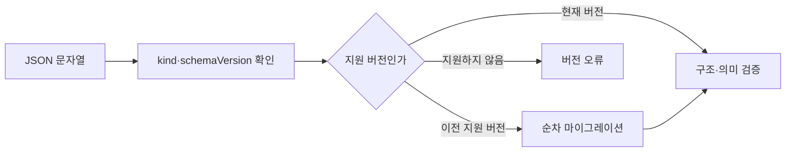

# DAT-001 파일 봉투와 버전

최종 갱신: 2026-09-28

## 개요

일반 `.slip` 파일의 최상위 판별 정보와 스키마 버전 처리 기준을 정의합니다. 파일은 UTF-8 JSON
문서이며 `kind`와 `schemaVersion`으로 해석 경로를 정합니다.

## 변경 이력

| 날짜 | 구분 | 변경 내용 |
| --- | --- | --- |
| 2026-09-28 | 신규 작성 | 일반 파일의 최상위 구조, 종류 판별과 버전 처리 원칙을 정의했습니다. |

## 최상위 구조

| 항목 | 양식 | 전표 | 설명 |
| --- | --- | --- | --- |
| `schemaVersion` | 필수 | 필수 | `major.minor.patch` 형태의 파일 스키마 버전입니다. |
| `kind` | `template` | `voucher` | 최상위 본문의 종류를 판별합니다. |
| `template` | 필수 | 없음 | 양식 본문입니다. |
| `templateSnapshot` | 없음 | 필수 | 작성 당시 양식 본문의 복사본입니다. |
| `values` | 없음 | 필수 | 전표 값입니다. |
| `issued` | 없음 | 필수 | UI 편집 잠금 상태입니다. |

정의하지 않은 최상위 프로퍼티는 거부합니다. 암호화 봉투는 이 구조와 별개이며 복호화한 내부 JSON이
이 계약을 따라야 합니다.

## 인코딩과 입력 정규화

파일은 UTF-8로 읽고 씁니다. 입력 문자열 맨 앞의 BOM 한 개는 제거하고 파싱하지만 직렬화할 때는
BOM을 출력하지 않습니다. JSON 파싱 뒤에도 숫자 범위, 배열 크기, 식별자 중복과 교차 필드 조건을
검사합니다.

## 버전 처리

현재 공개 전 스키마 버전은 `0.1.0`입니다. 구현에 내장된 이전 버전 단계가 없으므로 다른 버전은
지원하지 않는 버전 오류가 됩니다. 향후 버전을 추가하면 한 단계씩 현재 버전으로 올린 뒤 전체
검증을 수행합니다.

## 불변 조건

- `kind`와 본문 프로퍼티의 조합이 일치해야 합니다.
- 직렬화 결과는 현재 스키마 버전을 사용하고 정의하지 않은 값을 추가하지 않습니다.
- 파일 이름이나 확장자는 종류 판별 근거가 아니며 본문을 검증해야 합니다.
- JSON Schema 검증만으로 마이그레이션과 모든 의미 규칙을 대신하지 않습니다.

## 관련 설계와 근거

- 기능: FNC-001 파일 파싱과 검증, FNC-002 버전 마이그레이션과 정규화
- 인터페이스: IF-002 Core 독립 공개 API와 JSON Schema
- 오류: ERR-001 파일 파싱·검증·마이그레이션 오류
- [파일 형식 명세 2~4·22~23](../../SPEC.md)
- `packages/core/src/format/parse.ts`, `packages/core/src/format/version.ts`
