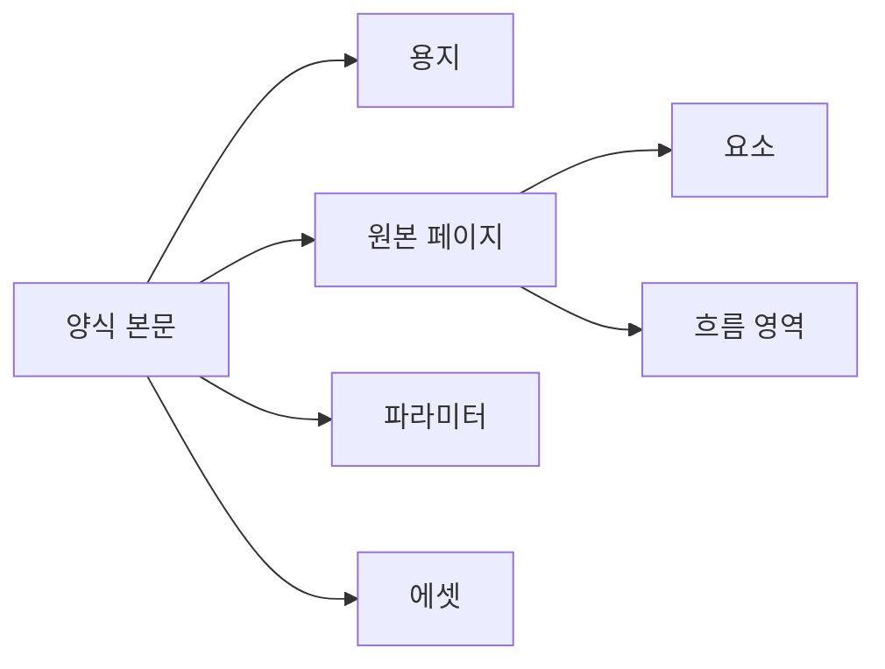

# DAT-002 양식 본문·메타데이터·용지·페이지

최종 갱신: 2026-09-28

## 개요

전표를 설계하고 출력하기 위한 양식 본문의 상위 구조와 페이지 구성을 정의합니다. 양식 본문은
전표 스냅샷에서도 같은 구조를 사용합니다.

## 변경 이력

| 날짜 | 구분 | 변경 내용 |
| --- | --- | --- |
| 2026-09-28 | 신규 작성 | 양식 메타데이터, 용지, 페이지, 파라미터와 자원 관계를 정의했습니다. |

## 구조

| 항목 | 필수 | 역할 |
| --- | --- | --- |
| `meta` | 필수 | 제목, 설명과 생성·수정 시각을 보관합니다. |
| `paper` | 필수 | 용지 크기, 방향과 여백을 정의합니다. |
| `pages` | 필수 | 한 개 이상의 원본 페이지와 요소를 순서대로 보관합니다. |
| `parameters` | 선택 | 전표 입력값의 키, 형식과 하위 필드를 정의합니다. |
| `sampleValues` | 선택 | 디자이너 미리보기에서 사용할 예제 값입니다. |
| `assets` | 선택 | `asset://`로 참조하는 내장 자원입니다. |
| `maxRepeatItems` | 선택 | 반복 그리드가 처리할 항목 수의 양식별 상한입니다. |

`meta`의 제목은 사용자에게 양식을 식별할 이름을 제공합니다. 업무 시스템의 양식 ID, 개정 승인과
배포 상태는 필수 파일 식별자가 아니며 호스트 저장소가 별도로 관리할 수 있습니다.

## 용지

용지는 A4·A5·Letter 같은 이름 있는 크기 또는 직접 지정한 폭과 높이를 사용합니다. 방향을 적용한
실제 폭·높이 안에 네 여백이 들어가야 합니다. 좌표와 길이 단위는 mm이고 글자 크기는 pt입니다.

## 페이지

각 원본 페이지는 고유한 `key`, 요소 배열과 선택적인 흐름 영역을 가집니다. 요소 ID는 양식 전체에서
중복될 수 없습니다. 원본 페이지 하나가 반복 그리드 때문에 여러 출력 페이지로 늘어날 수 있으므로
원본 페이지 번호와 출력 페이지 번호를 구분합니다.

## 생명주기

디자이너는 편집 결과마다 전체 양식 파일을 내보냅니다. 전표를 만들 때 양식 본문을 깊은 복사하여
`templateSnapshot`에 넣습니다. 이후 원본 양식 변경은 기존 전표에 반영되지 않습니다.

## 불변 조건

- 페이지 키, 요소 ID, 파라미터 키와 에셋 ID는 각각 요구되는 범위에서 고유해야 합니다.
- 요소와 흐름 영역은 용지와 여백 계약을 따라야 합니다.
- `sampleValues`는 미리보기 자료이며 Core가 양식 파일을 직접 PDF로 만들 때 자동 적용하지 않습니다.

## 관련 설계와 근거

- 데이터: DAT-004~DAT-009
- 기능: FNC-003, FNC-007, FNC-013
- 화면: SCR-001~SCR-013
- [파일 형식 명세 5·8·17](../../SPEC.md)
- `packages/core/src/format/schema.ts`
