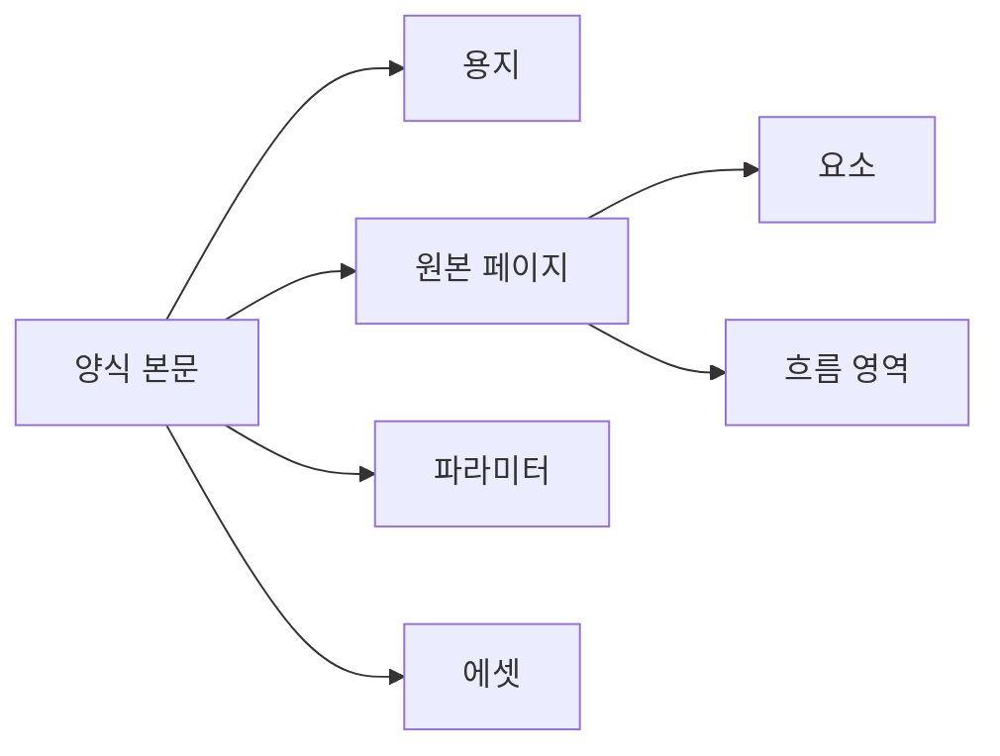
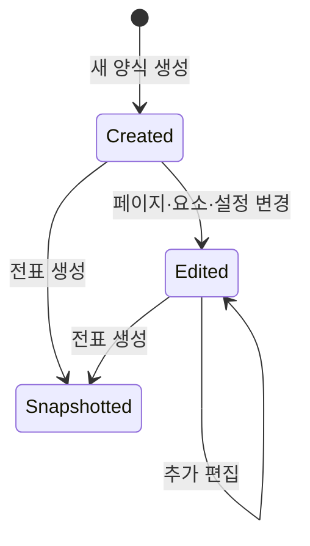

# DAT-002 양식 본문·메타데이터·용지·페이지

최종 갱신: 2026-09-28

## 개요

전표를 설계하고 출력하기 위한 양식 본문의 상위 구조와 페이지 구성을 정의합니다. 양식 본문은
전표 스냅샷에서도 같은 구조를 사용합니다.

## 변경 이력

| 날짜 | 구분 | 변경 내용 |
| --- | --- | --- |
| 2026-09-28 | 신규 작성 | 양식 메타데이터, 용지, 페이지, 파라미터와 자원 관계를 정의했습니다. |

## 소유 계층

디자이너가 양식 본문을 만들고 변경하며 Core가 저장 전 전체 구조와 참조를 검증합니다. 전표를 만들면
Core가 본문을 깊은 복사해 스냅샷으로 넘기고 이후에는 원본 양식과 별도로 보존합니다.

## 구조와 주요 항목

| 경로 | 자료형 | 필수 여부 | 기본값 | 허용 범위·형식 | 의미 |
| --- | --- | --- | --- | --- | --- |
| `meta.title` | 문자열 | 필수 | 없음 | 1~20,000자 | 화면과 저장 목록에서 양식을 구분하는 제목 |
| `meta.createdAt` | 문자열 | 선택 | 없음 | 시간대가 포함된 ISO 8601 일시 | 양식을 처음 만든 시각 |
| `meta.updatedAt` | 문자열 | 선택 | 없음 | 시간대가 포함된 ISO 8601 일시 | 양식을 마지막으로 바꾼 시각 |
| `paper` | 객체 | 필수 | 없음 | 아래 용지 계약 | 모든 원본 페이지가 공유하는 용지와 여백 |
| `pages` | 배열 | 필수 | 없음 | 1~500개 | 저장 순서대로 출력할 원본 페이지 |
| `assets` | 배열 | 필수 | 없음 | 0~1,000개, ID 고유 | 양식에 포함한 이미지 자원 |
| `parameters` | 배열 | 선택 | 정의 없음 | 0~500개, 키 고유 | 전표 입력값의 이름과 종류 |
| `sampleValues` | 객체 | 선택 | 빈 객체 | 최상위 키별 값은 모든 JSON 자료형 허용 | 디자이너 미리보기용 공개 예제 값 |

`meta`의 제목은 사용자에게 양식을 식별할 이름을 제공합니다. 업무 시스템의 양식 ID, 개정 승인과
배포 상태는 필수 파일 식별자가 아니며 호스트 저장소가 별도로 관리할 수 있습니다.

## 데이터 관계

| 기준 데이터 | 대상 데이터 | 관계·개수 | 연결 키 | 삭제·변경 시 처리 |
| --- | --- | --- | --- | --- |
| 양식 본문 | 원본 페이지 | 1:N | 배열 순서와 선택적인 페이지 `key` | 마지막 페이지는 삭제하지 않습니다. |
| 원본 페이지 | 요소 | 1:N | 요소 `id` | 페이지 삭제 시 그 페이지 요소도 함께 삭제합니다. |
| 양식 본문 | 파라미터 정의 | 1:N | 파라미터 `key` | 키 변경 시 수식과 요소 참조를 한 작업으로 갱신합니다. |
| 양식 본문 | 에셋 | 1:N | 에셋 `id` | 사용 중인 에셋을 삭제하면 참조 검증에 실패합니다. |
| 양식 본문 | 샘플 값 | 1:1 | 파라미터 키 | 파라미터 삭제 시 해당 샘플 값도 제거합니다. |

## 용지

용지는 A4·A5·Letter 같은 이름 있는 크기 또는 직접 지정한 폭과 높이를 사용합니다. 방향을 적용한
실제 폭·높이 안에 네 여백이 들어가야 합니다. 좌표와 길이 단위는 mm이고 글자 크기는 pt입니다.

## 페이지

각 원본 페이지는 요소 배열과 선택적인 `key`, 표시 이름, 페이지 번호, 흐름 영역을 가집니다. 지정한
페이지 키는 양식 안에서 고유해야 하며 요소 ID는 양식 전체에서 중복될 수 없습니다. 원본 페이지 하나가
반복 그리드 때문에 여러 출력 페이지로 늘어날 수 있으므로 원본 페이지 번호와 출력 페이지 번호를
구분합니다.

## 생명주기

디자이너는 편집 결과마다 전체 양식 파일을 내보냅니다. 전표를 만들 때 양식 본문을 깊은 복사하여
`templateSnapshot`에 넣습니다. 이후 원본 양식 변경은 기존 전표에 반영되지 않습니다.

## 불변 조건

- 페이지 키, 요소 ID, 파라미터 키와 에셋 ID는 각각 요구되는 범위에서 고유해야 합니다.
- 요소와 흐름 영역은 용지와 여백 계약을 따라야 합니다.
- `sampleValues`는 미리보기 자료이며 Core가 양식 파일을 직접 PDF로 만들 때 자동 적용하지 않습니다.

## 버전·검증·정규화·마이그레이션

DAT-001의 파일 버전 처리 뒤 이 본문을 엄격한 객체로 검증합니다. 정의하지 않은 필드는 거부하고 배열
상한, 고유 키, 요소 참조와 이미지 내용을 차례로 확인합니다. 현재 버전에서는 생략한 선택 필드를
직렬화 때 임의로 채우지 않습니다.

## 관련 설계와 근거

- 데이터: DAT-004~DAT-009
- 기능: FNC-003, FNC-007, FNC-013
- 화면: SCR-001~SCR-013·SCR-017
- [파일 형식 명세 5·8·17](../../SPEC.md)
- `packages/core/src/format/schema.ts`
