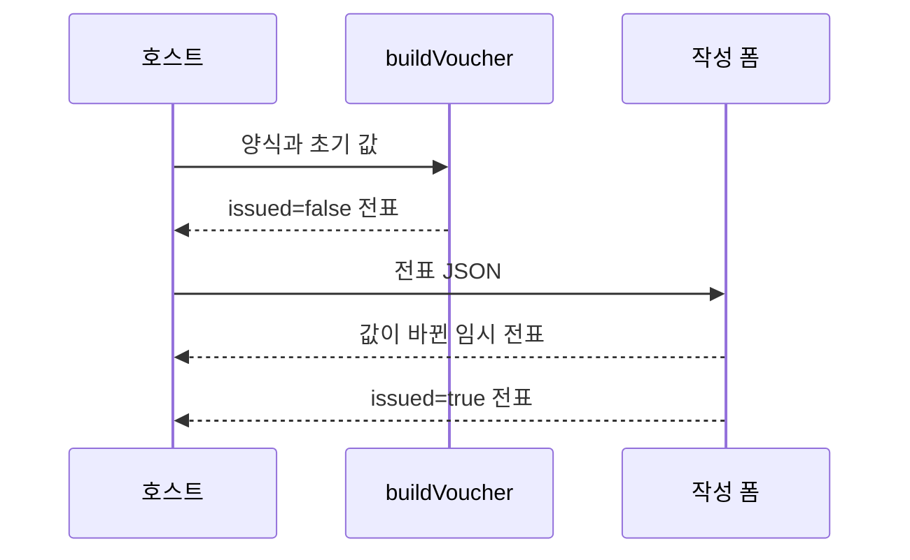

# DAT-003 전표 스냅샷·값·발행 상태

최종 갱신: 2026-09-28

## 개요

전표 파일이 작성 당시 양식, 사용자 값과 발행 상태를 보관하는 구조를 정의합니다. 전표는 원본 양식과
독립적으로 다시 표시하고 출력할 수 있어야 합니다.

## 변경 이력

| 날짜 | 구분 | 변경 내용 |
| --- | --- | --- |
| 2026-09-28 | 신규 작성 | 전표 스냅샷, 값, 발행 상태와 이미지 불변 조건을 정의했습니다. |

## 소유 계층

Core가 양식과 초기값에서 전표를 만들고 작성 폼이 미발행 전표의 값만 변경합니다. 발행된 전표의 보관,
승인과 접근 권한은 호스트 애플리케이션이 책임집니다.

## 구조와 주요 항목

| 경로 | 자료형 | 필수 여부 | 기본값 | 허용 범위·형식 | 의미 |
| --- | --- | --- | --- | --- | --- |
| `schemaVersion` | 문자열 | 필수 | 없음 | DAT-001의 현재 버전 | 전표 파일의 스키마 버전 |
| `kind` | 문자열 | 필수 | 없음 | `voucher` | 전표 파일 판별값 |
| `templateSnapshot` | 객체 | 필수 | 없음 | DAT-002 구조 | 작성 시작 때 깊은 복사한 양식 본문 |
| `values` | 객체 | 필수 | 없음 | JSON 값으로 된 평평한 키-값 객체 | 사용자가 입력하거나 계산에 사용할 값 |
| `issued` | 논리값 | 필수 | 생성 시 `false` | `true` 또는 `false` | 작성 완료 여부와 화면 편집 잠금 상태 |

`values`의 최상위는 평평한 키-값 객체입니다. 목록 파라미터 값은 객체 배열이며 각 객체 안에서
정의된 하위 필드 키를 사용합니다. `null`, 논리값, 유한한 숫자, 문자열, 배열과 객체로 표현할 수
있는 JSON 값만 저장합니다.

## 데이터 관계

| 기준 데이터 | 대상 데이터 | 관계·개수 | 연결 키 | 삭제·변경 시 처리 |
| --- | --- | --- | --- | --- |
| 전표 | 양식 스냅샷 | 1:1 | 본문 자체 | 원본 양식 변경·삭제와 무관하게 보존합니다. |
| 값 객체 | 파라미터 정의 | 0..1:1 | 최상위 파라미터 키 | 정의되지 않은 값도 JSON 값이면 보존합니다. |
| 목록 값 | 목록 하위 필드 | N:M | 행 객체의 하위 필드 키 | 정의를 바꿔도 기존 값을 자동 삭제하지 않습니다. |

## 생성 흐름

전표 조립은 양식 본문과 값을 깊은 복사하여 호출 뒤 원본 객체 변경의 영향을 받지 않게 합니다.
작성 폼은 양식 파일을 입력받아 임시 전표를 만들거나 기존 미발행 전표를 이어서 편집할 수 있습니다.

## 발행 상태

`issued: true`이면 SlipKit UI는 값을 수정하지 않습니다. 이 값은 전자서명, 작성자 인증, 감사 기록이나
법적 발행 증명이 아닙니다. 호스트가 승인 절차와 변경 방지 저장소를 별도로 적용해야 합니다.

발행 전표는 외부 URL 이미지에 의존할 수 없습니다. 고정 이미지와 에셋은 내장 데이터여야 하고,
변동 이미지 값은 비어 있거나 유효한 이미지 data URI여야 합니다.

## 불변 조건

- 양식 스냅샷과 값 객체는 전표 생성 뒤 원본 입력과 메모리를 공유하지 않습니다.
- 값 객체의 최상위는 평평하며 목록 파라미터의 행 객체만 한 단계 하위 필드를 가집니다.
- 발행 전표는 값을 수정하지 않고 모든 출력 이미지가 파일 안의 데이터만 사용합니다.
- 발행 상태만으로 사용자 신원, 승인과 법적 무결성을 보장하지 않습니다.

## 생명주기

원본 양식을 변경하거나 삭제해도 전표 스냅샷은 바뀌지 않습니다. 전표를 다시 편집 가능 상태로
되돌리는 업무 규칙은 SlipKit이 제공하지 않습니다. 저장소 ID, 개정 이력과 보존 기간은 호스트가
관리합니다.

## 버전·검증·정규화·마이그레이션

DAT-001의 버전 처리 뒤 양식 스냅샷과 값 구조를 검증합니다. 숫자 파라미터의 미입력 값은 화면과 렌더링
직전에 FNC-002 규칙으로 정규화할 수 있지만, 저장된 다른 값의 종류를 추정해 바꾸지 않습니다. 발행할
때는 외부 이미지 URL과 변동 이미지 값을 추가로 검사합니다.

## 관련 설계와 근거

- 기능: FNC-003 양식 생성과 전표 발행 생명주기
- 화면: SCR-014 전표 작성 폼, SCR-015 전표 뷰어
- 오류: ERR-001·ERR-004
- [파일 형식 명세 18~20](../../SPEC.md)
- [ADR-008·043·052](../../DECISIONS.md)
