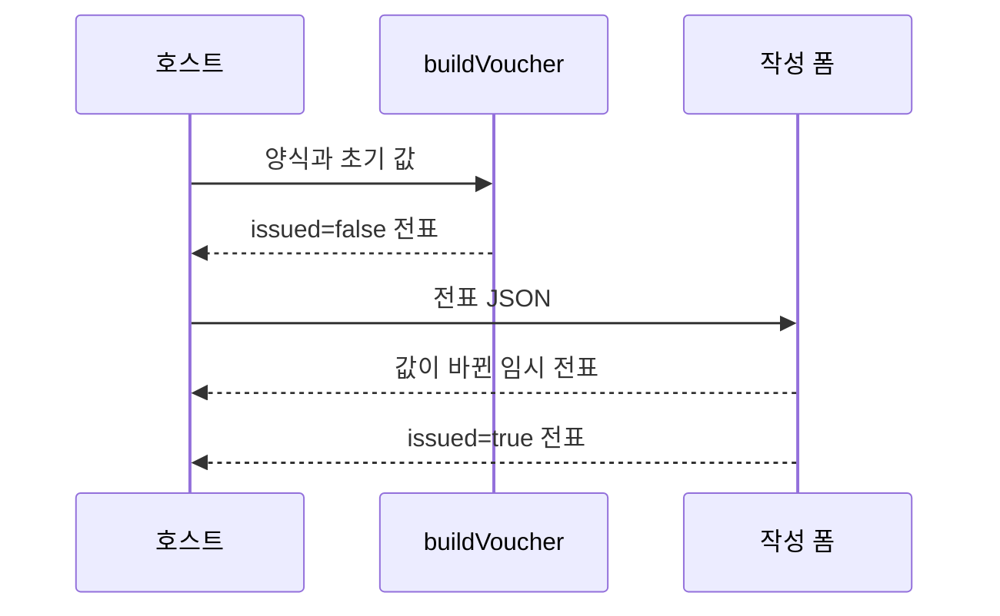

# DAT-003 전표 스냅샷·값·발행 상태

최종 갱신: 2026-09-28

## 개요

전표 파일이 작성 당시 양식, 사용자 값과 발행 상태를 보관하는 구조를 정의합니다. 전표는 원본 양식과
독립적으로 다시 표시하고 출력할 수 있어야 합니다.

## 변경 이력

| 날짜 | 구분 | 변경 내용 |
| --- | --- | --- |
| 2026-09-28 | 신규 작성 | 전표 스냅샷, 값, 발행 상태와 이미지 불변 조건을 정의했습니다. |

## 구조

| 항목 | 역할 |
| --- | --- |
| `schemaVersion` | 파일 스키마 버전입니다. |
| `kind: "voucher"` | 전표 파일임을 나타냅니다. |
| `templateSnapshot` | 전표 작성 시작 시점의 양식 본문입니다. |
| `values` | 파라미터 키와 JSON 값의 평평한 객체입니다. |
| `issued` | 발행 여부와 UI 편집 잠금 상태입니다. |

`values`의 최상위는 평평한 키-값 객체입니다. 목록 파라미터 값은 객체 배열이며 각 객체 안에서
정의된 하위 필드 키를 사용합니다. `null`, 논리값, 유한한 숫자, 문자열, 배열과 객체로 표현할 수
있는 JSON 값만 저장합니다.

## 생성 흐름

전표 조립은 양식 본문과 값을 깊은 복사하여 호출 뒤 원본 객체 변경의 영향을 받지 않게 합니다.
작성 폼은 양식 파일을 입력받아 임시 전표를 만들거나 기존 미발행 전표를 이어서 편집할 수 있습니다.

## 발행 상태

`issued: true`이면 SlipKit UI는 값을 수정하지 않습니다. 이 값은 전자서명, 작성자 인증, 감사 기록이나
법적 발행 증명이 아닙니다. 호스트가 승인 절차와 변경 방지 저장소를 별도로 적용해야 합니다.

발행 전표는 외부 URL 이미지에 의존할 수 없습니다. 고정 이미지와 에셋은 내장 데이터여야 하고,
변동 이미지 값은 비어 있거나 유효한 이미지 data URI여야 합니다.

## 생명주기와 보존

원본 양식을 변경하거나 삭제해도 전표 스냅샷은 바뀌지 않습니다. 전표를 다시 편집 가능 상태로
되돌리는 업무 규칙은 SlipKit이 제공하지 않습니다. 저장소 ID, 개정 이력과 보존 기간은 호스트가
관리합니다.

## 관련 설계와 근거

- 기능: FNC-003 양식 생성과 전표 발행 생명주기
- 화면: SCR-014 전표 작성 폼, SCR-015 전표 뷰어
- 오류: ERR-001·ERR-004
- [파일 형식 명세 18~20](../../SPEC.md)
- [ADR-008·043·052](../../DECISIONS.md)
