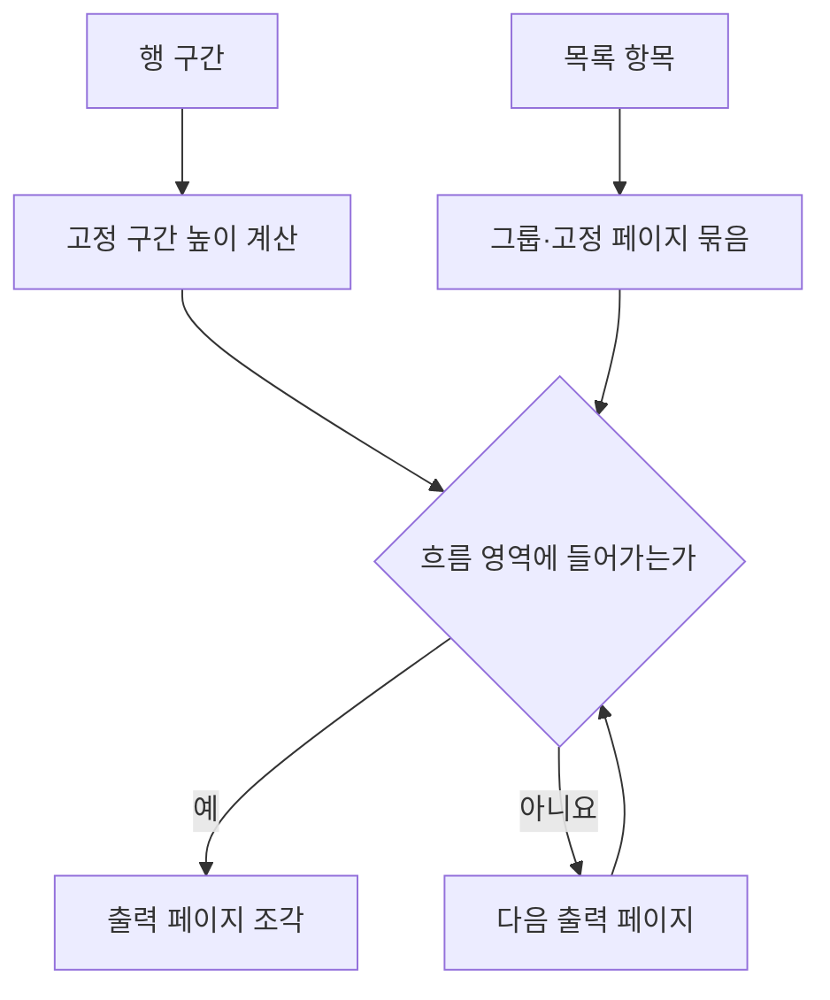

# DAT-007 그리드·셀·행 구간과 페이지 계획

최종 갱신: 2026-09-28

## 개요

고정 표와 반복 목록을 표현하는 그리드 구조와 출력 페이지를 나누는 행 구간·반복 규칙을 정의합니다.

## 변경 이력

| 날짜 | 구분 | 변경 내용 |
| --- | --- | --- |
| 2026-09-28 | 신규 작성 | 그리드 크기, 셀, 행 구간, 반복과 페이지 계획 자료를 정의했습니다. |

## 소유 계층

디자이너가 행·열·셀·행 구간과 반복 설정을 편집합니다. Core는 저장 구조와 기하 관계를 검증하고
페이지 계획기가 값 배열을 출력 페이지 조각으로 바꿉니다.

## 구조와 주요 항목

| 경로 | 자료형 | 필수 여부 | 기본값 | 허용 범위·형식 | 의미 |
| --- | --- | --- | --- | --- | --- |
| `columns` | 배열 | 필수 | 없음 | 1~100개, 각 너비 0 초과 5,000mm 이하 | 열 수와 열별 너비 |
| `columns[].autoMerge` | 논리값 | 선택 | `false` | 항목 구간 열에만 적용 | 연속한 같은 값을 세로로 합쳐 표시 |
| `rows` | 배열 | 필수 | 없음 | 1~1,000개, 각 높이 0 초과 5,000mm 이하 | 행 수와 행별 높이 |
| `cells` | 배열 | 필수 | 없음 | 0~100,000개 | 셀 시작 좌표, 병합, 값과 스타일 |
| `cells[].rowSpan`, `colSpan` | 정수 | 선택 | `1` | 1 이상, 그리드 범위 안 | 셀이 차지하는 행·열 수 |
| `repeat` | 객체 | 선택 | 정적 그리드 | 아래 반복 계약 | 목록 값을 행 구간에 반복하는 설정 |
| `repeat.bands` | 배열 | 반복에 필수 | 없음 | 1~20개, 전체 행을 한 번씩 포함 | 행을 출력 시점별 구간으로 분류 |
| `repeat.groupBy` | 문자열 배열 | 선택 | 그룹 없음 | 한 개 이상의 하위 필드 키 | 연속 항목을 묶는 비교 키 |
| `repeat.maxItems` | 정수 | 선택 | 모든 항목 | 1~100,000 | 페이지 계획 전에 사용할 실제 항목 상한 |
| `pagination.minItems` | 정수 | 자동 방식에 필수 | 없음 | 0~100,000 | 전체 출력에서 보장할 최소 항목 수 |
| `pagination.itemsPerPage` | 정수 | 고정 방식에 필수 | 없음 | 1~1,000 | 출력 페이지마다 배치할 항목 수 |

## 데이터 관계

| 기준 데이터 | 대상 데이터 | 관계·개수 | 연결 키 | 삭제·변경 시 처리 |
| --- | --- | --- | --- | --- |
| 그리드 | 행·열 | 1:N | 배열 위치 | 삭제 시 셀 좌표와 병합 범위를 함께 조정합니다. |
| 그리드 | 셀 | 1:N | 0부터 시작하는 행·열 | 범위를 벗어나거나 겹치는 셀은 저장하지 않습니다. |
| 반복 설정 | 목록 값 | 1:N | `repeat.parameter` | 값 순서를 유지하고 상한 뒤 항목은 계획에서 제외합니다. |
| 반복 설정 | 행 구간 | 1:N | 구간 ID와 행 범위 | 모든 행을 빈틈·겹침 없이 한 번 포함합니다. |

셀 내용은 고정 문자열, 파라미터 또는 수식을 사용할 수 있습니다. 셀 스타일은 그리드 기본값과
개별 셀 값을 합성하며 공유 경계는 한 번만 그립니다.

## 행 구간

행 구간은 첫 행부터 마지막 행까지 빈틈과 겹침 없이 덮고 위에서 아래 순서로 정의합니다. 반복
그리드는 항목 구간을 정확히 하나 가져야 합니다. 머리말이나 꼬리말 구간은 출력 페이지 조건과
페이지 나눔 반복 여부를 지정할 수 있습니다.

행·열 병합 셀은 행 구간 경계를 넘을 수 없습니다. 항목 구간의 자동 병합은 지정한 열의 연속된 같은
값을 하나의 셀처럼 표시하되 원본 데이터와 셀 정의를 바꾸지 않습니다.

## 페이지 계획

자동 방식은 흐름 영역에 들어가는 만큼 항목을 배치합니다. 고정 방식은 페이지당 항목 수를 따릅니다.
`minItems`는 데이터가 부족할 때 빈 항목 행을 추가합니다. 그룹 기준, 항목을 나누지 않는 옵션과
출력 페이지 상한은 계획 단계에서 함께 검사합니다.

## 불변 조건

- 열 너비와 행 높이 합계가 그리드의 렌더링 크기입니다.
- 셀은 범위를 벗어나거나 서로 겹칠 수 없습니다.
- 행 구간은 전체 행을 정확히 한 번 포함하고 항목 구간은 하나입니다.
- 고정 구간과 최소 항목도 흐름 영역에 들어갈 수 있어야 합니다.
- 계획 결과는 결정적이며 원본 페이지 순서와 목록 항목 순서를 유지합니다.

## 생명주기

정적 그리드에 반복 설정을 추가하면 행 구간과 목록 키를 함께 만듭니다. 행·열 편집은 셀과 행 구간을 한
명령에서 조정하고 전체 검증이 끝난 결과만 적용합니다. 반복 설정을 제거해도 행·열·셀은 정적 그리드로
남습니다.

## 버전·검증·정규화·마이그레이션

배열 수와 치수 범위, 셀 겹침, 행 구간 순서, 항목 구간 개수와 페이지 방식 전용 필드를 차례로
검사합니다. 생략한 병합 범위와 넘침 처리는 계산 때 기본값을 사용하고 원본에 덧붙이지 않습니다.

## 관련 설계와 근거

- 기능: FNC-007 원본 페이지와 출력 페이지 계획, FNC-008 반복 그리드 계획
- 화면: SCR-006 그리드 행·셀 편집
- 오류: ERR-003 레이아웃·렌더링·PDF 오류
- [파일 형식 명세 15](../../SPEC.md)
- [ADR-037·038·048·065·077](../../DECISIONS.md)
