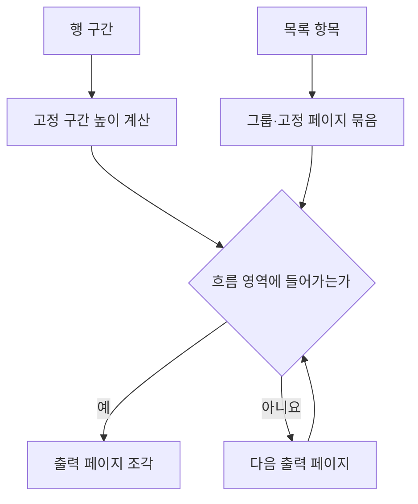

# DAT-007 그리드·셀·행 구간과 페이지 계획

최종 갱신: 2026-09-28

## 개요

고정 표와 반복 목록을 표현하는 그리드 구조와 출력 페이지를 나누는 행 구간·반복 규칙을 정의합니다.

## 변경 이력

| 날짜 | 구분 | 변경 내용 |
| --- | --- | --- |
| 2026-09-28 | 신규 작성 | 그리드 크기, 셀, 행 구간, 반복과 페이지 계획 자료를 정의했습니다. |

## 기본 구조

| 항목 | 역할 |
| --- | --- |
| `columns` | 열별 너비를 mm로 정의합니다. |
| `rows` | 행별 높이를 mm로 정의합니다. |
| `cells` | 시작 행·열, 병합 범위, 내용과 스타일을 정의합니다. |
| `bands` | 연속된 행을 머리말·항목·꼬리말 등 의미 구간으로 나눕니다. |
| `repeat` | 목록 파라미터, 최소 항목 수와 반복 동작을 정의합니다. |
| `pagination` | 출력 페이지의 흐름 영역과 항목 배치 규칙을 정의합니다. |

셀 내용은 고정 문자열, 파라미터 또는 수식을 사용할 수 있습니다. 셀 스타일은 그리드 기본값과
개별 셀 값을 합성하며 공유 경계는 한 번만 그립니다.

## 행 구간

행 구간은 첫 행부터 마지막 행까지 빈틈과 겹침 없이 덮고 위에서 아래 순서로 정의합니다. 반복
그리드는 항목 구간을 정확히 하나 가져야 합니다. 머리말이나 꼬리말 구간은 출력 페이지 조건과
페이지 나눔 반복 여부를 지정할 수 있습니다.

행·열 병합 셀은 행 구간 경계를 넘을 수 없습니다. 항목 구간의 자동 병합은 지정한 열의 연속된 같은
값을 하나의 셀처럼 표시하되 원본 데이터와 셀 정의를 바꾸지 않습니다.

## 페이지 계획

자동 방식은 흐름 영역에 들어가는 만큼 항목을 배치합니다. 고정 방식은 페이지당 항목 수를 따릅니다.
`minItems`는 데이터가 부족할 때 빈 항목 행을 추가합니다. 그룹 기준, 항목을 나누지 않는 옵션과
출력 페이지 상한은 계획 단계에서 함께 검사합니다.

## 불변 조건

- 열 너비와 행 높이 합계가 그리드의 렌더링 크기입니다.
- 셀은 범위를 벗어나거나 서로 겹칠 수 없습니다.
- 행 구간은 전체 행을 정확히 한 번 포함하고 항목 구간은 하나입니다.
- 고정 구간과 최소 항목도 흐름 영역에 들어갈 수 있어야 합니다.
- 계획 결과는 결정적이며 원본 페이지 순서와 목록 항목 순서를 유지합니다.

## 관련 설계와 근거

- 기능: FNC-007 원본 페이지와 출력 페이지 계획, FNC-008 반복 그리드 계획
- 화면: SCR-006 그리드 행·셀 편집
- 오류: ERR-003 레이아웃·렌더링·PDF 오류
- [파일 형식 명세 15](../../SPEC.md)
- [ADR-037·038·048·065·077](../../DECISIONS.md)
