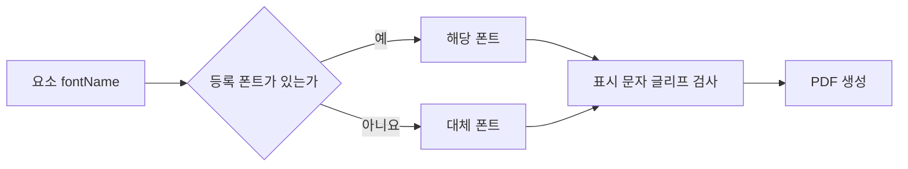

# DAT-009 이미지·에셋과 폰트

최종 갱신: 2026-09-28

## 개요

양식과 전표가 참조하는 이미지 자원과 실행 환경에서 주입하는 폰트의 구조, 확인 시점과 보존 원칙을
정의합니다.

## 변경 이력

| 날짜 | 구분 | 변경 내용 |
| --- | --- | --- |
| 2026-09-28 | 신규 작성 | 이미지 참조, 에셋, 변동 이미지와 폰트 제공 계약을 정의했습니다. |

## 이미지 참조

| 형식 | 저장 위치 | 사용 조건 |
| --- | --- | --- |
| 이미지 data URI | 요소 `src`, 에셋 `src`, 전표 값 | PNG·JPEG Base64이며 크기와 파일 서명을 검사합니다. |
| `asset://식별자` | 고정 이미지 `src` | 양식 `assets`에서 같은 ID를 찾아 내장 이미지로 해석합니다. |
| HTTP·HTTPS URL | 작성 중 양식의 고정 이미지·에셋 | 구조상 허용하지만 Core PDF가 직접 가져오지 않습니다. |

에셋 항목은 고유한 ID와 이미지 `src`를 가집니다. `asset://` 참조 대상이 없거나 이미지가 아닌
데이터이면 검증 또는 렌더링에 실패합니다. 이미지 data URI는 선언한 MIME, 디코딩한 파일 서명과
바이트 상한이 모두 맞아야 합니다.

## 고정·변동 이미지

고정 이미지는 요소에 `src`를 저장합니다. 변동 이미지는 이미지 종류 파라미터를 참조하고 전표
`values`에서 data URI를 읽습니다. 두 값 소스는 함께 사용할 수 없습니다. 발행 전표는 모든 고정·변동
이미지를 내장해야 하며 외부 URL에 의존할 수 없습니다.

## 폰트

폰트 파일은 `.slip`에 넣지 않습니다. 요소에는 `fontName`만 저장하고 호스트가 `getFonts()` 또는
MCP 설정으로 실제 TTF·OTF 바이트를 제공합니다. 제공 목록에는 이름, 바이트와 선택적인 대체 폰트
표시가 있습니다.

등록되지 않은 이름은 대체 폰트를 사용하지만 원본 `fontName`은 바꾸지 않습니다. 실제 표시할 문자에
글리프가 없으면 요소 이름, 문자와 코드 포인트를 포함한 렌더링 오류가 발생합니다.

## 보안과 보존

이미지와 폰트에는 개인정보나 라이선스 제한이 있을 수 있으므로 호스트가 수집·배포 정책을 관리합니다.
읽기 요약이나 로그에는 Base64 전체 내용을 남기지 않습니다. Core 렌더러는 확인한 이미지 원본 문자열을
한 렌더링 실행 안에서 재사용하여 출력 페이지마다 다시 디코딩하지 않습니다.

## 관련 설계와 근거

- 기능: FNC-011 이미지 확인과 해석, FNC-014 폰트 제공과 대체
- 오류: ERR-003
- 인터페이스: IF-001·IF-010
- [파일 형식 명세 7·12·19.1·20](../../SPEC.md)
- [ADR-014·036·040·042·081](../../DECISIONS.md)
